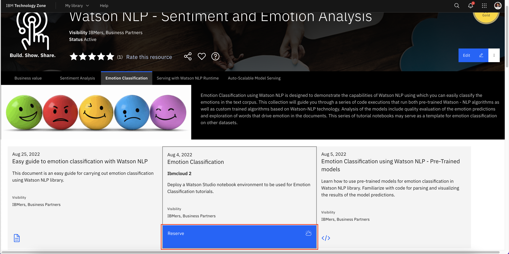
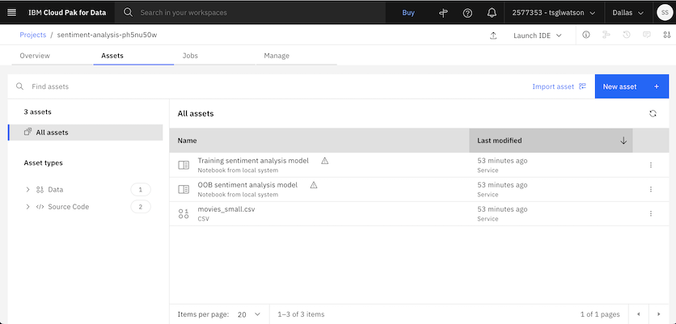
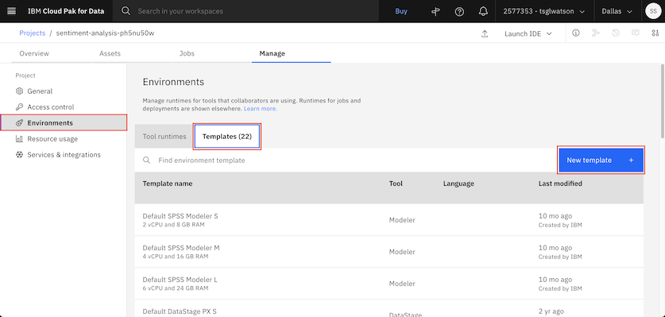
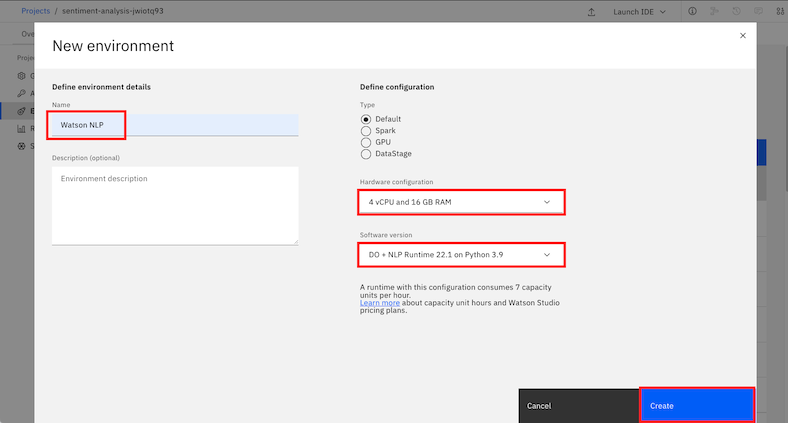
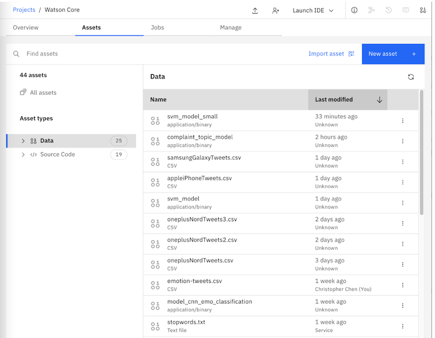
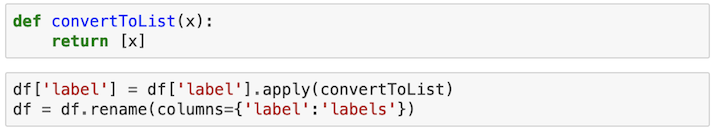
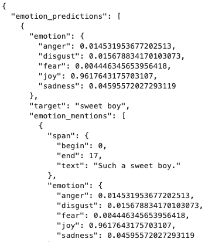

With IBM Watson NLP, IBM introduced a common library for artificial intelligence (AI) runtimes (for serving the model) and AI libraries (like Natural Language Processing, Document Understanding, Translation, and Trust). IBM Watson NLP brings everything under one umbrella for consistency and ease of development and deployment. This tutorial walks you through the steps of using a pretrained model to classify emotions in tweets using the `watson_nlp` library from IBM Watson NLP.

The `watson_nlp` library is available on IBM Watson Studio as a runtime library so that you can directly use it for model training, evaluation, and prediction. The following figure shows the Watson NLP NLP architecture.


IBM Watson NLP is a standard embeddable AI library that is designed to tie together the pieces of IBM Natural Language Processing. It provides a standard base natural language processing layer along with a single integrated roadmap, a common architecture, and a common code stack designed for widespread adoption across IBM products.

Emotion Classification is usually manually processed by humans to gather groups of qualitative data. Having the ability to automatically gather and process larger data sets of text through customer feedback, comments, or an entire article written on your product is a strong tool to gain insight into the most common emotional responses in a group of people or a block of text.

IBM Watson NLP now provides the ability to automatically classify text into the strongest emotions that are typically tracked: sadness, joy, anger, fear, and disgust. We are able to infer upon a certain emotion through syntax analysis and the emotion workflows provided by IBM AI libraries by using pretrained and custom models. The following figure shows emotion classification predictions.


This tutorial explains the fundamentals of IBM Watson NLP and walks you through the process of running and evaluating pretrained models to perform emotion classification. The Watson NLP pretrained models come in two forms: Blocks and Workflows.

### Blocks

Blocks are the embodiment of NLP models, which support load(), save(), run(), and train() functions. There are two types of Blocks. Type 1 are Blocks that operate directly on the input document. The most commonly used Type 1 block is the syntax block. Syntax block performs tokenization, lemmatization, part of speech tagging, and dependency parsing on the input document. Type 2 are blocks that depend on other blocks. Type 2 are unable to directly take documents as inputs. Generally, models that require text preprocessing, such as classifiers or entity extractors, will be Type 2 blocks. In most use-cases, the output of a Type 1 syntax block will be used as the input of a Type 2 classifier block.

### Workflows

Workflows are entire pipelines of the blocks. The previously mentioned flow of a Type 1 syntax block inputting to a Type 2 classifier block can be packaged as a workflow so that the process can run with one function call on the input document instead of multiple individual function calls.
Two blocks commonly used by Watson NLP are:

* *Syntax Analysis (or Watson Syntax Block*: Performs tokenization, lemmatization, parts of speech tagging, and dependency parsing on raw input documents so that custom models can properly classify documents.

* *Emotion Classification*: Provided with the Ensemble emotion workflow and the Aggregated emotion workflow, this can classify any block of text into five emotions: sadness, joy, anger, fear, and disgust.

Although the Emotion Classification block relies on parsing through the Watson syntax block, this tutorial focuses primarily on Emotion Classification workflows and how they work.

Before you begin using Watson NLP, you will need to import and initialize certain helper
libraries that are necessary to access Watson NLP’s Emotion Classification.

## Prerequisites

To follow the steps in this tutorial, you need:

* An [IBMid](https://cloud.ibm.com/login?cm_sp=ibmdev-_-developer-tutorials-_-cloudreg)
* A Watson Studio project
* A [Python notebook](https://github.com/ibm-build-labs/Watson-NLP/blob/main/Emotion-Classification/Emotion%20Classification%20-%20Pre-Trained%20Models.ipynb)
* **What are the helper libraries that you need to import?**

Before working through the tutorial, you should have an understanding of IBM Watson Studio and Jupyter Notebooks.

## Estimated time

It should take you approximately 1 hour to complete this tutorial.

## Steps

The steps in this tutorial use an example of IMDB movie reviews from Kaggle to walk you through the process.

### Setting up your environment

To begin, you set up a Python notebook environment using Watson Studio on IBM Cloud so that you can use the watson_nlp_ library.

#### Reserve your env

** How does this work outside of Tech Zone when you can't reserve an env? This process needs to be documented here for people outside of IBM.**
(Note: If you can't reserve an env on Tech Zone but if you have access to Watson Studio instance, you can skip steps 1 and 2 to complete the tutorial)

1. Under the [Emotion Classification](https://techzone.ibm.com/collection/watson-core-nlp#tab-2) tab, find the environment tile and click **Reserve** to reserve a Watson Studio environment.

    

2. Shortly, you will receive an email inviting you to join an IBM cloud account. Follow the instructions in the email to join.  Your environment should be ready within a few minutes.  When it is ready, you will recieve a second email similar to the following.

    

3. Log in to [IBM Cloud Pak for Data](https://dataplatform.cloud.ibm.com?cm_sp=ibmdev-_-developer-tutorials-_-cloudreg). After you log in, ensure that you are using cloud account **2577353 - tsglwatson**. You can check the name of the current account in the bar the top of the screen.  Change the account if necessary using the drop-down menu.  From the IBM Cloud Pak for Data dashboad, find the tile for the Project that you want to work with.  For the Emotion Classification tutorial, the name of this Project will have the prefix **emotion-classification**.  Once the Project is open, you can view the notebooks and data assets of the project using the **Assets** tab.

    (Note: If you are not using the TechZone environment, you will not have access to this IBM cloud account. You can load the [Emotion Classification - Pre-Trained Models notebook](https://github.com/ibm-build-labs/Watson-NLP/blob/main/Emotion-Classification/Emotion%20Classification%20-%20Pre-Trained%20Models.ipynb) into your Watson Studio project directly. Follow [instructions for creating notebook from URL](https://www.ibm.com/docs/en/cloud-paks/cp-data/4.5.x?topic=notebooks-creating)).

    

4. Before working with the notebooks, you must define the environment in which these notebooks will run. To get started on that, click on the **Manage** tab.

    

5. Click on **Environments** from the side Navbar. Next click on **Templates** tab. Finally, click on **New template**

    

6. We will create an environment template that contains the Watson NLP library. Give your environment template a name like **Watson NLP**. In the Hardware configuration, select at least **4 vCPU and 16 GB RAM**  (Note: For better performance, select higher Hardware configuration). For Software, select **DO + NLP Runtime 22.1 on Python 3.9**. Finally click **Create**

    

7. Now we will set an environment for a notebook.  Click on the **Assets** tab. Find the notebook you want to work with among the assets.  Click on the ellipsis (the three dots) to the right of the notebook name in order to open a drop-down menu.  Within this menu click **Change environment**.

    

8. Select the environment template that you created previously and click **Change**.
 
    

9. You will be able to run the notebook by clicking the ellipsis and selecting **Edit**.


10. Your notebook will load. You can follow the instructions in your notebook to complete the tutorials on Watson NLP.

    


### Step 1. Collecting the data set

Datasets for emotion classification will require an input text feature column and an emotion label column with labels such as ‘joy’, ‘anger’, fear’, and ‘sadness’. Let’s use this manually annotated tweet dataset found on <a href="https://www.kaggle.com/datasets/anjaneyatripathi/emotion-classification-nlp?select=emotion-labels-train.csv" target="_blank" rel="noopener noreferrer">Kaggle</a>. You can download all of the .csv files and combine them or download the single test .csv file.



After downloading the data set, youmust upload the file to the Watson Studio project as a data asset. From there, the data will be ready to be inserted into the notebook. Notebook is set up with instructions for reading the .csv as a Pandas DataFrame.


(Note: If you are reserving the env through TechZone, you don't need to collect the data manually. The env comes with the Watson Studio project pre-created for you. You can skip the rest of the steps here and follow the instructions in the notebook to complete the Emotion Classification tutorial. However, if you are not reserving the env through TechZone and you have a Watson Studio instance, then you should follow the steps described below)

1. The tweets data set can be downloaded from <a href="https://www.kaggle.com/datasets/anjaneyatripathi/emotion-classification-nlp?select=emotion-labels-train.csv" target="_blank" rel="noopener noreferrer">Kaggle</a>.

2. Upload the data set to your Watson Studio project by going to the Assets tab and then dropping the data files as shown in the following figure.

    

3. After you have added the dataset to the project, you might have to reload the Notebook. You have two options of accessing the dataset from the Jupyter Notebook depending on the level of access you have.

    A. If you are a project administrator, then

    i) You can just insert the project token as shown below:

    

    ii) After inserting the project token, you can continue executing all the cells in the notebook. This cell in particular will load your dataset in the notebook.'
    

    B. If you are not a Watson Studio project administrator, then you cannot create a project token.

    i) Create a new cell under Step 2 - Data Loading by clicking on **Insert** menu and then selecting **Insert Cell Below** or **Esc+B** shortcut key. Highlight the code cell shown in the image below by clicking it.

    


    ii) Ensure you place the cursor below the commented line. Click the Find and add data icon (01/00) on the top right corner. Choose the Files tab, and pick the `emotion-tweets.csv` or the name of your csv file (if it is different). Click Insert to code and choose pandas DataFrame. Rename the dataframe from `df_data_1` to `df`.

    

4. After you've added the data set to the project, you can access it from the Jupyter Notebook, and read the csv file into a pandas DataFrame.

    

### Step 2. Data processing

You can continue executing the cells in the notebook to complete the Data processing and exploratory data analysis step. There are some noteworthy points mentioned below (not steps):

Because the dataset already caters towards NLP emotion classification with the necessary
feature and label columns, there will be little processing need at this step. In practice, data will often have to be cleaned and transformed to fit the model’s needs. Watson NLP expects the
labels in the label column to be in a list as opposed to a standalone string. To achieve this, we



Optionally, the notebook has a step for creating a train/test split of the dataset. This can be performed on the larger, combined data of the train, test, and validation .csv files from Kaggle. Once again, the only data split that we will be using is the test split for evaluation of the
models.

### Step 3. Running pretrained models

You can continue executing the cells in the notebook to complete the Modeling step. There are some noteworthy points mentioned below (not steps):

Now for the fun part! Watson NLP has two pretrained emotion classification models using the workflow system. This means that to run the model, we’ll only have to provide a text input, rather than having to set up a syntax processing block and a model block.This blog will use ”Such a sweet boy. But after much thought and careful consideration, I’ve decided that the ruler for the next ten thousand years is going to have to be… me.” as a single input test with the expected label to be ”joy”.

### Step 3. Running pretrained emotion classification models

You can continue executing the cells in the notebook to complete the Model building step. There are some noteworthy points mentioned below (not steps):

Watson NLP has two pretrained/prebuilt emotion classification models using the workflow system. They are the Ensemble emotion model and the Aggregated emotion model. The following examples will use "Such a sweet boy. But after much thought and careful consideration, I've decided that the ruler for the next ten thousand years is going to have to be... me." as a single input test with the expected label to be "joy".

#### Ensemble emotion model

What are the emotions users are tweeting with? Do they feel angry, happy, sadness, disgust, or fear?

All models will have to be downloaded from the Watson NLP library on their initial run. They are saved to the runtime local, or local working path if the notebook is being run offline.


The result of the Ensemble model returns a list of dictionaries that indicate each label and its confidence score. The highest confidence score deems the label of prediction. Generating a prediction with the model is as straightforward as invoking model.run() with the
test text as the input. 


The return of the model prediction is a dictionary of emotions with their
respective confidence scores. The highest score is the predicted emotion.


By parsing out the results of the model runs, we can compare the differences between predicted labels and actual labels in a histogram plot.


Certain blocks and workflows also have the ability to run and evaualate an entire dataset i.e test data set. This is done with the model `model.evaluate_quality()` function. The outputting result is a dictionary of confusion matrices, precision, recall, and f1 score for each of the labeled
emotions.


#### Aggregated emotion model

Aggregated emotion model has the capability of specifying target words in addition to document emotion classification.

```
aggregated_emotion_model = watson_nlp.load(watson_nlp.download('aggregated_classification-wf_en_emotion-stock'))
```


Similarly to the Ensemble model, the Aggregated model returns a list of dictionaries that indicate each label and its confidence score. As before, the highest confidence score deems the label of prediction. The first dictionary in the result is the prediction of the overall input; the subsequent dictionaries with a "target" key is the prediction of each targeted text span. Likewise, by defining a target text phrase with the target_phrases parameter, the Aggregated model can predict emotion on exact words and phrases in the input. The result shows the "target" key having the targeted phrase.



By parsing out the results of the model runs, we can compare the differences between predicted labels and actual labels in a histogram plot.


### Step 4. Exploring document level tokenized predictions

You can continue executing the cells in the notebook to complete the Data processing and exploratory data analysis step. There are some noteworthy points mentioned below (not steps):

Because the aggregated emotion classification model is capable of classifying specific mentions, we can run the model on the entire dataset with tokenized text.

The following functions run the emotion classification model on each text row of the dataframe and store results in the form of a dictionary into a new dataframe column. The keys of the dictionary include `Document emotion` and `Mention emotion`.

```
def extract_emotion(text):
    # run the emotion model on the result of the syntax analysis
    emotion_result = emotion_model.run(text, document_emotion=True)
    
    document_emotion = emotion_result.to_dict()['emotion_predictions'][0]['emotion']
    mention_emotion = [(sm['span']['text'], sm['emotion']) for sm in emotion_result.to_dict()['emotion_predictions'][0]['emotion_mentions']]
    return (document_emotion, mention_emotion)

# Helper method to create a new dataframe with the corresponding emotion
def create_emotion_dataframe(df):
    emotion = df['text'].apply(lambda text: extract_emotion(text))
    emotion_df = pd.DataFrame.from_records(emotion, columns=('Document emotion', 'Mention emotion'))
    return emotion_df
```

By displaying the dataframe output from the function, we can see that each document/text tweet is broken down into tokenized "sentences" called Mention. The dataframe displays confidence scores for each Mention in the dialog.


## Conclusion

This introduction to Watson NLP is only a brief look at how easily NLP emotion classification can be performed on ready datasets by utilizing the Watson NLP Python library. As you explore the accessibility of the IBM NLP stack through Watson NLP, you interact with many more models that
come pretrained with the library such as topic modeling and sentiment analysis. This tutorial shows how easily you can use `watson_nlp` library for simplifying natural language processing tasks like emotion classification. The tutorial showed how you can perform classification on ready data sets by using the Watson NLP Python library.

## Next steps

You can run this <a href="https://github.com/ibm-build-labs/Watson-NLP/blob/main/Emotion-Classification/Emotion%20Classification%20-%20Pre-Trained%20Models.ipynb" target="_blank" rel="noopener noreferrer">Jupyter Notebook</a> to see how to 
classify emotions in tweets using Watson NLP pre-trained models.

To learn how to classify emotions in tweets using custom models, run this <a href="https://github.com/ibm-build-labs/Watson-NLP/blob/main/Emotion-Classification/Emotion%20Classification%20-%20Custom%20Model%20Training.ipynb" target="_blank" rel="noopener noreferrer">Jupyter Notebook</a>.
