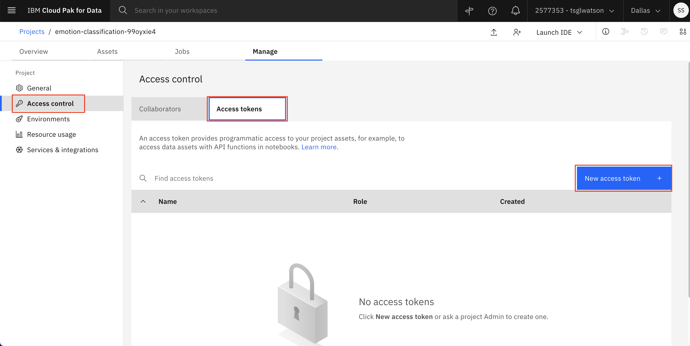
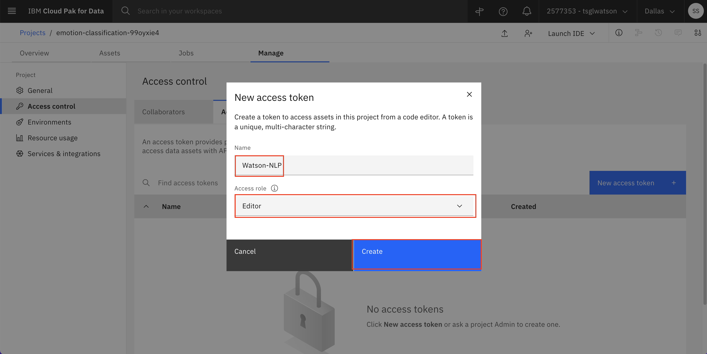

# Setting up your environment

To begin working with IBM Watson NLP, you set up a Python notebook environment that uses Watson Studio on the IBM Cloud so that you can use the `watson_nlp` library. There are two ways to set up your environment:

- For IBM Business Partners who have access to the [IBM Technology Zone](https://techzone.ibm.com/) (IBM Tech Zone), you can reserve a temporary (72 hour) environment there.
- If you do not have access to the IBM Tech Zone, you can load the notebook directly into your [Watson Studio](https://cloud.ibm.com/catalog/services/watson-studio) project.

## Reserve your environment

**Note:** If you can't reserve an environment on IBM Tech Zone, but you have access to a Watson Studio instance, you can skip steps 1 and 2 for reserving your environment.

1. Find the environment tile under the [Sentiment Analysis](https://techzone.ibm.com/collection/watson-core-nlp#tab-1) or [Emotion Classification](https://techzone.ibm.com/collection/watson-core-nlp#tab-2) tab (For any other use case, the Tech Zone collection name might be different but the step remains the same. So, you can find the right collection and click on the **Reserve** button), and click **Reserve** to reserve a Watson Studio environment.

   

2. Follow the instructions in the invitation email that you receive to join an IBM Cloud account. Your environment should be ready within about 15 minutes. When the environment is ready, you receive a second email similar to the one shown in the following figure. (You may also get an email every 24 hours saying your environment is about to expire as this sandbox is only available for 72 hours).

   

3. Log in to [IBM Cloud Pak for Data](https://dataplatform.cloud.ibm.com?cm_sp=ibmdev-_-developer-tutorials-_-cloudreg). If you are using the IBM Tech Zone environment, after you log in, ensure that you are using cloud account **2577353 - tsglwatson**. You can check the name of the current account in the bar at the top of the screen. If necessary, change the account by using the drop-down menu. From the IBM Cloud Pak for Data dashboard, find the tile for the project that you want to work with. For this tutorial, the name of this project has the prefix **sentiment-analysis** (This name will be different for Emotion Classification, Topic Modeling, Text Classification, and Entities Extraction use cases). After the project is open, you can view the notebooks and data assets of the project by using the **Assets** tab.

   **Note:** If you are not using the IBM Tech Zone environment, you do not have access to this IBM Cloud account. You can load the [Sentiment Analysis pre-trained model notebook](https://github.com/ibm-build-lab/Watson-NLP/blob/main/ML/Sentiment-Analysis/Sentiment%20Analysis%20-%20Pre-Trained%20models.ipynb) or the [Emotion Classification pre-trained notebook](https://github.com/ibm-build-lab/Watson-NLP/blob/main/ML/Emotion-Classification/Emotion%20Classification%20-%20Pre-Trained%20Models.ipynb) (or any other NLP notebook depending on your use case) into your Watson Studio project directly. Follow the <a href="https://www.ibm.com/docs/en/cloud-paks/cp-data/4.5.x?topic=notebooks-creating" target="_blank" rel="noopener noreferrer">instructions for creating notebook from URL</a> to load the notebook.

   

4. Define the environment in which these notebooks will run. To begin, click the **Manage** tab.

   

5. Click **Environments** from the navigation bar on the left, then click the **Templates** tab. Finally, click **New template**.

   

6. Create an environment template that contains the `watson_nlp` library. Begin by giving your environment template a name like **Watson NLP**. In the Hardware configuration field, select at least **4 vCPU and 16 GB RAM**. (For better performance, select a higher hardware configuration.) For software, select **DO + NLP Runtime 22.1 on Python 3.9**. Finally, click **Create**.

   

7. Switch to the **Access control** tab on the left, then select **Access tokens** and click on **New access token +** button.

   

8. Enter a **Name** for the access token and select **Editor** in the Access role. Then click **Create**. Now the access token will be created for you and you can use it in the notebook.

   

9. Set an environment for a notebook. Click on the **Assets** tab, and find the notebook that you want to work with among the assets. Click the ellipsis (the three dots) to the right of the notebook name to open a drop-down menu. Within this menu, click **Change environment**.

   

10. Select the environment template that you created previously, and click **Change**.

    

11. Run the notebook by clicking the ellipsis and selecting **Edit**.

    

12. Your notebook loads. You can follow the instructions in your notebook to complete the tutorials on Watson NLP.

    

## Conclusion

This tutorial walked you through the steps to set up your Python environment so that you can use the IBM Watson NLP library. The tutorial is a prerequisite to the [Use the Watson NLP library to perform sentiment analysis](https://developer.ibm.com/tutorials/use-the-watson-core-nlp-library-to-perform-sentiment-analysis/) and [Use the Watson NLP library to perform emotion classification](https://developer.ibm.com/tutorials/use-the-watson-nlp-library-to-perform-emotion-classification/) tutorials and any other tutorial that uses Watson NLP library for natural language processing tasks.
