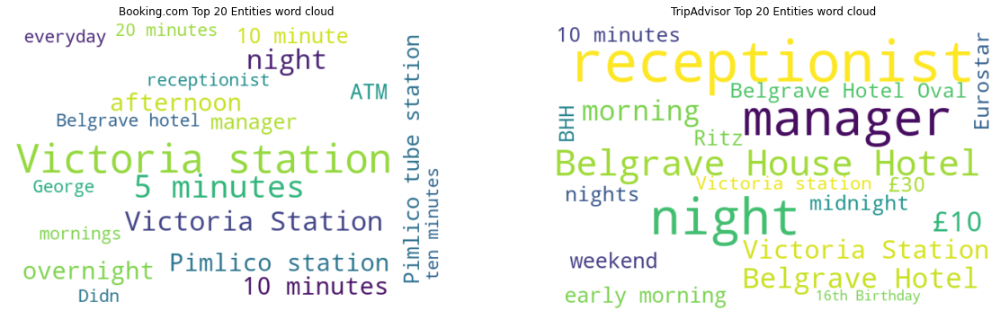
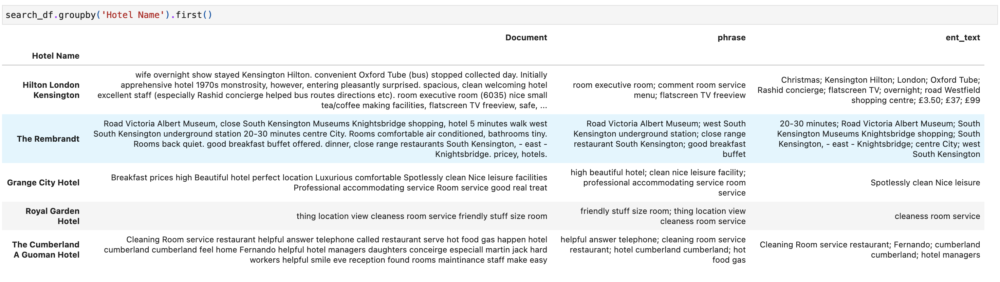
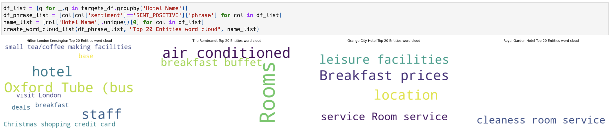

# Easy guide to Entities, Keywords and Phrases extraction with Watson NLP

Entities, Keyword & Phrase Extraction plays major role to understand the unstructured data. These entities can include People name, Organization name, Date, Price, Facility, etc.

The `watson_nlp` library is available on IBM Watson Studio as a runtime library so that you can directly use it for model training, evaluation, and prediction. The following figure shows the Watson NLP NLP architecture.


IBM Watson NLP is a standard embeddable AI library that is designed to tie together the pieces of IBM Natural Language Processing. It provides a standard base natural language processing layer along with a single integrated roadmap, a common architecture, and a common code stack designed for widespread adoption across IBM products.

IBM Watson NLP now provides the ability to automatically extract entities, keywords and phrases using pre-trained models Out of the box.

This tutorial explains the fundamentals of IBM Watson NLP and walks you through the process of extracting entities, keywords and phrases.

## Prerequisites

To follow the steps in this tutorial, you need:

- An [IBMid](https://cloud.ibm.com/login?cm_sp=ibmdev-_-developer-tutorials-_-cloudreg)
- A Watson Studio project
- A [Python notebook](https://github.com/ibm-build-labs/Watson-NLP/blob/main/Emotion-Classification/Emotion%20Classification%20-%20Pre-Trained%20Models.ipynb)
- Your [environment set up](https://developer.ibm.com/tutorials/set-up-your-ibm-watson-libraries-environment/)

## Estimated time

It should take you approximately 1 hour to complete this tutorial.

## Steps

The steps in this tutorial use an example of IMDB movie reviews from Kaggle to walk you through the process.

## Step 1. Collecting the data set

**These steps need to be broken out like the "Setting up your environment section.**
(Note: If you are reserving the env through TechZone, you don't need to collect the data manually. The env comes with the Watson Studio project pre-created for you. You can skip the rest of the steps here and follow the instructions in the notebook to complete the Text Classification tutorial. However, if you are not reserving the env through TechZone and you have a Watson Studio instance, then you should follow the steps described below)

1. The data is publicly available at [Kaggle 515K Hotel Reviews Data in Europe](https://www.kaggle.com/datasets/jiashenliu/515k-hotel-reviews-data-in-europe) and [OpinRank Review Dataset] (https://archive.ics.uci.edu/ml/datasets/OpinRank+Review+Dataset).
   We will use 3 hotels for analysis and comparison and they have been saved for you on the GitHub. The data for each of the hotels can be downloaded from GitHub: [Hotel 1](https://github.com/ibm-build-lab/Watson-NLP/blob/main/Entities-Keywords-Extraction/uk_england_london_belgrave_hotel.csv), [Hotel 2](https://github.com/ibm-build-lab/Watson-NLP/blob/main/Entities-Keywords-Extraction/uk_england_london_dorset_square.csv), [Hotel 3](https://github.com/ibm-build-lab/Watson-NLP/blob/main/Entities-Keywords-Extraction/uk_england_london_euston_square_hotel.csv).

2. Upload the data set to your Watson Studio project by going to the Assets tab and then dropping the data files as shown in the following figure.

   

3. After you have added the dataset to the project, you might have to reload the Notebook. You have two options of accessing the dataset from the Jupyter Notebook depending on the level of access you have.

   A. If you are a project administrator, then

   i) You can just insert the project token as shown below:

   

   ii) After inserting the project token, you can continue executing all the cells in the notebook. This cell in particular will load your dataset in the notebook.'
   

   B. If you are not a Watson Studio project administrator, then you cannot create a project token.

   i) Create a new cell under Step 2 - Data Loading by clicking on **Insert** menu and then selecting **Insert Cell Below** or **Esc+B** shortcut key. Highlight the code cell shown in the image below by clicking it.

   

   ii) Ensure you place the cursor below the commented line. Click the Find and add data icon (01/00) on the top right corner.

   Choose the Files tab, and pick the `uk_england_london_belgrave_hotel.csv` file. Click Insert to code and choose pandas DataFrame. Rename the dataframe from `df_data_1` to `belgrave_df`.

   Choose the Files tab, and pick the `uk_england_london_euston_square_hotel.csv` file. Click Insert to code and choose pandas DataFrame. Rename the dataframe from `df_data_2` to `euston_df`.

   Choose the Files tab, and pick the `uk_england_london_dorset_square.csv` file. Click Insert to code and choose pandas DataFrame. Rename the dataframe from `df_data_3` to `dorset_df`.

   Choose the Files tab, and pick the `london_hotel_reviews.csv` file. Click Insert to code and choose pandas DataFrame. Rename the dataframe from `df_data_4` to `hotels_df`.

   

4. After you've added the data set to the project, you can access it from the Jupyter Notebook, and read the csv file into a pandas DataFrame.

   

## Step 3. Entity Extraction

Entity extraction uses the entity-mentions block to encapsulate algorithms for the task of extracting mentions of entities (person, organizations, dates, locations,...) from the input text. The block offers implementations of strong entity extraction algorithms from each of the four families: rule-based, classic ML, deep-learning and transformers.

There are two types of models:

A rule-based model (the rbr models), which handles syntactically regular entity types such as number, email and phone.
A model trained on labeled data for the more complex entity types such as person, organization location.

### Step 3A. Entity extraction function

Rule-based models (rbr) do not depend on any blocks, so you can just directly run them on input text.

Models trained from labeled data, such as bilstm, bert, and transformer, depend on the Syntax block. As such, Syntax block must be run first to generate the input expected by the Entity Mention block.

1. Load the syntax model and three entity extraction models.

   ```python
   # Load a syntax model to split the text into sentences and tokens
   syntax_model = watson_nlp.load(watson_nlp.download('syntax_izumo_en_stock'))

   # Load bilstm model in WatsonNLP
   bilstm_model = watson_nlp.load(watson_nlp.download('entity-mentions_bilstm_en_stock'))

   # Load rbr model in WatsonNLP
   rbr_model = watson_nlp.load(watson_nlp.download('entity-mentions_rbr_en_stock'))

   # Load bert model in WatsonNLP
   bert_model = watson_nlp.load(watson_nlp.download('entity-mentions_bert_multi_stock'))
   ```

2. Build a custom function to run a specified entity extraction model and parse its results. The returned output is a dictionary of the review text, hotel name, website, and entity mentions.

   ```python
   def extract_entities(data, model, hotel_name=None, website=None):
       import html

       input_text = str(data)
       text = html.unescape(input_text)
       if model == 'rbr':
           # Run rbr model on text
           mentions = rbr_model.run(text)
       else:
           # Run syntax model on text
           syntax_result = syntax_model.run(text)
           if model == 'bilstm':
               # Run bilstm model on syntax result
               mentions = bilstm_model.run(syntax_result)
           elif model == 'bert':
               # Run bert model on syntax result
               mentions = bert_model.run(syntax_result)
           elif model == 'transformer':
               # Run transformer model on syntax result
               mentions = transformer_model.run(syntax_result)

       entities_list = mentions.to_dict()['mentions']
       print(entities_list)
       ent_list=[]
       for i in range(len(entities_list)):
           ent_type = entities_list[i]['type']
           ent_text = entities_list[i]['span']['text']
           ent_list.append({'ent_type':ent_type,'ent_text':ent_text})

       if len(ent_list) > 0:
           return {'Document':input_text,'Hotel Name':hotel_name,'Website':website,'Entities':ent_list}
       else:
           return {}
   ```

3. Stop-words are common words that are unmeaningful for separating the data. Such common words are assumed to be "noise" as their high frequency could hide the words carrying more informative signal. We filter them based on a pre-defined list used in WatsonNLP and based on the part-of-speech. Notes:

   The stop-words list can be customized for the target dataset. We demonstrate this below. When we vectorize the documents below, we apply a filter that ignores terms that appear in 50% or more of the documents. This filter can also be counted as part of stop-words filtering.

   ```python
   wnlp_stop_words = watson_nlp.download_and_load('text_stopwords_classification_ensemble_en_stock').stopwords
   stop_words = list(wnlp_stop_words)
   stop_words.remove('keep')
   stop_words.extend(["gimme", "lemme", "cause", "'cuz", "imma", "gonna", "wanna",
                      "gotta", "hafta", "woulda", "coulda", "shoulda", "howdy","day",
                      "first", "second", "third", "fourth", "fifth", "London", "london",
                      "1st", "2nd", "3rd", "4th", "5th",
                      "monday", "tuesday", "wednesday", "thursday", "friday", "saturday", "sunday",
                      "weekend", "week", "evening", "morning"])
   ```

### Step 3B. Run entity extraction

1. Apply data pre-processing on the input text/documents and then run the cleaned text through the model. The model used can be specified via the model parameter in extract_entities().

   ```python
   def run_extraction(df_list, text_col):
       extract_list = []
       for df in df_list:
           all_text = dict(zip(df[text_col], zip(df['hotel'], df['website'])))
           all_text_clean = {clean(doc[0]): doc[1] for doc in all_text.items()}
           for text in all_text_clean.items():
               # change the second parameter to 'rbr', 'bilstm', or 'bert' to try other models
               extract_value = extract_entities(text[0], 'bilstm', text[1][0], text[1][1])
               if len(extract_value) > 0:
                   extract_list.append(extract_value)
       return extract_list
   ```

2. The model will output a text's entity mention as well as its category of entity. For example, "london" mention is a Location type and "good soundproof rooms" is a Facility type.

   

3. The Entities extraction model output can be visualized to analyze and understand the entities in the hotel reviews clearly.

   

### Step 3C. Comparing top 20 entities for each hotel

We can examine the results of the entity extraction by plotting the top frequently mentioned entities for each hotel. These mentions can be used to generate tags for a hotel to create relevancy and familiarity for search engine results.

1. Display frequency with horizontal barcharts.
   

### Step 3D. Comparison between Booking.com vs TripAdvisor for one hotel

Another approach to analyzing hotel customer reviews is by comparing the entity mentions found on the two websites where the reviews are published. Here we are looking at Booking.com vs TripAdvisor. We can hope to gain insight on the tendencies of reviewers who use one platform compared to the other platform.

1. Plot side-by-side word clouds for each of the hotels.
   

   It can be observed that the customers on Booking.com care more about the convenience to tube stations where as TripAdvisor customers care more about the reception and atmosphere of the hotel itself.

2. Similarly for the Euston hotel.
   

   We can use this collective information to give priority to the website with reviews that better align with our own preferences about choosing a hotel. Do we care more about the convenience of the location of a hotel or do we care about the hotel's ambience, reception, perks?

## Step 4. Keyword phrase extraction

Another Watson NLP capability we can utilize to analyze the hotel reviews is Keyword phrase extraction. The keywords block ranks noun phrases extracted from an input document based on how relevant they are within the document.

We will be using the text-rank model here. The text-rank model takes the output of Noun Phrase models and assigns a relevance score for each extracted noun phrase. The relevance score calculation is inspired by the Page Rank algorithm. In the context of the input document, extracted noun phrases that appear in “more connected” contexts receive a higher rank. In addition, the relevance score of extracted noun phrases is upgraded when the noun phrase appears more frequently in Wikipedia.

1. Load Noun Phrases, Embedding and Keywords models for English

   ```python
   syntax_model = watson_nlp.load(watson_nlp.download('syntax_izumo_en_stock'))
   noun_phrases_model = watson_nlp.load(watson_nlp.download('noun-phrases_rbr_en_stock'))
   keywords_model = watson_nlp.load(watson_nlp.download('keywords_text-rank_en_stock'))
   ```

2. The following function captures the flow for running a keyword extraction model. First, we run the input document/text through the syntax model and the noun phrases model to extract noun texts. Then, we use both syntax output and noun output as inputs for the keyword model where the ouput will include the text phrase and relevance score. We can use this score to rank the phrases

   ```python
   def extract_keywords(text):
       # Run the Syntax and Noun Phrases models
       syntax_prediction = syntax_model.run(text, parsers=('token', 'lemma', 'part_of_speech'))
       noun_phrases = noun_phrases_model.run(text)
       # Run the keywords model
       keywords = keywords_model.run(syntax_prediction, noun_phrases, limit=5)
       keywords_list = keywords.to_dict()['keywords']
       key_list = []
       for i in range(len(keywords_list)):
           dict_list = {}
           key = custom_tokenizer(keywords_list[i]['text'])
           dict_list['phrase'] = key
           dict_list['relevance'] = keywords_list[i]['relevance']
           key_list.append(dict_list)
       return {'Complaint data':text,'Phrases':key_list}
   ```

3. Plot the result of the keyword phrase extraction for the 3 hotels.
   

   These top-ranked phrases can be used to generate a brief description of the most noteable attributes of each hotel. Customers can find interest in a particular hotel with just take one look at the list of phrases.

## Step 5. Entity and Phrase Search

One of the applications of entity detection is in searching. We can search for entitiy mentions and phrases by using them as tags of reviews in our large London hotel reviews dataset.

1. Sample 5% of the London hotels reviews for the sake of runtime and capacity.

   ```python
   hotels_df_sample = hotels_df.sample(frac = 0.05, random_state = 1)
   ```

2. Run entity extraction on the sampled dataframe.

   ```python
   hotels_extract_list = run_extraction([hotels_df_sample], 'text')
   ```

3. Build a function to run and parse phrase on the sampled dataframe. This function uses the previously built `extract_keywords()` function.

   ```python
   def explode_phrases2(hotels_df):
       keywords = []
       for index, row in hotels_df.iterrows():
           keywords.append(extract_keywords(row['Document'], row['Hotel Name']))
       phrases_df = pd.DataFrame(keywords)

       exp_phrases = phrases_df.explode('Phrases')
       exp_phrases = exp_phrases.dropna(subset=['Phrases'])
       exp_phrases = pd.concat([exp_phrases.drop(['Phrases'], axis=1), exp_phrases['Phrases'].apply(pd.Series)], axis=1)
       exp_phrases['phrase_length'] = exp_phrases['phrase'].apply(lambda x: len(x.split(' ')))
       # Removing uni-gram and bi-grams
       exp_phrases = exp_phrases[exp_phrases.phrase_length > 2]
       return exp_phrases
   ```

4. Combine the results of the entity extraction and phrase extraction functions into one dataframe.

5. Input a list of entities and a list of phrases to the search function and run it on the dataframe.

   ```python
   def search_entity(hotels_df, entities_list, phrases_list):
       search_df = hotels_df[(hotels_df['ent_text'].str.lower().str.contains('|'.join(entities_list).lower())) &
                             (hotels_df['phrase'].str.lower().str.contains('|'.join(phrases_list).lower()))]
       hotel_count = search_df['Hotel Name'].value_counts().to_dict()
       return search_df, hotel_count
   ```

   For example, if we care about the food, cleanliness, and convenience of a hotel; we can use the words `good breakfast`, `room service`, `clean`, and `shopping` to look for hotel reviews that mention these entities and phrases. We hope to find a shortend list of hotels that fulfill our criteria.

   

   Just based on the results of the entity and phrase extraction search, we can determine that these 5 hotels best offer the features that we are looking for. To get a better idea of how the hotels were received, we can read all of the reviews from each of the hotels that matched.

## Step 6. Actionable insights using entities and keyword phrase extraction combined with sentiment analysis

For these 5 hotels, we can determine the targeted sentiment for the phrases found in their reviews. We want to make sure that the entities and phrases we've detected are positive so that we can make an accurate decision on which hotel to pick.

The Targets Sentiment Extraction block contains algorithms for the task of extracting the sentiments expressed in text and identifying the targets of those sentiments. The block automatically outputs both the target terms and the sentiment expressed towards each target term when given an input text.

For example, given the input:

```sh
“The served food was delicious, yet the service was slow.”
```

The block identifies that there is a positive sentiment expressed towards the target “food”, and a negative sentiment expressed towards “service”. A significant advantage of this block is that it can handle multiple targets with different sentiments in one sentence. For the above example, it automatically identifies the positive sentiment towards “food” and the negative sentiment towards “service”.

1. Load the target sentiment extraction model.

   ```python
   sentiment_extraction_model = watson_nlp.load(watson_nlp.download('targets-sentiment_sequence-bert_multi_stock'))
   ```

2. Build a function to run the sentiment extraction model on the entity and phrase results from the previosu step.

   ```python
   def run_sentiment(df, text_col, ent_col):
       pos_targets =[]
       neg_targets =[]
       targets = []
       entities = dict(df[ent_col])
       for text, hotel in zip(df[text_col], df['Hotel Name']):
           syntax_analysis_en = syntax_model.run(text, parsers=('token',))
           extracted_sentiments = sentiment_extraction_model.run(syntax_analysis_en)
           for key , score in extracted_sentiments.to_dict()['targeted_sentiments'].items():
               label = score['label']
               targets.append({'Hotel Name' : hotel, 'phrase' : key, 'sentiment' : score['label']})
               if label=='SENT_POSITIVE': # and key not in pos_targets:
                   pos_targets.append(key)
               elif label=='SENT_NEGATIVE': # and key not in neg_targets:
                   neg_targets.append(key)
       return pos_targets, neg_targets, targets
   ```

   The function captures the flow for running a target sentiment extraction model. First, we run the input document/text through the syntax model. Then, we use the syntax output as input for the target sentiment extraction model where the ouput will include the target text and their sentiment. We will return the outputs into two separate lists of positive and negative sentiment text as well as one list of labels for every phrase.

3. We can display a word cloud for the positive sentiment phrases of every hotel in the search result to get a better view at the well rated features of each hotel.

   

## Conclusion

This tutorial shows you how to use the Watson NLP library and how easily you can run various entity, phrase, and target sentiment extraction models on input text. This notebook also demonstrated one possible application of Watson NLP.
