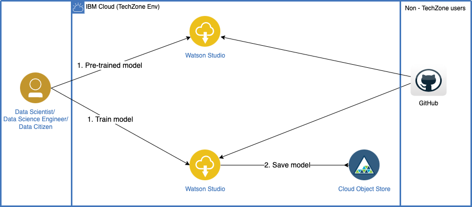
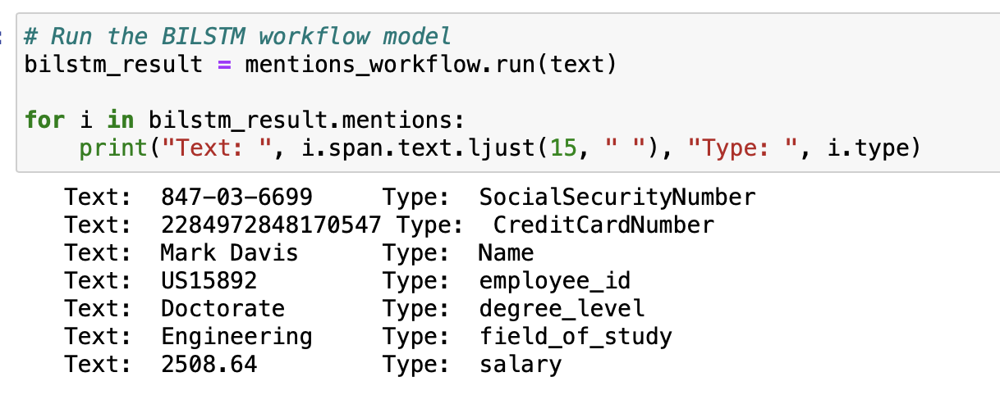
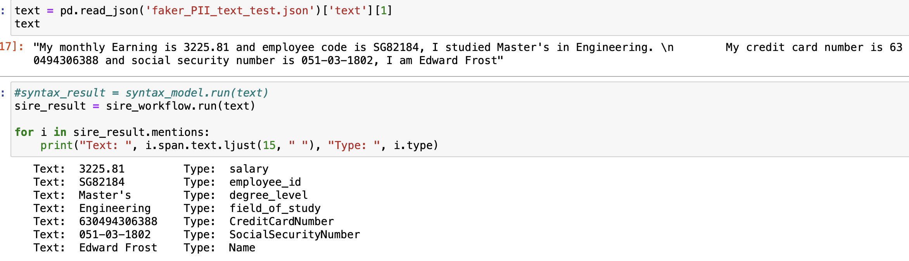

# Personal Identifiable Information (PII) extraction using Watson NLP

Personal Identifiable Information (PII) extraction refers to the process of identifying and extracting personal information from various sources, such as documents, databases, and websites. PII is any information that can be used to identify an individual, including their name, address, phone number, email address, social security number, driver's license number, credit card number, and more.

PII extraction is a crucial process in maintaining data privacy compliance while also extracting valuable insights from data. IBM Watson NLP models offer a powerful solution for PII extraction, utilizing natural language processing and machine learning techniques to accurately identify and extract personally identifiable information. Additionally, these models offer a flexible and scalable solution, allowing businesses to fine-tune the models to extract specific types of PII and integrate them into their applications for compliance with data privacy regulations. These models can help businesses improve operational efficiency by automating manual processes, reducing errors, and saving time and resources. 

The `watson_nlp` library is available on IBM Watson Studio as a runtime library so that you can directly use it for model training, evaluation, and prediction. The following figure shows the Watson NLP architecture.



This tutorial provides an introduction to IBM Watson NLP, covering the fundamental concepts and guiding you through the process of using <b>fine-tuning</b> them for PII extraction.

# Prerequisites

To follow the steps in this tutorial, you need:

* An [IBMid](https://cloud.ibm.com/login?cm_sp=ibmdev-_-developer-tutorials-_-cloudreg)
* A Watson Studio project
* A Python [Fine-Tuned Models notebook](https://github.com/ibm-build-lab/Watson-NLP/blob/main/ML/PII-Extraction/PII%20Extraction%20-%20Fine-Tuned%20Models.ipynb)
* Your [environment set up](https://developer.ibm.com/tutorials/set-up-your-ibm-watson-libraries-environment/)

# Estimated time

It should take you approximately 1 hour to complete this tutorial.

# Steps

The tutorial demonstrates the extraction of PII using generated training data for custom PII entities and fine-tune the models. In this section, we focus on PII extraction models for the following PII entities: 

|Pre-trained models |Fine-tuned models|
|-------------------|-----------------|
|Name|Employee ID|
|Social Security Number|Salary|
|Credit Card number|Educational Detail|
|Email|Driving Licence Number|
|URL|Gender|


# Fine-Tune Watson NLP Models for custom PIIs


## Step 1. Generate the data for custom PII 

### Step 1.1 Set Project token
Before you can begin working on notebook in Watson Studio in Cloud Pak for Data as a Service, you need to ensure that the project token is set so that you can access the project assets via the notebook.

When this notebook is added to the project, a project access token should be inserted at the top of the notebook in a code cell. If you do not see the cell above, add the token to the notebook by clicking **More > Insert project token** from the notebook action bar. By running the inserted hidden code cell, a project object is created that you can use to access project resources.


### 1.2 Generate the sample data set for train the custom PIIs using faker library. Below table shows the custom PIIs which demonstrate in this tutorial:

|Custom PIIs|
|-----------|
|Name|
|Social Security Number|
|Credit Card Number|
|Employee ID|
|Education Details|
|Salary|
|Driving Licence Number|

Here is a demonstration of how to generate custom Personally Identifiable Information (PII) using Faker, which is a function for generating data. The generated custom PIIs can be utilized to create a sentence that includes all the relevant information. This sentence can then be used to fine-tune the model. The image below shows the data generation process for custom PIIs.

```
def format_data():  
        #Generate a random
        name = fake.name() 

        #Generate a random SSN 
        ssn = fake.ssn()

        #Generate a random CCN 
        ccn = fake.credit_card_number()

        # Generate a random degree level
        degree_level = fake.random_element(elements=('Bachelor\'s', 'Master\'s', 'Doctorate'))

        # Generate a random field of study
        field_of_study = fake.random_element(elements=('Computer Science', 'Engineering', 'Business', 'Psychology','Medical'))

        # Generate a random prefix with 1-2 alphabets
        prefix = ''.join(random.choices(string.ascii_uppercase, k=random.randint(1, 2)))
        # Generate a random employee ID with the prefix and a random integer
        employee_id = f"{prefix}{fake.random_int(min=10000, max=99999):05d}"

        # Generate salary using faker
        salary = str(fake.pyfloat(left_digits=5, right_digits=2, positive=True, min_value=1000, max_value=5000))


        text_1 = """My name is %s, and my social security number is %s. Here's the number to my Visa credit card, 
        %s. I studied %s in %s, My employee id is %s and salary is %s""" % (name, ssn, ccn,degree_level,field_of_study,employee_id,salary)

        text_2 = """%s is my social security number. The name on my credit card %s is %s. 
        My employee id is %s and I done my %s in %s, I am earning %s per month""" % (ssn, ccn, name,employee_id,degree_level, field_of_study,salary)

        text_3 = """My monthly Earning is %s and employee code is %s, I studied %s in %s. 
        My credit card number is %s and social security number is %s, I am %s""" %(salary,employee_id,degree_level,field_of_study,ccn,ssn,name)


        text = random.choice([text_1, text_2,text_3])
 ```

Now that we have the sentence that we can use for fine-tuning the model, we need to label the Personally Identifiable Information (PII) entities within the sentence. This labeling process will enable the model to recognize the PII entities and assign the appropriate labels to them. To achieve this, we can pass the exact index locations of all the PII entities, along with their corresponding labels, as shown below.


```

        name_begin = text.find(name)
        name_end = text.find(name) + len(name)

        ssn_begin = text.find(ssn)
        ssn_end = text.find(ssn) + len(ssn)

        ccn_begin = text.find(ccn)
        ccn_end = text.find(ccn) + len(ccn)

        field_of_study_begin = text.find(field_of_study)
        field_of_study_end = field_of_study_begin + len(field_of_study)

        degree_level_begin = text.find(degree_level)
        degree_level_end = degree_level_begin + len(degree_level)

        employee_id_begin = text.find(employee_id)
        employee_id_end = employee_id_begin + len(employee_id)

        salary_begin = text.find(salary)
        salary_end = salary_begin + len(salary)

        data = {
                    "text": text,
                    "mentions": [
                        {
                            "location": {
                                "begin": field_of_study_begin,
                                "end": field_of_study_end
                            },
                            "text": field_of_study,
                            "type": "field_of_study"
                        },
                        {
                            "location": {
                                "begin": degree_level_begin,
                                "end": degree_level_end
                            },
                            "text": degree_level,
                            "type": "degree_level"
                        },
                        {
                            "location": {
                                "begin": employee_id_begin,
                                "end": employee_id_end
                            },
                            "text": employee_id,
                            "type": "employee_id"
                        },
                        {
                            "location": {
                                "begin": salary_begin,
                                "end": salary_end
                            },
                            "text": salary,
                            "type": "salary"
                        },
                        {
                            "location": {
                                "begin": name_begin,
                                "end": name_end
                            },
                            "text": name,
                            "type": "Name"
                        },
                        {
                            "location": {
                                "begin": ssn_begin,
                                "end": ssn_end
                            },
                            "text": ssn,
                            "type": "SocialSecurityNumber"
                        },
                        {
                            "location": {
                                "begin": ccn_begin,
                                "end": ccn_end
                            },
                            "text": ccn,
                            "type": "CreditCardNumber"
                        }
                        ]   
                    }
        return data
```

Now, we can run this function 10,000 times to generate 10,000 labeled training sentences with PII entities and 1000 for labeled testing sentences, and store the resulting data in a JSON format. This will enable us to utilize the training data whenever it's required.

```
#Prepared and store Training dataset for Custom PII entities 
train_list_faker = []
for i in range(0, 10000):
    train_list_faker.append(format_data())

with open('faker_PII_text_train.json', 'w') as f:
    json.dump(train_list_faker, f)
project.save_data('faker_PII_text_train.json', data=json.dumps(train_list_faker), overwrite=True)
```

## Step 2. Fine-Tune BiLSTM Model for PII Extraction


The Watson NLP platform provides a fine-tune feature that allows for custom training. This enables the identification of personally identifiable information (PII) entities from text using two distinct models: the BiLSTM model and the Sire model.


* BILSTM: the BiLSTM network would take the preprocessed text as input and learn to identify patterns and relationships between words that are indicative of PII data. The BiLSTM network would then output a probability score for each word in the text, indicating the likelihood that the word is part of a PII entity. The BiLSTM network may also be trained to recognize specific entities such as names, addresses, phone numbers, email addresses, etc.


## Step 2.1 PII extraction function

Both the model are trained from labeled data, which require the syntax block to be executed first to generate the expected input for the entity-mention block. BiLSTM model requires Glove embedding for fine tuning. It allows for words to be represented as dense vectors in a high-dimensional space, where the distance between vectors reflects the semantic similarity between the corresponding words. We can use GloVe embedding to generate vector representations of the words in our data, which can then be utilized for further analysis or modeling." is a popular method for generating vector representations of words in natural language processing. It allows for words to be represented as dense vectors in a high-dimensional space, where the distance between vectors reflects the semantic similarity between the corresponding words. We can use GloVe embedding to generate vector representations of the words in our data, which can then be utilized for further analysis or modeling."

```
# Load a syntax model to split the text into sentences and tokens
syntax_model = watson_nlp.load(watson_nlp.download('syntax_izumo_en_stock'))
# Load bilstm model in WatsonNLP
bilstm_model = watson_nlp.load(watson_nlp.download('entity-mentions_bilstm_en_pii'))
# Download the GloVe model to be used as embeddings in the BiLSTM
glove_model = watson_nlp.load(watson_nlp.download('embedding_glove_en_stock'))
# Download the algorithm template
mentions_train_template = watson_nlp.load(watson_nlp.download('file_path_entity-mentions_sire_multi_template-crf'))
# Download the feature extractor
default_feature_extractor = watson_nlp.load(watson_nlp.download('feature-extractor_rbr_entity-mentions_sire_en_stock'))
```

## Step 2.2 Fine-Tuning the models

Fine-tuning a BiLSTM model for PII extraction involves training the model on a labeled training dataset includes examples of PII entities.

```
#Fine-Tune BiLSTM model using Custom PII
bilstm_custom = bilstm_model.train(train_iob_stream, 
                                   dev_iob_stream, 
                                   embedding=glove_model.embedding,
                                   num_train_epochs=5,
                                   num_conf_epochs=5, 
                                   checkpoint_interval=5, 
                                   learning_rate=0.005,
                                   lstm_size=16)
```

In the above Fine-tuning, `train_iob_stream` is the training data that generate at beginning of the tutorial which includes 10,000 sentences, `dev_iob_stream` is the testing data of 1000 sentences, and `glove_model.embedding` is glove embedding which describes in the above section.

```
#Save the Trained block model as a workflow model 
from watson_nlp.workflows.entity_mentions.bilstm import BiLSTM 

mentions_workflow = BiLSTM(syntax_model, bilstm_custom)

project.save_data('bilstm_pii_workflow_custom', data=mentions_workflow.as_file_like_object(), overwrite=True)
```
now save the model with Syntax model as workflow model so we can directly test on the input text.

## 2.3 Test the Fine-Tuned Model

Now let's run the trained models with testing data, Here testing data is a sentence from test data which we generate before. We can fetch single sentences : `text = pd.read_json('faker_PII_text_test.json')['text'][1]` 




As per the above result, fine-tuned BiLSTM model can identify all trained custom PII entities as `SocialSecurityNumber`, `CreditCardNumber`, `Name`, `employee_id`, `degree_level`, `filed_of_study` and,`salary`.


## Step 3. Fine-Tune SIRE Model for PII Extraction

* SIRE: Statistical Information and Relation Extraction (SIRE) is a technique used in natural language processing (NLP) to extract specific information and relationships from text. It involves using machine learning algorithms to identify and extract structured data such as entities, attributes, and relations from unstructured text. SIRE is used in a variety of applications, including information extraction, knowledge graph construction, and question answering. SIRE typically uses supervised learning approach, where a model is trained using annotated examples of text and the corresponding structured data. The model can then be used to extract the same information from new, unseen text.

## 3.1 Fine-Tuning the models

Fine-tuning a Sire model for PII extraction involves training the model on a labeled training dataset includes examples of PII entities.

```
#Fine-Tune SIRE using custom PII
sire_custom = watson_nlp.blocks.entity_mentions.SIRE.train(train_iob_stream, 
                                                           'en', 
                                                           mentions_train_template,
                                                           feature_extractors=[default_feature_extractor])
```

In the above Fine-tuning, `train_iob_stream` is the training data that generate at beginning of the tutorial which includes 10,000 sentences, `en` is the language code for English, and `mentions_train_template` is the SIRE model entity mention template which we load in the beginning 

```
#Save the Trained block model as a workflow model 
from watson_nlp.workflows.entity_mentions.sire import SIRE

sire_workflow = SIRE("en",syntax_model,sire_custom)

project.save_data('sire_pii_workflow_custom', data=sire_workflow.as_file_like_object(), overwrite=True)
```

now save the model with Syntax model as workflow model so we can directly test on the input text.

## 3.1 Test the Fine-Tuned Model

Now let's run the trained models with testing data, Here testing data is a sentence from test data which we generate before. 



As per the above result, fine-tuned SIRE model can identify all trained custom PII entities as `SocialSecurityNumber`, `CreditCardNumber`, `Name`, `employee_id`, `degree_level`, `filed_of_study` and,`salary`.

## Conclusion 

The purpose of this tutorial is to demonstrate the practical process of fine-tuning a Watson NLP model using custom entities, with a focus on achieving high accuracy. Through the use of a [Notebook](https://dataplatform.cloud.ibm.com/analytics/notebooks/v2/922271a1-f9d7-45d1-a2ae-e5da6377c598?projectid=ae1a755d-e162-4f07-9f5a-130d2280e78e&context=cpdaas), the step-by-step process of fine-tuning will be presented in detail, with testing results showing that organizations can fine-tune their required custom PIIs with good accuracy.
