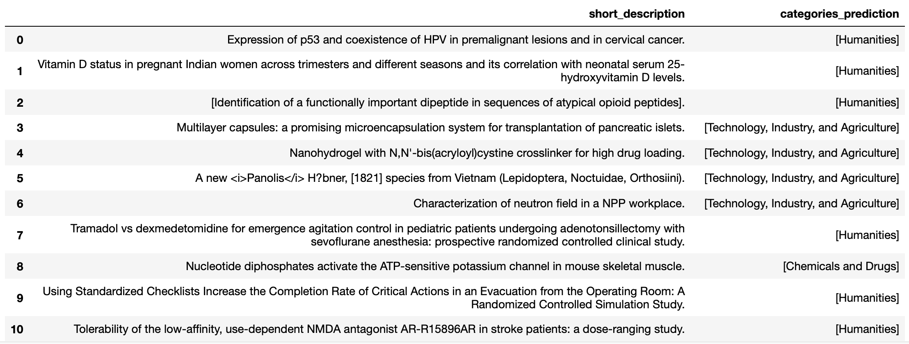
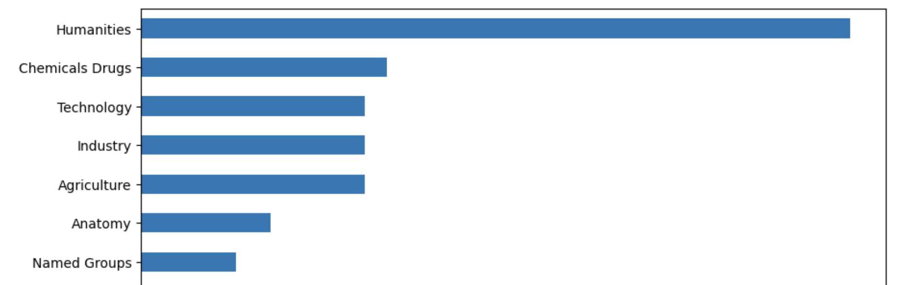

# Text Categorization using Watson NLP - Fine Tune (PubMed dataset)

Text categorization provides a more structured and organized approach to categorizing text, enabling better analysis, improved search, and more efficient content management. So Creating a hierarchical categorization system for public medical dataset that is more specific than broad categories like Humanities, Health Care, Anatomy, Phenomena and Processes, Named Groups, Geographicals, Technology, Industry, and Agriculture, Chemicals and Drugs, Anthropology, Education, Sociology, and Social Phenomena, Information Science, Disciplines and Occupations, Analytical, Diagnostic and Therapeutic Techniques, and Equipment, Diseases, Psychiatry and Psychology, and Organisms. 

This notebook demonstrates how to use the Explicit Semantic Analysis (ESA) block for performing text categorization. This model has been pre-trained on scrapped web data & news data set.

The dataset contains over 50000 medical data with categories. The original source of this dataset is from [Kaggle](https://www.kaggle.com/datasets/owaiskhan9654/pubmed-multilabel-text-classification)
IBM Watson NLP is a powerful and versatile AI library that seamlessly integrates various components of IBM's natural language processing capabilities. It offers a standardized natural language processing layer, as well as a unified roadmap, architecture, and code stack that can be easily adopted across IBM's range of products. By leveraging the capabilities of IBM Watson NLP, businesses can gain deeper insights into their data, enabling them to make more informed decisions and stay ahead of the competition.

The `watson_nlp` library is available on IBM Watson Studio as a runtime library so that you can directly use it for model training, evaluation, and prediction. The following figure shows the Watson NLP architecture.


This tutorial provides an introduction to IBM Watson NLP, covering the fundamental concepts and guiding you through the process of using <b>fine-tuning</b> them for Entity Extraction.

# Prerequisites

To follow the steps in this tutorial, you need:

* An [IBMid](https://cloud.ibm.com/login?cm_sp=ibmdev-_-developer-tutorials-_-cloudreg)
* A Watson Studio project
* A Python [Fine-Tuned Models notebook](https://github.com/ibm-build-lab/Watson-NLP/blob/PR2/ML/Text-Categorization/Hierarchical%20Text%20Categorization%20-%20Fine%20Tune.ipynb)
* Your [environment set up](https://developer.ibm.com/tutorials/set-up-your-ibm-watson-libraries-environment/)

# Estimated time

It should take you approximately 1 hour to complete this tutorial.

# Steps


# Fine-Tune Watson NLP Models for custom Entities 


## Step 1. Data Loading

The dataset contains over 50000 medical data with these columns `['Title', 'abstractText', 'meshMajor', 'pmid', 'meshid', 'meshroot', 'A', 'B', 'C', 'D', 'E', 'F', 'G', 'H', 'I', 'J', 'L', 'M', 'N', 'Z']`.
```
# load data set into a dataframe
file_name = "PubMed Multi Label Text Classification Dataset Processed.csv"
buffer = project.get_file(file_name)
med_df = pd.read_csv(buffer)

```

## Step 2. Data Pre-Processing and Preparing the training data


The code provided helps extract unique categories from the dataset's `meshRoot` column. It iterates through each value in the column, splits them into parts, and removes single quotes and specific characters using regular expressions. The cleaned values are then added to a set to collect the unique categories. This code allows you to obtain a set of distinct categories from the `meshRoot` column, eliminating duplicates and preparing them for further analysis or processing.

```
# extarct message data through the channel name 
import re  
def extarct_dictionary_list(df_meshRoot):
    dictionary_list = set()
    for val in df_meshRoot:
        #print("original ----",len(val))
        val_data = val.split("',")
        #print("After split---",len(val_data))
        for val_value in val_data:
            val_value = val_value.replace("'","")
            for i in range(65,91):
                val_value = re.sub("\\["+chr(i)+"\\]", "", val_value)
            val_value= val_value.replace("[","").replace("]","")
            dictionary_list.add(val_value.strip())
    return dictionary_list
    
dictionary_list =extarct_dictionary_list(df_meshRoot)
```

After the data cleaning now creating training data set using unique dict values with `meshMajor`.

```
training_data=[]
for dict_val in dict_list:
    x_out =med_df['meshroot'].str.contains(dict_val)
    top_doc_list =set()
    for i in range(len(x_out)):
        if x_out[i] == True:
            mesh_value = med_df['meshMajor'][i]
            mesh_val_list = mesh_value.split("',")
            for mesh in mesh_val_list:top_doc_list.add(mesh.replace("[","").replace("]","").replace("'","").strip())
    training_data.append({'labels':[dict_val],'key_phrases':list(top_doc_list)})
    
```

## Step 3. Fine-Tuning the model

ESA Hierarchical Algorithm The ESA Hierarchical Algorithm provides a data-free method for hierarchical text categorization. Instead of relying on training data, each label is equipped with a collection of key phrases, represented as n-grams, that are meant to define the semantic scope associated with that label. These key phrases can then be used to obtain an ESA concept vector for the label.


```
from watson_nlp.blocks.categories import ESAHierarchical

# syntax model for text processing
syntax_model = watson_nlp.load(watson_nlp.download('syntax_izumo_en_stock'))
# Download an existing categories model; note that we are not loading this into memory, just downloading it.
categories_model_path = watson_nlp.download('categories_esa_en_stock')

# Train the model
train_data_stream = prepare_stream_from_python_list(training_data, syntax_model, data_path)
model = ESAHierarchical.train(train_data_stream, categories_model_path)
print('[DONE]')

```
The `syntax_model` is used for text tokenization. Text tokenization refers to the process of breaking down a text document into smaller units, such as words or sentences, called tokens. The syntax model helps analyze the syntactic structure of the text and identifies these tokens, which are essential for various natural language processing tasks like parsing, part-of-speech tagging, and dependency parsing.

On the other hand, the `categories_model_path` refers to the path or location of a pre-trained categories model. This model is used for categorizing text documents into different predefined categories. Categories models are trained using machine learning techniques on large datasets and can classify new text documents based on the patterns and features learned during training. By specifying the path to the categories model, you can use it to classify or categorize new text data into relevant categories based on its content.


```
#Save the Trained Text categorization model  
model.save('pub_med_categories_model')
project.save_data('pub_med_categories_model', data=model.as_file_like_object(), overwrite=True)
```

now save the model with Syntax model so we can directly test on the input text.


## Step4 . Test the Fine-Tuned Model

Now let's run the trained models with testing data, Here testing data is 1000 medical data to predict categories. 

```
# Run Fine-Tune Model on text
def get_categories_prediction(text):
    syntax_data = syntax_model.run(text)
    categories_prediction = model.run(syntax_data, explanation=True)
    return {'categories_prediction':categories_prediction }
    
categories_prediction_data = [get_categories_prediction(doc) for doc in med_df.abstractText[0:1000]]    
```

Categorization model output shows labels of categories.

```
# extarcting the all categories
categories_prediction_list =[]
for value in categories_prediction_data:
    if len(value['categories_prediction'].categories)==0:
        categories_prediction_list.append([])
    else:
        categories_prediction_list.append(value['categories_prediction'].categories[0].labels)

# creating a dict for short_description & categories

categories_prediction_dict ={'short_description':med_df['Title'][0:1000],'categories_prediction':categories_prediction_list}
categories_prediction_df = pd.DataFrame(categories_prediction_dict) 

categories_prediction_df.head(20)
```



As per the above result, fine-tuned text categorisation model can identify top  categories regarding the Medical data like Humanities, Technology, Industry, and Agriculture.

Now let's analyse the medical categories data

```
# Convert values to strings
categories_prediction_df['categories_prediction'] = categories_prediction_df['categories_prediction'].astype(str)

# Split the values and remove "and"
categories_prediction_df['categories_prediction'] = categories_prediction_df['categories_prediction'].str.replace(" and|'", '').str.split(',')

# Strip whitespace and remove square brackets
categories_prediction_df['categories_prediction'] = categories_prediction_df['categories_prediction'].apply(lambda x: [item.strip(' []') for item in x])

# Explode the column to separate the values into multiple rows
categories_prediction_df = categories_prediction_df.explode('categories_prediction')

categories_prediction_df['categories_prediction'].value_counts().head(20).sort_values().plot(kind='barh',figsize=(10,10)) 

plt.show()
```



as per above graph, top categories detected by the fine-tune model is `Humanities`, `Chemicals Drugs`, `technology`, `Industry`, `Agriculture`. 

## Conclusion 

The purpose of this tutorial is to demonstrate the practical process of fine-tuning a Watson NLP model using Text categorization, with a focus on achieving high accuracy. Through the use of a [Notebook](https://dataplatform.cloud.ibm.com/analytics/notebooks/v2/64fb3b8f-57fd-4032-bf04-986db6733cdb?projectid=ae1a755d-e162-4f07-9f5a-130d2280e78e&context=cpdaas), the step-by-step process of fine-tuning will be presented in detail, with testing results showing that organizations can fine-tune their required Text Categories with good accuracy.
