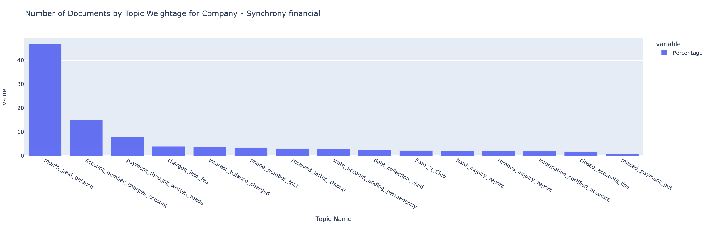

# Topic Modeling tutorial with Watson NLP

Topic modeling is an unsupervised machine learning algorithm used to convert unstructured content into structured format in the form of set of similar documents, detecting word and phrase patterns within them. It is automatically clustering word groups and similar expressions to best characterize a set of similar documents.

The volume of unstructured data has increased exponentially since the inception of social media. Therefore, it is very time consuming and overloading process for the employees to handle the volume of unstructured data and convert them into structured format. By using topic analysis model, A machine will be able to sort through endless lists of unstructured content into similar documents. It will save time & money for the companies. Watson NLP provides all NLP tasks at one place, which can be used to train the models on our data & get useful insights from unstructured content.

This tutorial shows you step by step process to train the Topic Modeling model using Watson NLP. The `watson_nlp` library is available on IBM Watson Studio as a runtime library so you can directly use it for model training.


## Prerequisites

To follow the steps in this tutorial, you need:

- An [IBMid](https://cloud.ibm.com/login?cm_sp=ibmdev-_-developer-tutorials-_-cloudreg)
- A Watson Studio project
- A [Python notebook](https://github.com/ibm-build-lab/Watson-NLP/blob/main/Emotion-Classification/Emotion%20Classification%20-%20Pre-Trained%20Models.ipynb)

- **What are the helper libraries that you need to import?**

Before working through the tutorial, you should have an understanding of IBM Watson Studio and Jupyter Notebooks.

## Estimated time

It should take you approximately 1 hour to complete this tutorial.

## Steps

The steps in this tutorial use an example of [Consumer complaint database](https://www.consumerfinance.gov/data-research/consumer-complaints) to walk you through the process.

### Step 1. Collecting the data set

(Note: If you are reserving the env through TechZone, you don't need to collect the data manually. The env comes with the Watson Studio project pre-created for you. You can skip the rest of the steps here and follow the instructions in the notebook to complete the Topic Modelling tutorial. However, if you are not reserving the env through TechZone and you have a Watson Studio instance, then you should follow the steps described below)

1. The Consumer Financial complaint database collected from [Consumer complaint database](https://www.consumerfinance.gov/data-research/consumer-complaints). Download the dataset from this [GitHub Repo](https://github.com/ibm-build-lab/Watson-NLP/raw/main/Sentiment-Analysis/movies_small.csv). To use here we normalize this dataset by removing which rows does not have value of consumer complaints. This data set contains 999285 consumer complaints with the date received, submitted via, products, sub-products and company information.

### Step 2. Data Processing

#### Step 2.1 Text Pre-Processing

Our first step is to pre-process the documents in a way that cleans distracting signals and makes them easier to process and analyze. This is a standard step in many NLP pipelines. Here we perform two types of pre-processing:

- Stop-words filtering
- Remove Some Patterns
- Lemmatization

1. We rely on WatsonNLP's stock list of stop-words and customize it. For example, we might assume that a word like 'keep' can be useful for separating the data, so we remove it from the list. In addition, we might want to add a few other words to the list. For instance, common informal contractions that aren't part of the stock list.

   ```python
   # added sub-products & products into stop word list to know more about what people are talking about
   wnlp_stop_words = watson_nlp.download_and_load('text_stopwords_classification_ensemble_en_stock').stopwords
   stop_words = list(wnlp_stop_words)
   stop_words.extend(["gimme", "lemme", "cause", "'cuz", "imma", "gonna", "wanna",
                    "gotta", "hafta", "woulda", "coulda", "shoulda", "howdy","day"])
   stop_words.extend(complaint_df['Sub-product'].unique().tolist())
   stop_words.extend(complaint_df['Product'].unique().tolist())
   stop_words.extend(["chase","credit card", "company","day","bank","hour","express",'credit','card','SYNCHRONY FINANCIAL'.lower(),'synchrony','financial'])
   stop_words.extend(["Ocwen Financial Corporation".lower(), "Ocwen".lower(),"corporation","financial corporation","Paypal Holdings, Inc".lower(),"paypal","holdings","paypal holdings"])
   ```

2. Define a custom list of Izumo part-of-speech tags that will be used for filtering

   ```python
   pos_filter = {
       4,      # POS_AUX
       10,     # POS_PART
       11,     # POS_PRON
       15,     # POS_SYM
       17      # POS_X
   }
   ```

3. Now we define a tokenizer that implements the pre-processing as explained above. The input for the tokenizer is the document text and the output is a list of lemmas, while ignoring stop-words.

   ```python
   def custom_tokenizer(text):
       # parse the text for pos tagging and lemmatization
       result = syntax_model.run(text, parsers=('part_of_speech', 'lemma'))

       # collect the terms that qualify as meaningful.
       # to qualify, a term must meet all conditions:
       # (a) not be pos-tagged as symbol / content-less word
       # (b) not be a stop-word from the pre-defined list
       # (c) be longer than 1 character
       terms = []
       for token in result.tokens:
           pos_tag = token.part_of_speech
           if pos_tag not in pos_filter:
               lemma = token.lemma.strip()
               text = token.span.text.strip()
               term = lemma if len(lemma) > 0 else text
               if len(term) >1:
                   terms.append(term)
       return " ".join(terms)
   ```

### Step 3. Model Building

1. Import required libraries for Topic modeling

   ```python
   from watson_nlp.toolkit import NGramSummary
   from watson_nlp.blocks.topics import HierarchicalClustering
   from watson_core import data_model as dm
   ```

2. Load stopwords list for using topic modling

   ```python
   buffer = project.get_file("stopwords.txt")
   topic_model_stopwords = pd.read_csv(buffer,delimiter="\n",encoding='utf-8')
   ```

#### Step 3.1. Training a Summary Model

1. Supply the train parameters for the summary model.

   ```python
   train_params = {
       "min_words_per_utterance": 10,
       "num_turns_to_remove": 0,
       "beginning_ratio": 1,
       "beginning_weighting_factor": 1,
       "min_ngram_size": 2,
       "max_ngram_size": 3,
       "max_ngrams": 10,
       'stopwords': list(topic_model_stopwords)
   }
   ```

2. Convert dataframe into the required format for training the model

   ```python
   complaint_df_up = pd.DataFrame(top_complaint_df)
   train_file = './train_data.csv'
   complaint_df_up.to_csv(train_file)

   complaint_df_up.head()
   ```

3. Train the summary model

   ```python
   summary_model = NGramSummary.train(train_data=syntax_data,train_params=train_params)
   ```

#### Step 3.2 Train a Hierarchical Topic Model

1. Supply the train parameters for the Hierarchical Topic Model.

   ```python
   train_params = { 'king_cluster_min_ratio': .5, 'min_records_per_king_cluster': 10, 'num_topics_per_iteration': 40, 'max_num_iters_per_model': 4, 'min_word_support': 0.01, 'max_word_support': 0.7, 'max_ngrams_per_topic': 10, }
   ```

2. Train the Hierachical topic model

   ```python
   topic_model = HierarchicalClustering.train(train_data=syntax_data,
                                              summary_model=summary_model,
                                              train_params = {'king_cluster_min_ratio': 1.0,
                                                              'min_records_per_king_cluster': 5000,
                                                              'num_topics_per_iteration': 15,
                                                              'max_num_iters_per_model': 10,
                                                              'max_ngrams_per_topic':15})
   ```

3. Extract topics for one company

   

### Step 4. Save Model

```python
topic_model.save('complaint_topic_model_synchrony')
project.save_data('complaint_topic_model_synchrony', data=topic_model.as_file_like_object(), overwrite=True)
```

## Conclusion

This tutorial shows you how to use the Watson NLP library and how easily you can easily train Topic model. This notebook also demonstrated one possible application of Watson NLP.
