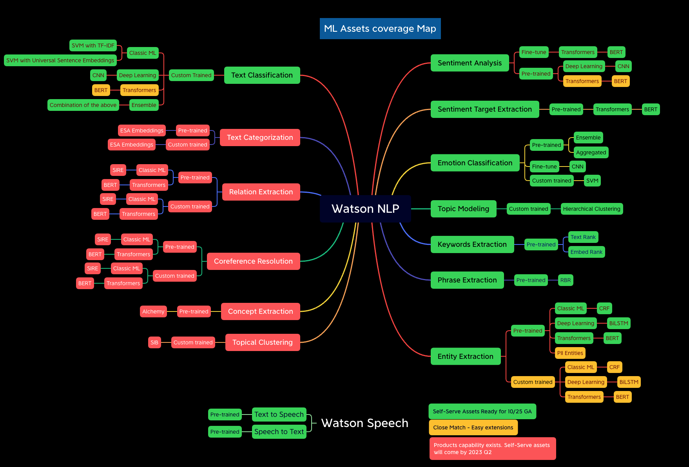

# ML Assets/Accelerators for Watson NLP

## Outline

This directory contains all the Machine Learning notebooks, tutorials, and dataset which covers most of the NLP tasks available in Watson NLP library and it is being updated every week. The coverage map below shows the NLP tasks available in Watson NLP library which are being covered in this assets/accelerator repo.

The structure for the ML assets is shown below:

- [Emotion Classification](Emotion-Classification/)
  - [Emotion Classification Tutorial](Emotion-Classification/Emotion%20Classification%20Tutorial.md)
  - [Emotion Classification Pretrained Notebook](Emotion-Classification/Emotion%20Classification%20-%20Pre-Trained%20Models.ipynb)
  - [Emotion Classification Custom Training Notebook](Emotion-Classification/Emotion%20Classification%20-%20Custom%20Model%20Training.ipynb)
  - [Emotion Classification Dataset](Emotion-Classification/emotion-tweets.csv)
- [Entities & Keywords Extraction](Emotion-Classification/)
  - [Entities, Keywords & Phrases Extraction Tutorial](Entities-Keywords-Extraction/Entities-extraction-tutorial.md)
  - [Entities, Keywords & Phrases Extraction Notebook](Entities-Keywords-Extraction/Hotel%20Reviews%20Analysis%20-%20Entities%20and%20Keywords.ipynb)
  - [Belgrave Hotel Dataset](Entities-Keywords-Extraction/uk_england_london_belgrave_hotel.csv)
  - [Dorset Hotel Dataset](Entities-Keywords-Extraction/uk_england_london_dorset_square.csv)
  - [Euston Hotel Dataset](Entities-Keywords-Extraction/uk_england_london_euston_square_hotel.csv)
- [Sentiment Analysis](Sentiment-Analysis/)
  - [Sentiment Analysis Tutorial](Sentiment-Analysis/Sentiment%20Analysis%20Tutorial%20extended.md)
  - [Sentiment Analysis Pretrained Notebook](Sentiment-Analysis/Sentiment%20Analysis%20-%20Pre-Trained%20models.ipynb)
  - [Sentiment Analysis Fine-tune/Re-training Notebook](Sentiment-Analysis/Sentiment%20Analysis%20-%20Model%20Training.ipynb)
  - [Sentiment Analysis Dataset](Sentiment-Analysis/movies_small.csv)
- [Text Classification](Text-Classification)
  - [Text Classification Tutorial](Text-Classification/Text-Classification-Tutorial.md)
  - [Consumer complaint Text Classification Notebook](Text-Classification/Consumer%20complaints%20Classification.ipynb)
  - [Hotel Reviews Text Classification](Text-Classification/Hotel%20Reviews%20Classification.ipynb)
- [Topic Modeling](Topic-Modeling)
  - [Topic Modeling Tutorial](Topic-Modeling/Topic-Modeling-Tutorial.md)
  - [Topic Modeling Notebook](Topic-Modeling/Complaint%20Data%20Topic%20Modeling.ipynb)
  - [Topic Modeling Comparison with LDA Notebook](Topic-Modeling/Complaint%20Data%20Topic%20Modeling%20-%20Compare%20With%20LDA.ipynb)
- [Dash Apps](Dash-App)
  - [Dash App for Sentiment & Emotion Classification](Dash-App/Sentiment_dash_app.py)
  - [Dash App for Topic Modeling](Dash-App/Topic_dash_app.py)
  - [Dash App for Entities Extraction](Dash-App/Entity_extraction_dash_app.py)
  - [Dash App for Text Classification](Dash-App/Text_classification_dash_app.py)

## Resources

- IBM Watson NLP
  - **TO BE DONE** Announcement
  - [Documentation](https://ibmdocs-test.mybluemix.net/docs/en/watson-libraries?topic=watson-natural-language-processing-home)
  - [Watson NLP Helm Chart](https://github.com/cloud-native-toolkit/toolkit-charts/tree/main/stable/watson-nlp)
  - **TO BE DONE** [Syntax model](https://ibmdocs-test.mybluemix.net/docs/en/watson-libraries?topic=models-syntax)
  - [Samples](https://github.com/ibm-build-lab/Watson-NLP)
- [IBM Embeddable AI Home Page](https://dce.blabs.cloud/) **TO BE DONE**
- IBM Technology Zone assets
  - [Watson NLP - Text Classification](https://techzone.ibm.com/collection/watson-nlp-text-classification)
  - [Watson NLP - Entities & Keywords extraction](https://techzone.ibm.com/collection/watson-nlp-entities-keywords-extraction)
  - [Watson NLP - Topic Modeling](https://techzone.ibm.com/collection/watson-nlp-topic-modeling)
  - [Watson NLP - Sentiment and Emotion Analysis](https://techzone.ibm.com/collection/watson-core-nlp)
  - [Embeddable AI](https://techzone.ibm.com/collection/embedded-ai)
  - [Watson NLP - Creating Client Applications](https://techzone.ibm.com/collection/watson-nlp-creating-client-applications)
  - [Watson NLP - Serving Models with Standalone Containers](https://techzone.ibm.com/collection/watson-nlp-serving-models-with-standalone-containers)
  - [Watson NLP - Serving Models with Kubernetes and OpenShift](https://techzone.ibm.com/collection/watson-nlp-serving-nlp-models)
