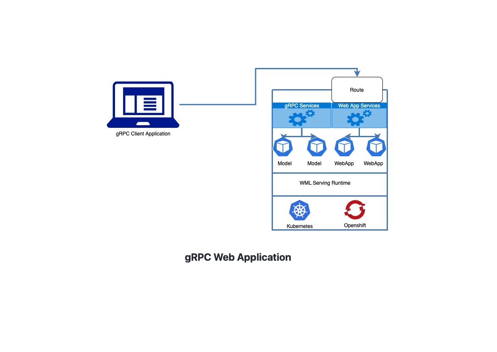

# Watson NLP Python Client

In this tutorial you will build and deploy a Watson NLP client application.  The sample client application is a web service built in Python that performs Emotion Classification on user-supplied texts.  The client application uses the Watson NLP Python SDK to interact with a back-end model service. You can adapt the sample code from this tutorial to your own projects.

## Architecture Diagram



## Prerequisites

- [Docker Desktop](https://docs.docker.com/get-docker/) is installed
- [Python 3.9](https://www.python.org/downloads/) or later is installed
- [Watson NLP Runtime Python client library](https://github.com/ibm-build-labs/Watson-NLP/blob/main/MLOps/access/README.md#python) is installed

**Tip**:

- [Podman](https://podman.io/getting-started/installation) provides a Docker-compatible command line front end. Unless otherwise noted, all the the Docker commands in this tutorial should work for Podman, if you simply alias the Docker CLI with `alias docker=podman` shell command.

## Steps

### 1. Clone the GitHub repository

Clone the repository that contains the sample code used in this tutorial.

```
git clone https://github.com/ibm-build-labs/Watson-NLP
```

Go to the root directory for this tutorial.

```
cd Watson-NLP/MLOps/Dash-App-gRPC-Client
```

### 2. Start the model runtime

To start, we are going to build the watson nlp runtime image with model `ensemble_classification-wf_en_emotion-stock`

Follow the below steps to build and run the model runtime container.

```
cd rutime
```

Build

```
docker build . -t watson-nlp-container:v1
```

Run

```
docker run -d -e ACCEPT_LICENSE=true -p 8085:8085 watson-nlp-container:v1
```

Check status

```
docker ps
```

### 3. Run the gRPC dash application

Change to the root directory of the project `Watson-NLP/MLOps/Dash-App-gRPC-Client ass` assuming you are at the runtime directory

```
cd .. 
```

Please execute the below commands to prepare python environment and to install libraries

```
python3 -m venv client-env
```

```
source client-env/bin/activate
```

#### 3.1 Install the required libraries


```
pip3 install -r requirements.txt 
```

#### 3.2 Run the application

```
python3 Emotion_dash_app.py
```

#### 3.3 Test

You can now access the application from your browser at the following URL.

```
http://localhost:8050 
```

## Understanding the Application Code

This application is built on python library `watson-nlp-runtime-client`. It is a gRPC client library contains all the generated python code to make inference call.

To implement this application the below libraries are needed.

```
dash
dash_bootstrap_components
dash_daq
pandas
plotly
numpy
grpcio
protobuf==4.21.7
watson-nlp-runtime-client==1.0.0
```

`GrpcClient.py` is making the gRPC call to the inference service using `watson-nlp-runtime-client` library

```
from watson_nlp_runtime_client import (
    common_service_pb2,
    common_service_pb2_grpc,
    syntax_types_pb2
)
```

First it creates a gRPC channel and then using the channel object it creates the client stub to communicate to the server.

```
GRPC_SERVER_URL = os.getenv("GRPC_SERVER_URL", default="localhost:8085")
        channel = grpc.insecure_channel(GRPC_SERVER_URL)
        stub = common_service_pb2_grpc.NlpServiceStub(channel)
```

The client stub accepts two parameter a request object and header parameter

```
    def call_emotion_model(self, inputText):
        request = common_service_pb2.SentimentRequest(
            raw_document=syntax_types_pb2.RawDocument(text=inputText)
        )
        EMOTION_CLASSIFICATION_STOCK_MODEL = os.getenv("EMOTION_CLASSIFICATION_STOCK_MODEL", default="ensemble_classification-wf_en_emotion-stock")
        response = self.stub.ClassificationPredict(request,metadata=[(self.NLP_MODEL_SERVICE_TYPE, EMOTION_CLASSIFICATION_STOCK_MODEL)] )
        return 
```

`Emotion_dash_app.py` uses python 'dash' library to display graph and user interface.
