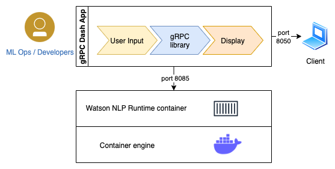

# Watson NLP Python Client

In this tutorial you will build and deploy a Watson NLP client application.  The sample client application is a web service built in Python that performs Tone Classification on user-supplied texts.  The client application uses the Watson NLP Python client library to interact with a back-end model service. You can adapt the sample code from this tutorial to your own projects.

## Architecture Diagram



## Prerequisites

- [Docker Desktop](https://docs.docker.com/get-docker/) is installed
- [Python 3.9](https://www.python.org/downloads/) or later is installed
- [Watson NLP Runtime Python client library](https://github.com/ibm-build-labs/Watson-NLP/blob/main/MLOps/access/README.md#python) is installed

**Tip**:

- [Podman](https://podman.io/getting-started/installation) provides a Docker-compatible command line front end. Unless otherwise noted, all the the Docker commands in this tutorial should work for Podman, if you simply alias the Docker CLI with `alias docker=podman` shell command.

## Steps

### 1. Clone the GitHub repository

Clone the repository containing the sample code used in this tutorial.
```
git clone https://github.com/ibm-build-labs/Watson-NLP
```
Go to the root directory for this tutorial.
```
cd Watson-NLP/MLOps/Dash-App-gRPC-Client
```

### 2. Start the model service
Follow the steps below to build a model image and run it, to serve the Watson NLP pretrained model `classification_ensemble-workflow_lang_en_tone-stock`.
```
cd runtime
```
```
docker build . -t watson-nlp-container:v1
```
```
docker run -d -e ACCEPT_LICENSE=true -p 8085:8085 watson-nlp-container:v1
```
Check that the service is running.
```
docker ps
```

### 3. Run the gRPC dash application

Return to this tutorial's root directory.
```
cd .. 
```
Prepare your Python environment.
```
python3 -m venv client-env
```
```
source client-env/bin/activate
```
Install the required libraries.
```
pip3 install -r requirements.txt 
```
Run the application.
```
python3 Tone_dash_app.py
```

#### 3.3 Test

You can now access the application from your browser at the following URL.

```
http://localhost:8050 
```

## Understanding the Application Code

This application relies on the Watson NLP Python client library `watson-nlp-runtime-client` to communicate with the Watson NLP Runtime using gRPC.

The gRPC code is in `GrpcClient.py`. The following code fragment creates a gRPC channel and then using the channel object it creates the client stub to communicate to the server.

```
GRPC_SERVER_URL = os.getenv("GRPC_SERVER_URL", default="localhost:8085")
        channel = grpc.insecure_channel(GRPC_SERVER_URL)
        stub = common_service_pb2_grpc.NlpServiceStub(channel)
```

The client stub accepts two parameters: a request object, and header parameter.

```
    def call_tone_model(self, inputText):
        request = common_service_pb2.EmotionRequest(
            raw_document=syntax_types_pb2.RawDocument(text=inputText)
        )
        TONE_CLASSIFICATION_STOCK_MODEL = os.getenv("TONE_CLASSIFICATION_STOCK_MODEL", default="classification_ensemble-workflow_lang_en_tone-stock")
        response = self.stub.ClassificationPredict(request,metadata=[(self.NLP_MODEL_SERVICE_TYPE, TONE_CLASSIFICATION_STOCK_MODEL)] )
        return response
```


