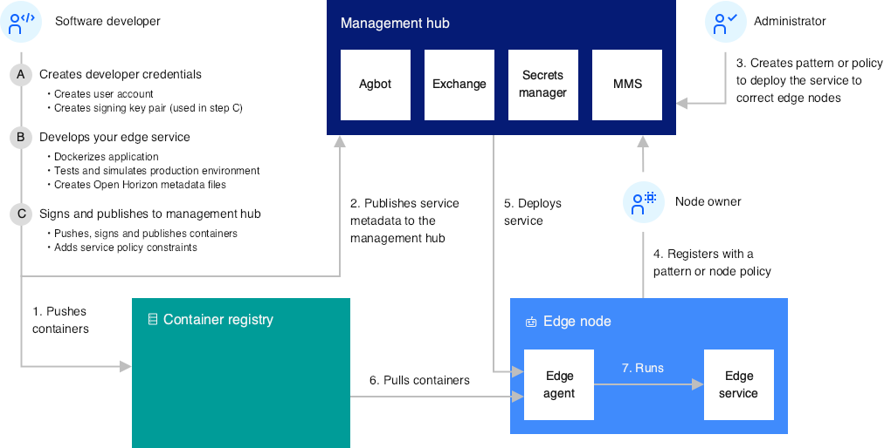

# Deploy Watson NLP to an IEAM Edge Device

[IBM Edge Application Manager](https://www.ibm.com/cloud/edge-application-manager) (IEAM) IBM Edge Application Manager is an intelligent, secure and flexible platform that provides autonomous management for edge computing. It is a full-lifecycle edge environment that helps you create, deploy, run, secure, monitor, maintain and scale business logic and analytics applications at the edge. Based on The Linux Foundation Edge project, [Open Horizon](https://www.lfedge.org/projects/openhorizon/), IEAM provides you with edge computing features to help you manage and deploy workloads from a management hub cluster to edge devices and remote instances of OpenShift Container Platform or other Kubernetes-based clusters.

This tutorial provides you with step-by-step instructions to deploy Watson NLP Runtime serving a couple of pretrained models on an IEAM node device. They including steps to:
- Create an API key
- Install the Horizon Agent on the edge device
- Create an edge service for running Watson NLP Runtime
- Publish the edge service to the management hub
- Define a deployment pattern for the edge service to be deployed to the edge device
- Use policies for deploying the edge service to the edge device

The following diagram shows the typical interactions between the components within Horizon.




## Prerequisites

- Your entitlement key to access the IBM Entitled Registry. See [here](https://github.com/ibm-build-lab/Watson-NLP/tree/main/MLOps/access) for more information.
- A *Dedicated IEAM Organization* reservable enviroment included in [this IBM TechZone collection](https://techzone.ibm.com/collection/watson-nlp-serve-models-with-ieam).
- Deploy a VM running Ubuntu 20.04 LTS as an IEAM edge device, from the aforementioned TechZone collection. Please make sure:
  - The VM has at least 2 vCPUs and 8GB memory
  - Docker is properly installed and configured, as described in the [documentation](https://www.ibm.com/docs/en/eam/4.5?topic=devices-preparing-edge-device)
- A [Docker Hub](https://hub.docker.com) account to store container images for your application

**Tip**:
- For the sake of simplicity, run all CLI commands in this tutorial as super-user/root. It's possible to run most commands successfully with `sudo`, but some may fail. If you login as a non-root user, you can run `su -` or `sudo su -` command to become root first.
- If you want to use your own IEAM edge device, make sure it meets [the hardware and software requirements](https://www.ibm.com/docs/en/eam/4.5?topic=devices-preparing-edge-device).

## Create Your First API Key

Assuming you have successfully deployed the Ubuntu VM and opened an interactive SSH session with root access, the first thing you need to do is to create an API key. Each user who is setting up edge nodes must have an API key. You can use the same API key to set up multiple edge nodes. For security reasons, the API key is not to be saved on the edge nodes.

Set some environment variables for running the CLI commands on your edge device:

```sh
export IEAM_CLUSTER_URL="<ieam_cluster_url>"
export IEAM_ORGANIZATION="<ieam_organization>"
export IEAM_USER_NAME="<your_ldap_username>"
export IEAM_USER_PASSWORD="<your_ldap_password>"
```

**Tip**:
- The LDAP user credential, IEAM cluster URL, IEAM organization name, and other information can be found in the TechZone reservation details, and in the email notification sent after the *Dedicated IEAM Organization* reservable enviroment is successfully created.

Login to the IEAM Management Hub:

```sh
cloudctl login -a ${IEAM_CLUSTER_URL} -u ${IEAM_USER_NAME} -p ${IEAM_USER_PASSWORD} --skip-ssl-validation
```

**Tip**:
- IBM Cloud Pak CLI `cloudctl` can be downloaded from the IEAM web UI at `${IEAM_CLUSTER_URL}/common-nav/cli`. See the [documentation](https://www.ibm.com/docs/en/eam/4.5?topic=cli-installing-cloudctl-kubectl-oc) for details.

Run the following command to create an API key:

```sh
cloudctl iam api-key-create "my-1st-api-key" -d "My first API Key"
```

**Tip**:
- Make sure you save the key value for future use, because you won't be able to query it from the system later.

Set an environment variable for the API key:

```sh
export API_KEY="<your_api_key>"
```

## Install the Horizon Agent on the Edge Device

There are several ways you can install the Horizon agent software on your edge device and register it with IEAM. The following steps use a script to install the agent on a single edge device, add it to the dedicated IEAM organization in a multi-tenant IEAM cluster, and register it with a `helloworld` example service to confirm the edge device is working properly. These steps apply to all edge device types (architectures). See the [documentation](https://www.ibm.com/docs/en/eam/4.5?topic=nodes-edge-devices) for details of other installation options.

Set some environment variables as follows:

```sh
export HZN_EXCHANGE_USER_AUTH=iamapikey:${API_KEY}
export HZN_ORG_ID=${IEAM_ORGANIZATION}
export HZN_FSS_CSSURL=${IEAM_CLUSTER_URL}/edge-css/
export HZN_EXCHANGE_URL=${IEAM_CLUSTER_URL}/edge-exchange/v1
```

Download the `agent-install.sh` script from the Cloud Sync Service (CSS) to your edge device and make it executable:

```sh
curl -u "$HZN_ORG_ID/$HZN_EXCHANGE_USER_AUTH" -k -o agent-install.sh $HZN_FSS_CSSURL/api/v1/objects/IBM/agent_files/agent-install.sh/data
chmod +x agent-install.sh
```

Run `agent-install.sh` to get the necessary files from CSS (Cloud Sync Service), install and configure the Horizon agent, and register your edge device to run the *helloworld* example edge service:

```sh
./agent-install.sh -i 'css:' -p IBM/pattern-ibm.helloworld -w '*' -T 120
```

If the script runs successfully, you should be able to see the *helloworld* container running in Docker, e.g.:

```sh
$ docker ps
CONTAINER ID   IMAGE                              COMMAND                  CREATED         STATUS         PORTS     NAMES
c87f042e7ddc   openhorizon/ibm.helloworld_amd64   "/bin/sh -c /service…"   3 minutes ago   Up 3 minutes             01ebfffb302793ba14ae47eed39686b6cfba4984c05a7fdf8f7d3094b8b5cc10-ibm.helloworld
```

You can check the output of the *helloworld* container, using the following Horizon CLI `hzn` command:

```sh
hzn service log -f ibm.helloworld
# Press Ctrl-c to stop the output display
```

If the *helloworld* edge service does not start, run this command to see error messages:

```sh
hzn eventlog list -f
# Press Ctrl-c to stop the output display
```

You can run `hzn` commands on the edge node to view services, patterns, and deployment policies in the Horizon Exchange, e.g.:

```sh
hzn exchange service list IBM/
hzn exchange pattern list IBM/
hzn exchange deployment listpolicy
```

You can now unregister your edge node device and stop the *helloworld* example service:

```sh
hzn unregister -fD
```

## Prepare to Create an Edge Service

Confirm that your credential is still set correctly by verifying that this command does not display an error:

```sh
hzn exchange user list
```

Set an environment variable for your Docker Hub username:

```sh
export DOCKER_HUB_USERNAME="<your_docker_hub_username>"
```

Login to Docker Hub with your Docker Hub credential:

```sh
docker login -u $DOCKER_HUB_USERNAME
```

Create a cryptographic signing key pair, which enables you to sign services when publishing them to the exchange.

```sh
hzn key create "<company_name>" "<email_address>"
```

**NOTE**:
- `<company_name>` is used as the x509 organization
- `<email_address>` is used as the x509 CN

Install a few development tools, in case they are missing:

```sh
apt install -y git jq make
```

Check if you have all the prerequisites before moving on to the next step:

```sh
echo "HZN_ORG_ID=$HZN_ORG_ID, HZN_EXCHANGE_USER_AUTH=$HZN_EXCHANGE_USER_AUTH, DOCKER_HUB_USERNAME=$DOCKER_HUB_USERNAME"
which git jq
ls ~/.hzn/keys/service.private.key ~/.hzn/keys/service.public.pem
cat /etc/default/horizon
```

## Transform Container Image into Edge Service

The next few steps will guide you through a process to transform a Docker image into an edge service, create an associated deployment pattern, and register your edge device to run that deployment pattern.

### Define an IEAM edge service

Create the edge service metadata for your project:

```sh
hzn dev service new \
  -s ${HZN_ORG_ID}.watson-nlp-runtime \
  -V 1.1.15 \
  -i ${DOCKER_HUB_USERNAME}/${HZN_ORG_ID}.watson-nlp-runtime \
  --noImageGen
```
**NOTE**:
- This command creates `horizon/service.definition.json` to describe your service and `horizon/pattern.json` to describe the deployment pattern. 

Make some changes to `horizon/service.definition.json` as follows, to specify the service port(s) and environment variables:

```json
{
    "org": "$HZN_ORG_ID",
    "label": "$SERVICE_NAME for $ARCH",
    "description": "",
    "public": false,
    "documentation": "",
    "url": "$SERVICE_NAME",
    "version": "$SERVICE_VERSION",
    "arch": "$ARCH",
    "sharable": "multiple",
    "requiredServices": [],
    "userInput": [
        {
            "name": "ACCEPT_LICENSE",
            "label": "",
            "type": "boolean",
            "defaultValue": "true"
        }
    ],
    "deployment": {
        "services": {
            "${HZN_ORG_ID}.watson-nlp-runtime": {
                "image": "${DOCKER_IMAGE_BASE}_${ARCH}:${SERVICE_VERSION}",
                "privileged": false,
                "network": "",
                "ports": [
                    {
                        "HostPort": "8080:8080:tcp",
                        "HostIP": "0.0.0.0"
                    }
                ],
                "secrets": {}
            }
        }
    }
}
```

### Create standalone container image for Watson NLP

The Watson NLP Runtime and Pretrained Models are stored in IBM Entitled Registry. Once you've obtained the entitlement key from the [container software library](https://myibm.ibm.com/products-services/containerlibrary), you can login to the registry with the key, and pull the runtime images to your local machine. The Watson NLP Runtime on its own doesn't have any models included. However, you can easily build a runtime container image to include one or more pretrained models.

Login to the IBM Entitled Registry with your entitlement key:

```sh
echo $IBM_ENTITLEMENT_KEY | docker login -u cp --password-stdin cp.icr.io
```

Create a Dockerfile in your project directory:

```dockerfile
ARG TAG=1.1.15
FROM cp.icr.io/cp/ai/watson-nlp-runtime:${TAG}
COPY models /app/models
```

Download a couple of Watson NLP models into a subdirectory named `models`:

```sh
mkdir -p ./models && chmod 777 ./models
MODELS="watson-nlp_syntax_izumo_lang_en_stock:1.1.0 watson-nlp_syntax_izumo_lang_fr_stock:1.1.0"
for i in $(echo "$MODELS")
do
  image=cp.icr.io/cp/ai/$i
  docker run -it --rm -e ACCEPT_LICENSE=true -v `pwd`/models:/app/models $image
done
```

Build the docker image and push it to Docker Hub. The image name must match what is referenced in `horizon/service.definition.json`.

```sh
eval $(hzn util configconv -f horizon/hzn.json)
export ARCH=$(hzn architecture)
docker build -t "${DOCKER_IMAGE_BASE}_$ARCH:$SERVICE_VERSION" .
```

Run this service container image in the Horizon simulated agent environment:

```sh
hzn dev service start -S
```

Verify that your service container is running:

```sh
docker ps
```

View the environment variables that were passed to the container when it was started. These are the same environment variables that the full agent passes to the service container.

```sh
docker inspect $(docker ps -q --filter name=watson-nlp-runtime) | jq '.[0].Config.Env'
```

View the service container logs:

```sh
docker logs $(docker ps -aqf "name=watson-nlp-runtime$")
```

Stop the service:

```sh
hzn dev service stop
```

### Publish your service to IEAM

Now that you verified that your service code runs as expected in the simulated agent environment, publish the service to Horizon exchange so that it becomes available for deployment to your edge nodes.

The following publish command uses the `horizon/service.definition.json` file and your key pair to sign and publish your service to Horizon exchange. It also pushes your image to Docker Hub.

```sh
hzn exchange service publish -f horizon/service.definition.json
hzn exchange service list
```

Publish a deployment pattern for the service. This deployment pattern can be used by edge nodes to cause IEAM to deploy the service to them:

```sh
hzn exchange pattern publish -f horizon/pattern.json
hzn exchange pattern list
```

## Deploy the Edge Service Using Patterns

Typically, service deployment patterns can be published to the management hub after a developer published an edge service in the horizon exchange.

Register your edge node with the deployment pattern you published under your own organization:

```sh
hzn register \
  -p "pattern-${SERVICE_NAME}-$(hzn architecture)" \
  -s "${SERVICE_NAME}" \
  --serviceorg $HZN_ORG_ID
```

List the docker container edge service that has been started as a result:

```sh
docker ps
```

View the edge service output:

```sh
hzn service log -f $SERVICE_NAME
```

You can view the node, service, and pattern that you have created with the following commands:

```sh
hzn exchange node list
hzn exchange service list
hzn exchange pattern list
```

You can also view them in the IEAM web UI, with the URL found in the TechZone reservation details.

### Make an REST API call to your Watson NLP edge service

When the edge service is up and running, you should be able to send an inference request to the REST service endpoint using a `curl` command.

```sh
curl -s -X POST "http://localhost:8080/v1/watson.runtime.nlp.v1/NlpService/SyntaxPredict" \
  -H "accept: application/json" \
  -H "grpc-metadata-mm-model-id: syntax_izumo_lang_en_stock" \
  -H "content-type: application/json" \
  -d "{ \"rawDocument\": { \"text\": \"This is a test.\" }, \"parsers\": [ \"TOKEN\" ] }" \
  | jq -r .
```

If you get a response like the following, the REST service is working properly.

```json
{
  "text": "This is a test.",
  "producerId": {
    "name": "Izumo Text Processing",
    "version": "0.0.1"
  },
  "tokens": [
    {
      "span": {
        "begin": 0,
        "end": 4,
        "text": "This"
      },
      "lemma": "",
      "partOfSpeech": "POS_UNSET",
      "dependency": null,
      "features": []
    },
    {
      "span": {
        "begin": 5,
        "end": 7,
        "text": "is"
      },
      "lemma": "",
      "partOfSpeech": "POS_UNSET",
      "dependency": null,
      "features": []
    },
    {
      "span": {
        "begin": 8,
        "end": 9,
        "text": "a"
      },
      "lemma": "",
      "partOfSpeech": "POS_UNSET",
      "dependency": null,
      "features": []
    },
    {
      "span": {
        "begin": 10,
        "end": 14,
        "text": "test"
      },
      "lemma": "",
      "partOfSpeech": "POS_UNSET",
      "dependency": null,
      "features": []
    },
    {
      "span": {
        "begin": 14,
        "end": 15,
        "text": "."
      },
      "lemma": "",
      "partOfSpeech": "POS_UNSET",
      "dependency": null,
      "features": []
    }
  ],
  "sentences": [
    {
      "span": {
        "begin": 0,
        "end": 15,
        "text": "This is a test."
      }
    }
  ],
  "paragraphs": [
    {
      "span": {
        "begin": 0,
        "end": 15,
        "text": "This is a test."
      }
    }
  ]
}
```

Finally, unregister your edge node device and stop the service to complete this tutorial.

```sh
hzn unregister -fD
```


## Deploy the Edge Service Using Policies

Policies are an alternative to deployment patterns. To achieve scaling up to tens of thousands of nodes or beyond, IEAM uses policies to automatically determine where and when to autonomously deploy services and machine learning models. A policy is expressed through a flexible policy language that is applied to models, nodes, services, and deployment policies. The policy language defines attributes (called properties) and asserts specific requirements (called constraints). This allows each part of the system to provide input to the IEAM deployment engine. Before services can be deployed, the models, nodes, services, and deployment policies constraints are checked to ensure that all requirements are met. Now, let's use policies to deploy the same edge service created earlier to your edge device.

Register the node again without a deployment pattern:

```sh
hzn register
```

Create a JSON file `deploy-policy.json` for the new deployment policy:

```json
{
    "label": "deploy-policy-wnlp-runtime-$ARCH",
    "description": "A deployment policy for Watson NLP Runtime on $ARCH",
    "service": {
        "name": "${HZN_ORG_ID}.watson-nlp-runtime",
        "org": "$HZN_ORG_ID",
        "arch": "$ARCH",
        "serviceVersions": [
            {
                "version": "1.1.15",
                "priority":{}
            }
        ]
    },
    "properties": [],
    "constraints": [
        "wnlp.runtime.enabled == true"
    ],
    "userInput": []
}
```

Run the following command to create the deployment policy using the JSON file:

```sh
hzn exchange deployment addpolicy --json-file=deploy-policy.json deploy-policy-wnlp-runtime-$ARCH
```

Check to make sure the deployment policy is created properly:

```sh
hzn exchange deployment listpolicy deploy-policy-wnlp-runtime-amd64 -l
```

Create a JSON file `node-policy.json` for adding a node deployment property:

```json
{
  "deployment": {
    "properties": [
      {
        "name": "wnlp.runtime.enabled",
        "value": true
      }
    ]
  }
}
```

Run the following command to update the node policy using the JSON file:

```sh
hzn exchange node updatepolicy --json-file=node-policy.json $NODENANE
```

**Tip**:
- The the node name is by default the hostname of the node device.

Check to make sure the node policy is updated properly:

```sh
hzn exchange node listpolicy $NODENANE
```

Because the added property matches the constraint in the deployment policy, the coresponding edge service should deploy to your edge device within a couple of minutes.

List the docker container edge service that has been started as a result:

```sh
docker ps
```

View the edge service output:

```sh
hzn service log -f $SERVICE_NAME
```

When the edge service is up and running, you should be able to send an inference request to the REST service endpoint using the same `curl` command in the previous section to verify that the service is working as expected.

With that, you've successfully completed the tutorial. You can now go to the [My reservations](https://techzone.ibm.com/my/reservations) page on TechZone and delete the *Dedicated IEAM Organization* and the *IBM Cloud VSI (Classic)* sandbox environments.


## Summary

In this tutorial, you learned how to build a standalone container image with pretrained models baked into the Watson NLP Runtime, push it to a container image registry, and deploy it to an edge device with a deployment pattern or a deployment policy published in IEAM.

