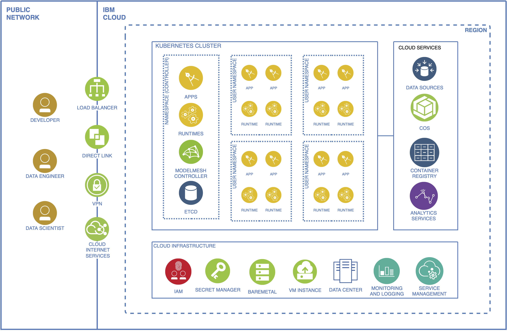

# Deploy a Watson NLP Model to KServe ModelMesh Serving

[KServe](https://KServe.github.io/website/0.9/) is a standard Model Inference Platform on Kubernetes, built for highly scalable use cases. [KServe ModelMesh Serving](https://KServe.github.io/website/0.9/modelserving/mms/modelmesh/overview/) is a recently added feature intended to increase KServe's scalability. It is designed to handle large volumes of models, where the deployed models change frequently. It loads and unloads models aiming to balance between responsiveness to users, and computational footprint. Leveraging existing third-party model servers, a number of standard ML/DL model formats are supported out-of-the box with more to follow: TensorFlow, PyTorch ScriptModule, ONNX, scikit-learn, XGBoost, LightGBM, OpenVINO IR. It's also possible to extend with custom runtimes to support arbitrary model formats, such as Watson NLP runtime.

This tutorial will walk you through the steps to deploy a Watson NLP model to the KServe ModelMesh Serving sandbox environment on [IBM Technology Zone](https://techzone.ibm.com/) (TechZone).

## Prerequisites

- Create a KServe ModelMesh Serving [sandbox environment](https://techzone.ibm.com/collection/watson-nlp-serving-nlp-models#tab-3) on TechZone
- Install IBM Cloud CLI: [ibmcloud](https://cloud.ibm.com/docs/cli?topic=cli-getting-started)
- Install Kubernetes CLI: [kubectl](https://kubernetes.io/docs/tasks/tools/#kubectl)
- Install Minio Client CLI: [mc](https://min.io/download)
- Install [gRPCurl](https://github.com/fullstorydev/grpcurl)

## Getting started

When you first reserve a TechZone sandbox environment for KServe ModelMesh Serving, an instance of ModelMesh Serving would be created for you in a dedicated Kubernetes [namespace](https://kubernetes.io/docs/concepts/overview/working-with-objects/namespaces/) on an [IBM Cloud Kubernetes Service](https://cloud.ibm.com/docs/containers) (IKS) cluster.



### Step 1: Open the Kubernetes Dashboard

When the sandbox environment is ready, you will receive an email that includes a link to the [Kubernetes Dashboard](https://github.com/kubernetes/dashboard). Clicking on this link will open the Dashboard in your browser and show the Kubernetes `service` resources in your namespace.

**Tip**:

- For new users, you would receive an email invitation from IBM Cloud to join the `tsglwatson` account.
- You need to have an active login session on [IBM Cloud Console](https://cloud.ibm.com/docs/overview?topic=overview-ui) before you can open the Kubernetes Dashboard.

### Step 2: Open the sample application

A sample Watson NLP application, written in [Dash](https://github.com/plotly/dash), is also deployed in your sandbox environment. On the Kubernetes Dashboard, find a `service` named `dash-app-lb`, which has an external endpoint. Click on the link to the external endpoint to open it in your browser. The sample Dash App allows you to provide some text input data, and get visualized **Emotion Classification** prediction results, using a pretrained models served by the ModelMesh Serving instance with Watson NLP Runtime in your sandbox environment.

**Tip**:

- It might take a few minutes for the DNS record of the Dash App's external endpoint to propagate across the Internet.

## Login with CLI

You need to [login to the IKS cluster](https://cloud.ibm.com/docs/containers?topic=containers-access_cluster) with the CLI tools to run the `kubectl` commands in this tutorial.

### Step 3: Install the Kubernetes Service plug-in

```sh
ibmcloud plugin install ks
```

### Step 4: Log in to your IBM Cloud account

```sh
ibmcloud login
```

Use `ibmcloud login --sso` command to login, if you have a federated ID.

### Step 5: Download and add the kubeconfig configuration file for your cluster

The following command will update the kubeconfig file specified by the `KUBECONFIG` environment variable, or `~/.kube/config` by default.

```sh
ibmcloud ks cluster config --cluster <iks-cluster-name>
```

**NOTE**:

- The name of the IKS cluster can be found in the email from TechZone when the sandbox environment is ready.

### Step 6: Set the current context to use your namespace by default

```sh
kubectl config set-context --current --namespace=<your-namespace>
```

**NOTE**:

- The name of your `namespace` can be found in the email from TechZone when the sandbox environment is ready.

## Predictors for pretrained models

Your TechZone sandbox environment comes with 3 pretrained Watson NLP models. They are stored in an [AWS S3](https://aws.amazon.com/s3/) compatible [IBM Cloud Object Storage](https://cloud.ibm.com/docs/cloud-object-storage) (COS) bucket, so that they can be served by KServe ModelMesh Serving. A Kubernetes [custom resource](https://kubernetes.io/docs/concepts/extend-kubernetes/api-extension/custom-resources/) named [InferenceService](https://kserve.github.io/website/0.9/get_started/first_isvc/) must also be created to register the model with the service.

### Step 7: Check the InferenceService predictors

You should be able to see the InferenceService predictors created for those 3 pretrained Watson NLP models in your namespace.

```sh
$ kubectl get inferenceservice
NAME                                                    URL                                                       READY   PREV   LATEST   PREVROLLEDOUTREVISION   LATESTREADYREVISION   AGE
ensemble-classification-wf-en-emotion-stock-predictor   grpc://modelmesh-serving.ibmid-6620037hpc-669mq7e2:8033   True                                                                  93m
sentiment-document-cnn-workflow-en-stock-predictor      grpc://modelmesh-serving.ibmid-6620037hpc-669mq7e2:8033   True                                                                  93m
syntax-izumo-en-stock-predictor                         grpc://modelmesh-serving.ibmid-6620037hpc-669mq7e2:8033   True                                                                  93m
```

## Access KServe Modelmesh Serving from your local machine

KServe ModelMesh Serving currently provides a gRPC API using a ClusterIP service on port `8033`, which is on the internal network of the Kubernetes cluster.

### Step 8: Check the Kubernetes service for ModelMesh Serving

```sh
$ kubectl get service/modelmesh-serving
NAME                TYPE        CLUSTER-IP   EXTERNAL-IP   PORT(S)                      AGE
modelmesh-serving   ClusterIP   None         <none>        8033/TCP,8008/TCP,2112/      4h34m
```

### Step 9: Use port forwarding to remotely access the service

You can run the `kubectl port-forward` command to forward a port on your local machine to the `modelmesh-serving` service on port `8033`.

```sh
kubectl port-forward service/modelmesh-serving <local-port>:8033
```

**Note**:

- You could let kubectl choose an available local port for you, by not specifying the `<local-port>`.

## Use gRPCurl to make a gRPC call

You can interact with the gRPC service using the `grpcurl` CLI tool on your local machine. With this tool you could browse the schema for gRPC services, either by querying a server that supports [server reflection](https://github.com/grpc/grpc/blob/master/src/proto/grpc/reflection/v1alpha/reflection.proto), or by reading [Protocol Buffers](https://developers.google.com/protocol-buffers/docs/overview) (Protobufs) source files, or `.proto` files. Since `modelmesh-serving` doesn't support server reflection, we'll use the `.proto` files here.

### Step 10: Copy the protobuf files to a local directory

The protobuf files are included in the Watson NLP Runtime container image. You can extract them from the running pods and save them to a local directory.

Create a directory named `protos` and make it your current working directory:

```sh
mkdir protos && cd protos
```

Run the following command to extract the protobuf files:

```sh
kubectl exec deployment/modelmesh-serving-watson-nlp-runtime -c watson-nlp-runtime -- jar cM -C /app/protos . | jar x
```

You should be able to see the `.proto` files in the current directory.

```sh
$ ls
category-types.proto emotion-types.proto nounphrases-types.proto target-mention-types.proto
classification-types.proto entity-types.proto producer-types.proto text-primitive-types.proto
clustering-types.proto keyword-types.proto relation-types.proto text-similarity-types.proto
common-service.proto lang-detect-types.proto rules-types.proto topic-types.proto
concept-types.proto language-types.proto sentiment-types.proto vectorization-types.proto
embedding-types.proto matrix-types.proto syntax-types.proto
```

### Step 11: Use gRPCurl to make gRPC inference calls

Assuming local port 18033 was chosen in Step 9, you should now be able to send an inference call at `127.0.0.1:18033` to one of the pretrained models loaded into the Watson NLP Runtime on KServe ModelMesh Serving.

```sh
grpcurl -plaintext -proto ./common-service.proto \
-H 'mm-vmodel-id: syntax-izumo-en-stock-predictor' \
-d '
{
  "parsers": [
    "TOKEN"
  ],
  "rawDocument": {
    "text": "This is a test."
  }
}
' \
127.0.0.1:18033 watson.runtime.nlp.v1.NlpService.SyntaxPredict
```

If you get a response like the following, the Watson NLP Runtime is working properly.

```json
{
  "text": "This is a test.",
  "producerId": {
    "name": "Izumo Text Processing",
    "version": "0.0.1"
  },
  "tokens": [
    {
      "span": {
        "end": 4,
        "text": "This"
      }
    },
    {
      "span": {
        "begin": 5,
        "end": 7,
        "text": "is"
      }
    },
    {
      "span": {
        "begin": 8,
        "end": 9,
        "text": "a"
      }
    },
    {
      "span": {
        "begin": 10,
        "end": 14,
        "text": "test"
      }
    },
    {
      "span": {
        "begin": 14,
        "end": 15,
        "text": "."
      }
    }
  ],
  "sentences": [
    {
      "span": {
        "end": 15,
        "text": "This is a test."
      }
    }
  ],
  "paragraphs": [
    {
      "span": {
        "end": 15,
        "text": "This is a test."
      }
    }
  ]
}
```

## Upload your own model

The KServe ModelMesh Serving instance in TechZone comes with a dedicated COS bucket, where you can store your own models and serve them through the KServe ModelMesh Serving instance. Several CLI tools can be used to upload your models to the COS bucket. We'll use the Minio Client here as an example.

### Step 12: Find the HMAC credential for the COS bucket

You will need the [HMAC credential](https://cloud.ibm.com/docs/cloud-object-storage?topic=cloud-object-storage-uhc-hmac-credentials-main) stored in a Kubernetes `secret` object named `storage-config` to access the COS bucket. Here is how you can retrieve it.

```sh
kubectl get secret/storage-config -o json | jq -r '."data"."'$BUCKET'"' | base64 -d
```

**Note**:

- Replace `$BUCKET` with the name of the dedicated COS bucket, which should be the same as the your Kubernetes namespace.

**Example**:

```sh
$ kubectl get secret/storage-config -o json | jq -r '."data"."'$BUCKET'"' | base64 -d
{
    "type": "s3",
    "access_key_id": "683a3fb50e0a49d5ae2463725b3e83f5",
    "secret_access_key": "86b13e59da3a28d1b134d11ace6913705043c4289d976e37",
    "endpoint_url": "https://s3.us-south.cloud-object-storage.appdomain.cloud",
    "region": "us-south",
    "default_bucket": "ibmid-6620037hpc-669mq7e2"
}
```

### Step 13: Configure Minio Client

To add an entry in your Minio Client configuration for your COS bucket, run the following command:

```sh
mc config host add $ALIAS $COS_ENDPOINT $ACCESS_KEY_ID $SECRET_ACCESS_KEY
```

**Note**:

- Replace `$ALIAS` with a short alias for referencing Object Storage in commands.
- Replace `$COS_ENDPOINT` with the `endpoint_url` of the HMAC credential.
- Replace `$ACCESS_KEY_ID` with the `access_key_id` of the HMAC credential.
- Replace `$SECRET_ACCESS_KEY` with the `secret_access_key` of the HMAC credential.

### Step 14: Upload a model from a local directory to the COS bucket

Use `mc cp --recursive` command to upload your model.

```sh
mc cp --recursive /path/to/mymodel ${ALIAS}/${BUCKET}
```

Check the content of your COS bucket with `mc tree --files` command.

```sh
mc tree --files ${ALIAS}/${BUCKET}
```

More details regarding Minio and other tools can be found in the following IBM Cloud docs:

- https://cloud.ibm.com/docs/cloud-object-storage?topic=cloud-object-storage-minio
- https://cloud.ibm.com/docs/cloud-object-storage?topic=cloud-object-storage-upload

### Step 15: Create an InferenceService predictor for your model

A Kubernetes custom resource can be created for the uploaded model as follows.

```sh
kubectl create -f - <<EOF
apiVersion: serving.kserve.io/v1beta1
kind: InferenceService
metadata:
  name: $NAME
  annotations:
    serving.kserve.io/deploymentMode: ModelMesh
spec:
  predictor:
    model:
      modelFormat:
        name: watson-nlp
      storage:
        path: $PATH_TO_MODEL
        key: $BUCKET
        parameters:
          bucket: $BUCKET
EOF
```

**Note**:

- Replace `$NAME` with any valid unique name.
- Replace `$PATH_TO_MODEL` with the folder path inside the bucket.
- Replace `$BUCKET` with the name of the COS bucket.

Once the model is successfully loaded, you will see the `READY` status is `True`, when checked with the following command:

```sh
kubectl get inferenceservice
```

You should now be able to make inference calls to your own custom model from your local machines, in a way similar to what you did with the pretrained model. More details regarding custom serving runtime for KServe ModelMesh Serving can be found [here](https://github.com/kserve/modelmesh-serving/blob/main/docs/runtimes/custom_runtimes.md).

## Clean up

After you've completed this tutorial, you can go to the [My reservations](https://techzone.ibm.com/my/reservations) page on TechZone and delete your Sandbox Environment for KServe ModelMesh Serving.
