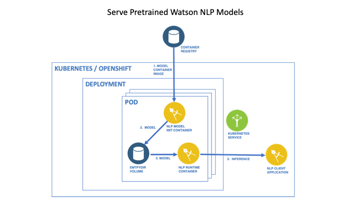

# Serve Pretrained Models on Kubernetes or OpenShift

In this tutorial you will serve Watson NLP pretrained models on a Kubernetes or OpenShift cluster.

You will create a Kubernetes Deployment to run the Watson NLP Runtime image. In the Pods of this Deployment, pretrained model images are specified as _init containers_. These init containers will run to completion before the main application starts, and will provision models to the _emptyDir_ volume of the Pod. When the Watson NLP Runtime container starts it will load the models and begin serving them.

When using this approach, models are kept in separate containers from the runtime. To change the set of served models you need only to update the Kubernetes manifest.

## Reference Architecture



## Prerequisites

- [Python 3.9](https://www.python.org/downloads/) or later is installed
- You have a Kubernetes or OpenShift cluster on which you can deploy an application
- You have either the Kubernetes (`kubectl`) or OpenShift (`oc`) CLI installed, and configured to talk to your cluster.
- Your Kubernetes or OpenShift cluster namespace has access to the [Watson NLP Runtime and pretrained models](https://github.com/ibm-build-lab/Watson-NLP/blob/main/MLOps/access/README.md#kubernetes-and-openshift)

## Steps

### 1. Get the sample code

Clone the GitHub repository containing the sample code used in this tutorial.

```sh
git clone https://github.com/ibm-build-lab/Watson-NLP
```

Go to the directory with code used in this tutorial.

```sh
cd Watson-NLP/MLOps/Init-Container
```

### 2. Deploy the service

Create a namespace in which to deploy the service, and set that as your current namespace.

If using Kubernetes:

```sh
kubectl apply -f deployment/deployment.yaml
```

If using OpenShift:

```sh
oc apply -f deployment/deployment.yaml
```

The model service is now deployed.

**Tip:**

Ensure that you have created a secret named `watson-nlp` in the namespace in which you created the Deployment, to allow the images to be pulled. See the instructions [here](https://github.com/ibm-build-lab/Watson-NLP/blob/main/MLOps/access/README.md#kubernetes-and-openshift).

### 3. Test the service

Run a simple Python client program to test that the model is being served. Note that the client code is specific to the model. If you serve a different model you will need to update the client program.

Enable port forwarding from your local machine. For a Kubernetes cluster:

```sh
kubectl port-forward svc/watson-nlp-runtime-service 8085
```

If you are using OpenShift:

```sh
oc port-forward svc/watson-nlp-runtime-service 8085
```

Execute the following commands to prepare your Python environment.

```sh
python3 -m venv client-env
```

```sh
source client-env/bin/activate
```

```sh
pip3 install watson-nlp-runtime-client
```

Go to the directory with the client program and run it.

```sh
cd client
```

Run the client command with a single string argument.

```sh
python3 client.py "Watson NLP is awesome"
```

The client will print out the inference response returned by the model similar to the following.

```sh
###### Calling GRPC endpoint =  localhost:8085
classes {
  class_name: "excited"
  confidence: 0.541912198
}
classes {
  class_name: "satisfied"
  confidence: 0.474965394
}
classes {
  class_name: "polite"
  confidence: 0.193365365
}
classes {
  class_name: "sympathetic"
  confidence: 0.106541924
}
classes {
  class_name: "sad"
  confidence: 0.0195402242
}
classes {
  class_name: "frustrated"
  confidence: 0.0112322783
}
classes {
  class_name: "impolite"
  confidence: 0.00411729887
}
producer_id {
  name: "Voting based Ensemble"
  version: "0.0.1"
}
```

## Understanding the Kubernetes Manifest

The Kubernetes manifest to deploy the service is here.

```sh
cat deployment/deployment.yaml
```

This manifest consists of a Kubernetes Deployment and a Service. Pods of the Deployment specify a pretrained model image as an init container.

```yaml
      initContainers:
      - name: ensemble-workflow-lang-en-tone-stock
        image: cp.icr.io/cp/ai/watson-nlp_classification_ensemble-workflow_lang_en_tone-stock:1.0.6
        volumeMounts:
        - name: model-directory
          mountPath: "/app/models"
        env:
        - name: ACCEPT_LICENSE
          value: 'true'
        resources:
          requests:
            memory: "100Mi"
            cpu: "100m"
          limits:
            memory: "200Mi"
            cpu: "200m"
```

In each Pod the init container will run to completion before the Watson NLP Runtime image starts. It mounts the Pod's `emptyDir` volume at path `/app/models`. The image's entrypoint script will copy the model files to this location when it runs.

The Pod's main application container image is the Watson NLP Runtime.

```yaml
      containers:
      - name: watson-nlp-runtime
        image: cp.icr.io/cp/ai/watson-nlp-runtime:1.0.18
        env:
        - name: ACCEPT_LICENSE
          value: 'true'
        - name: LOCAL_MODELS_DIR
          value: "/app/models"
        - name: LOG_LEVEL
          value: debug
        resources:
          requests:
            memory: "1Gi"
            cpu: "500m"
          limits:
            memory: "4Gi"
            cpu: "2"
        ports:
        - containerPort: 8080
        - containerPort: 8085
        volumeMounts:
        - name: model-directory
          mountPath: "/app/models"
```

This container also mounts the Pod's `emptyDir` volume at path `/app/models`. The environment variable `LOCAL_MODELS_DIR` is set to `/app/models` to inform the Watson NLP Runtime where to find the models.

Note that for both runtime and models the `ACCEPT_LICENSE` environment variable must be set to `true`.
