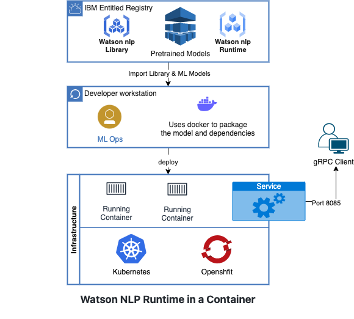

# Serve Models on Kubernetes or OpenShift using Standalone Containers

In this tutorial you will build a standalone container image to serve Watson NLP models, and then run it on a Kubernetes or OpenShift cluster.

The standalone container image will include both the Watson NLP Runtime as well as models. When the container runs, it will expose gRPC and REST endpoints that clients can use to run inference against the served models.

While this tutorial uses pretrained models, the approach can be adapted to serving custom models.

## Architecture diagram



## Prerequisites

- [Docker Desktop](https://docs.docker.com/get-docker/) is installed
- [Python 3.9](https://www.python.org/downloads/) or later is installed
- You have a Kubernetes or OpenShift cluster on which you can deploy an application or you can reserve an OpenShift Sandbox [here](https://github.com/ibm-build-lab/Watson-NLP/tree/sandbox-reserve-ht/MLOps/reserve-openshift-sandbox#readme) to try out this tutorial
- You have either the Kubernetes (`kubectl`) or OpenShift (`oc`) CLI installed, and configured to talk to your cluster.
- Your Kubernetes or OpenShift cluster has access to the [Watson NLP Runtime and pretrained models](https://github.com/ibm-build-lab/Watson-NLP/blob/main/MLOps/access/README.md#kubernetes-and-openshift)
- [Watson NLP Runtime Python client library](https://github.com/ibm-build-lab/Watson-NLP/blob/main/MLOps/access/README.md#python) is installed

**Tip**:

- [Podman](https://podman.io/getting-started/installation) provides a Docker-compatible command line front end. Unless otherwise noted, all the the Docker commands in this tutorial should work for Podman, if you simply alias the Docker CLI with `alias docker=podman` shell command.

## Steps

### 1. Clone the GitHub repository

Clone the repository containing the code used in this tutorial.

```sh
git clone https://github.com/ibm-build-lab/Watson-NLP
```

### 2. Build the container image

In this step, you will build a container image to deploy. If you already have a standalone container image to serve pretrained and/or custom Watson NLP models that you prefer to use, you can skip this step.

Go to the build directory.

```sh
cd Watson-NLP/MLOps/Watson-NLP-Container-k8/Runtime
```

There is a `Dockerfile` in this directory. Run the build command.

```sh
docker build . -t watson-nlp-container:v1
```

This will create a Docker image called `watson-nlp-container:v1`. When the container runs, it will serve two pretrained models:

- `sentiment_document-cnn-workflow_en_stock`
- `ensemble_classification-wf_en_emotion-stock`

### 3. Copy the image to a container registry

To deploy this image in Kubernetes or OpenShift cluster, you must first provision the image to a container repository that your cluster can access.  Tag your image with proper repository and namespace/project name. Replace `<REGISTRY>` and `<NAMESPACE>` in the following commands based on your configuration.

***If you reserved a sandbox in TechZone, you will the instruction [here](https://github.com/ibm-build-lab/Watson-NLP/tree/sandbox-reserve-ht/MLOps/reserve-openshift-sandbox#readme) to push image in OpenShift internal registry.*** 

```sh
docker tag watson-nlp-container:v1 <REGISTRY>/<NAMESPACE>/watson-nlp-container:v1 
```

Push the image to upstream

```sh
docker push <REGISTRY>/<NAMESPACE>/watson-nlp-container:v1
```

### 4. Deploy in Kubernetes/OpenShift

Go here:

```sh
cd deployment
```

In this directory is a Kubernetes manifest called `deployment.yaml` which can be used to deploy the model service. The default image in this deployment is `us.icr.io/watson-core-demo/watson-nlp-container:v1` hosted in IBM Container Registry. Before you start this service, you will need to update the image path in the `Deployment` to point to the registry you used.

```yaml
apiVersion: apps/v1
kind: Deployment
metadata:
  name: watson-nlp-container
spec:
  selector:
    matchLabels:
      app: watson-nlp-container
  replicas: 1
  template:
    metadata:
      labels:
        app: watson-nlp-container
    spec:
      containers:
        - name: watson-nlp-container
          image: us.icr.io/watson-core-demo/watson-nlp-container:v1
          ports:
            - containerPort: 8085
---
apiVersion: v1
kind: Service
metadata:
  name: watson-nlp-container
spec:
  type: ClusterIP
  selector:
    app: watson-nlp-container
  ports:
    - port: 8085
      protocol: TCP
      targetPort: 8085
```

#### 4.1 Run on Kubernetes

Run the below commands to deploy in the cluster from the directory `Watson-NLP/MLOps/Watson-NLP-Container-k8`.

```sh
kubectl apply -f Runtime/deployment/deployment.yaml
```

Check that the pod and service are running.

```sh
kubectl get pods
```

```sh
kubectl get svc
```

#### 4.2 Run on OpenShift

Run the below commands to deploy in the cluster from the project root directory `Watson-NLP/MLOps/Watson-NLP-Container-k8`.

```sh
oc apply -f Runtime/deployment/deployment.yaml
```

Check that the pod and service are running.

```sh
oc get pods
```

```sh
oc get svc
```

### 5. Test

Finally, you can test the service using a simple Python client program. The client code is under the directory `Watson-NLP/MLOps/Watson-NLP-Container-k8/Client`. Note that the client command is specific to the models. If you are using different models from the ones in the above build, you will have to change the client code. Ensure that the [Watson NLP python client library](https://github.com/ibm-build-lab/Watson-NLP/blob/main/MLOps/access/README.md) is installed on your machine.

Assuming that you start in the Runtime directory:

```sh
cd ../Client
```

Please execute the below commands to prepare python environment and to install libraries

```sh
python3 -m venv client-env
```

```sh
source client-env/bin/activate
```

```sh
pip3 install watson-nlp-runtime-client==1.0.0
```

Enable port forwarding from your local machine prior to running the test. For a Kubernetes cluster:

```sh
kubectl port-forward svc/watson-nlp-container 8085
```

If you are using OpenShift:

```sh
oc port-forward svc/watson-nlp-container 8085
```

The client command expects a single text string argument, and requests inference scoring of the models being served. Run the client command as:

```sh
python3 client.py "Watson NLP is awesome"
```

##### Output

```json
classes {
  class_name: "joy"
  confidence: 0.9687168002128601
}
classes {
  class_name: "anger"
  confidence: 0.03973544389009476
}
classes {
  class_name: "fear"
  confidence: 0.030667975544929504
}
classes {
  class_name: "sadness"
  confidence: 0.016257189214229584
}
classes {
  class_name: "disgust"
  confidence: 0.0033179237507283688
}
producer_id {
  name: "Voting based Ensemble"
  version: "0.0.1"
}

score: 0.9761080145835876
label: SENT_POSITIVE
sentiment_mentions {
  span {
    end: 21
    text: "Watson NLP is awesome"
  }
  score: 0.9761080145835876
  label: SENT_POSITIVE
}
producer_id {
  name: "Document CNN Sentiment"
  version: "0.0.1"
}
```

### Note

> `If you see any error during running the client program like below`

```sh
"/usr/local/Cellar/python@3.9/3.9.14/Frameworks/Python.framework/Versions/3.9/lib/python3.9/turtle.py", line 107, in <module>
    import tkinter as TK
  File "/usr/local/Cellar/python@3.9/3.9.14/Frameworks/Python.framework/Versions/3.9/lib/python3.9/tkinter/__init__.py", line 37, in <module>
    import _tkinter # If this fails your Python may not be configured for Tk
ModuleNotFoundError: No module named '_tkinter'
```

Please install python `tk` module based on your operating system and then rerun the client program `python3 client.py "Watson NLP is awesome"`

### macOS

```sh
brew install python-tk@3.9
```

### Ubuntu / Debian

```sh
sudo apt-get install python3-tk
```

### Fedora

```sh
sudo dnf install python3-tkinter
```

### CentOS

```sh
sudo yum install python3-tkinter
```
