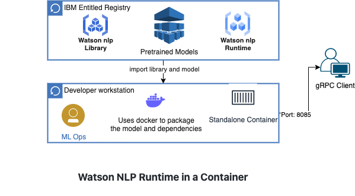

# Serve Pretrained Models with a Standalone Container
This tutorial will walk you through the steps to build a container image to serve pretrained Watson NLP models, and to run it with Docker. The container image will include both the Watson NLP Runtime and the models.  When the container runs it will expose REST and gRPC endpoints that client programs can use to make inference requests on the models. 

These containers can run anywhere. In the tutorial you will run the container using Docker. The same image could also be run on a Kubernetes or OpenShift cluster; or on a cloud container service like IBM Code Engine or AWS Fargate.  

For this tutorial, we will use pretrained models for sentiment analysis and emotion classification. Though other pretrained models could be served similarly.

### Architecture diagram



### Prerequisites
- [Docker Desktop](https://docs.docker.com/get-docker/) is installed
- [Python 3.9](https://www.python.org/downloads/) or later is installed
- Docker has access to the [Watson NLP Runtime and pretrained models](https://github.com/ibm-build-labs/Watson-NLP/blob/main/access/README.md#docker)
- [Watson NLP Runtime Python client library](https://github.com/ibm-build-labs/Watson-NLP/blob/main/access/README.md#python) is installed

**Tip**:
- [Podman](https://podman.io/getting-started/installation) provides a Docker-compatible command line front end. Unless otherwise noted, all the the Docker commands in this tutorial should work for Podman, if you simply alias the Docker CLI with `alias docker=podman` shell command.

## Steps

### 1. Get the sample code
Clone the GitHub repository that contains sample code used in this tutorial.
```
git clone https://github.com/ibm-build-labs/Watson-NLP 
```
The sample code for this tutorial is under the subdirectory `Watson-NLP/Watson-NLP-Container`.

### 2. Build
```
cd Watson-NLP/Watson-NLP-Container/Runtime
```
Have a look at the Dockerfile in this directory, which will be used to build the service.
```
ARG WATSON_RUNTIME_BASE="wcp-ai-foundation-team-docker-virtual.artifactory.swg-devops.com/watson-nlp-runtime:0.20.0"
ARG SENTIMENT_MODEL="wcp-ai-foundation-team-docker-virtual.artifactory.swg-devops.com/watson-nlp_sentiment_aggregated-cnn-workflow_lang_en_stock:2.8.0"
ARG EMOTION_MODEL="wcp-ai-foundation-team-docker-virtual.artifactory.swg-devops.com/watson-nlp_classification_ensemble-workflow_lang_en_tone-stock:2.3.1"

FROM ${SENTIMENT_MODEL} as model1
RUN ./unpack_model.sh

FROM ${EMOTION_MODEL} as model2
RUN ./unpack_model.sh

FROM ${WATSON_RUNTIME_BASE} as release

RUN true && \
    mkdir -p /app/models

ENV LOCAL_MODELS_DIR=/app/models
COPY --from=model1 app/models /app/models
COPY --from=model2 app/models /app/models
```

Pretrained Watson NLP models are stored as container images. When these containers are run normally, they will invoke an `unpack_model.sh` script. The script unzips the model file and copies it to the `/app/models` directory within the container's filesystem.

In this Dockerfile we run `unpack_model.sh` to trigger the unpacking during the build.

The final image generated uses the Watson NLP Runtime image is used as its base image. The environment variable `LOCAL_MODELS_DIR` is used to tell the Watson NLP Runtime where to find the models it is supposed to serve. Models files are copied from the intermediate images to `/app/models` in the final image.

Build the image with the following command.
```
docker build . -t watson-nlp-container:v1
```
This will create a Docker image called `watson-nlp-container:v1`.

### 3. Run
Use the following command to start the service on your local machine.
```
docker run -d -p 8085:8085 watson-nlp-container:v1
```
The models are now being served through a gRPC endpoint at port 8085.

### 4. Test 
You can now test the service with a simple Python client program. Ensure that the [Watson NLP python client library](https://github.com/ibm-build-labs/Watson-NLP/blob/main/access/README.md) is installed on your machine. 
```
cd ../Client 
```

The client command expects a single text string argument and requests inference from stock Sentiment Analysis and Emotion Classification models. If you are serving different models, you will have to update the client code.  

Run the client command as: 
```
python3 client.py "Watson NLP is awesome" 
```
You will see output similar to the following.
```
classes {
  class_name: "joy"
  confidence: 0.9687168002128601
}
classes {
  class_name: "anger"
  confidence: 0.03973544389009476
}
classes {
  class_name: "fear"
  confidence: 0.030667975544929504
}
classes {
  class_name: "sadness"
  confidence: 0.016257189214229584
}
classes {
  class_name: "disgust"
  confidence: 0.0033179237507283688
}
producer_id {
  name: "Voting based Ensemble"
  version: "0.0.1"
}

score: 0.9761080145835876
label: SENT_POSITIVE
sentiment_mentions {
  span {
    end: 21
    text: "Watson NLP is awesome"
  }
  score: 0.9761080145835876
  label: SENT_POSITIVE
}
producer_id {
  name: "Document CNN Sentiment"
  version: "0.0.1"
}
```
