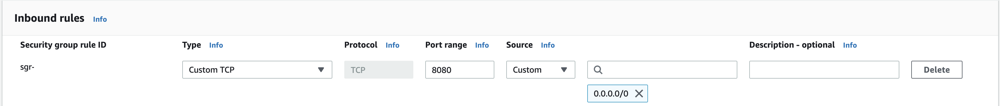

# Deploy Watson NLP in AWS ECS Cluster

With IBM Watson NLP, IBM introduced a common library for natural language processing, document understanding, translation, and trust. IBM Watson NLP brings everything under one umbrella for consistency and ease of development and deployment. This tutorial walks you through the steps to build a container image to serve pretrained Watson NLP models and to run it with Docker. The container image includes both the Watson NLP Runtime and the models. When the container runs, it exposes REST and gRPC endpoints that client programs can use to make inference requests on the models.

Amazon Elastic Container Service (ECS) is a fully managed container orchestration service that helps you easily deploy, manage, and scale containerized applications that supports Docker containers and allows you to run applications on a managed cluster of Amazon Elastic Compute Cloud (Amazon EC2) instances and Fargate.

This tutorial you are going to deploy a pretrained models `watson-nlp_syntax_izumo_lang_en_stock:1.0.6` but other pretrained models also can be served. You can find all the pretrained model [here](https://www.ibm.com/docs/en/watson-libraries?topic=models-catalog)

## Prerequisite

- Ensure you have your entitlement key to access the IBM Entitled Registry to access [Watson NLP Runtime and pretrained models](https://github.com/ibm-build-lab/Watson-NLP/blob/main/MLOps/access/README.md#kubernetes-and-openshift)
- Ensure you have an AWS account
- [Install](https://docs.aws.amazon.com/cli/latest/userguide/getting-started-install.html) AWS CLI

**Tip**:

- If you don't have an AWS account, you may want to consider [AWS Free Tier](https://aws.amazon.com/free/free-tier/).
- Follow the [security best practices](https://docs.aws.amazon.com/accounts/latest/reference/best-practices-root-user.html) for the root user of your AWS account, and [create an admin user](https://docs.aws.amazon.com/IAM/latest/UserGuide/getting-started_create-admin-group.html) for daily use.
- Make sure you have [required permissions](https://docs.docker.com/cloud/ecs-integration/#requirements) on AWS account to run applications on ECS.

## Create Watson NLP container image

The IBM Entitled Registry contains various container images for Watson Runtime. Once you've obtained the entitlement key from the [container software library](https://myibm.ibm.com/products-services/containerlibrary), you can login to the registry with the key, and pull the runtime images to your local machine. The Watson Runtime on its own doesn't have any models included. However, you can easily build a runtime container image to include one or more pretrained models, which are also stored as container images in the IBM Entitled Registry.

### Step 1: Login to the IBM Entitled Registry

```sh
echo $IBM_ENTITLEMENT_KEY | docker login -u cp --password-stdin cp.icr.io
```

### Step 2: Download a couple of models to a local directory

Create a directory named `models`:

```sh
mkdir models
```

Set variable `REGISTRY` as follows to pull the images from IBM Entitled Registry.

```sh
REGISTRY=cp.icr.io/cp/ai
```

Use a variable `MODELS` to provide the list of models you want to download:

```sh
MODELS="watson-nlp_syntax_izumo_lang_en_stock:1.0.6"
```

Copy the models into the local directory `models`:

```sh
for i in $MODELS
do
  image=${REGISTRY}/$i
  docker run -it --rm -e ACCEPT_LICENSE=true -v `pwd`/models:/app/models $image
done
```

### Step 3: Create a `Dockerfile` using a text editor of your choice

```sh
ARG REGISTRY
ARG TAG=1.0.18
FROM ${REGISTRY}/watson-nlp-runtime:${TAG}
COPY models /app/models
```

### Step 4: Build the image

```sh
docker build . -t my-watson-nlp-runtime:latest --build-arg REGISTRY=${REGISTRY}
```

## Upload your runtime image to Amazon ECR

Now the runtime image is created, let's put it on [Amazon ECR](https://aws.amazon.com/ecr/), so that it can be used for deployment. Each AWS account is provided with a [default private registry](https://docs.aws.amazon.com/AmazonECR/latest/userguide/Registries.html) (*aws_account_id*.dkr.ecr.*region*.amazonaws.com).

### Step 5: Login to the default registry

Set an environment variable for the default private registry as appropriate:

```sh
export DEFAULT_REGISTRY=<your-12-digit-account-id>.dkr.ecr.<region>.amazonaws.com
```

Login to the default private registry:

```sh
aws ecr get-login-password | docker login --username AWS --password-stdin ${DEFAULT_REGISTRY}
```

### Step 6: Create a repository in the default registry

```sh
aws ecr create-repository --repository-name my-watson-nlp-runtime
```

### Step 7: Upload the image to Amazon ECR

```sh
docker tag my-watson-nlp-runtime:latest ${DEFAULT_REGISTRY}/my-watson-nlp-runtime:latest
```

Push the image:

```sh
docker push ${DEFAULT_REGISTRY}/my-watson-nlp-runtime:latest
```

## Deploy the Runtime to Amazon ECS

Set the cluster name in an environment variable. The cluster I am using here is `MyFargateCluster`, your cluster name might be different, make sure you set the correct cluster name and Region.

```sh
CLUSTER_NAME=MyFargateCluster
REGION=us-east-2
```

Find Amazon task `executionRoleArn` with policy assigned `AmazonECSTaskExecutionRolePolicy` in AWS console `Path: IAM -> Roles -> ecsTaskExecutionRole`. You should find the execution role like this `arn:aws:iam::<ACCOUNT_ID>:role/ecsTaskExecutionRole`. If there is no role found, please create a new one.

Create a new file name `task-definition.json` and save the following content in the file. Change the `image:` location where you pushed the image in the previous step. And also `executionRoleArn:` you found in aws console `IAM -> Roles -> ecsTaskExecutionRole`

> Tip: Look at the `CHANGE_ME` in the below json file and replace them with proper value.

```json
{
    "containerDefinitions": [
        {
            "name": "watson-nlp-container",
            "image": "CHANGE_ME",
            "cpu": 0,
            "portMappings": [
                {
                    "name": "watson-nlp-container-8080-tcp",
                    "containerPort": 8080,
                    "hostPort": 8080,
                    "protocol": "tcp",
                    "appProtocol": "http"
                }
            ],
            "essential": true,
            "environment": [
                {
                    "name": "ACCEPT_LICENSE",
                    "value": "true"
                }
            ],
            "environmentFiles": [],
            "mountPoints": [],
            "volumesFrom": []
        }
    ],
    "family": "watson-nlp-runtime",
    "executionRoleArn": "CHANGE_ME",
    "networkMode": "awsvpc",
    "volumes": [],
    "placementConstraints": [],
    "requiresCompatibilities": [
        "FARGATE"
    ],
    "cpu": "1024",
    "memory": "4096",
    "runtimePlatform": {
        "cpuArchitecture": "X86_64",
        "operatingSystemFamily": "LINUX"
    }
}
```

### Step 8: Register the task definition

Set the task definition family name and ECS service name in environment variables

```sh
TASK_FAMILY=watson-nlp-runtime
SERVICE_NAME=watson-nlp-svc
```

Register the task definition file.

```sh
aws ecs register-task-definition --cli-input-json file://task-definition.json
```

Check if the task definition registered successfully.

```sh
aws ecs list-task-definitions
```

output:

```json
{
    "taskDefinitionArns": [
        "arn:aws:ecs:<REGION>:<AWS-ACCOUNT-ID>:task-definition/watson-nlp-runtime:1"
    ]
}
```

To view the task-defintion execute the below command.

```sh
aws ecs describe-task-definition --task-definition "$TASK_FAMILY" --region $REGION
```

### Step 9: The Watson NLP ECS Services

To start the service you need to provide network configuration, subnets and security group. To find your subnets execute the below command

```sh
aws ec2 describe-subnets \
--query "Subnets[*].SubnetId" \
--output text
```

To find security groups execute the command below,

```sh
aws ec2 describe-security-groups \
--query "SecurityGroups[*].GroupId" \
--output text
```

Replace the subnet ids and security group you found in the previous two commands. Please note that you may use one or more subnet id.

```sh
aws ecs create-service \
--cluster $CLUSTER_NAME \
--service-name $SERVICE_NAME \
--task-definition watson-nlp-runtime:1 \
--desired-count 1 \
--launch-type "FARGATE" \
--network-configuration "awsvpcConfiguration={subnets=[subnet-CHANGE_ME, subnet-CHANGE_ME, subnet-CHANGE_ME],securityGroups=[sg-CHANGE_ME],assignPublicIp=ENABLED}"
```

It will take some time to deploy the NLP model. To see list of services,

```sh
aws ecs list-services --cluster $CLUSTER_NAME
```

To view details of the service

```sh
aws ecs describe-services --cluster $CLUSTER_NAME --services $SERVICE_NAME
```

### Step 10: Test the deployed NLP Model

Before testing the service, make sure you have allowed port 8080 in inboud rule, so that traffic can flow to the deployed model.



Lets find the public IP assigned to the task.

```sh
NLP_TASK_ID=$(aws ecs list-tasks --cluster $CLUSTER_NAME --query "taskArns[0]" --output text)
echo $NLP_TASK_ID
```

Describe the task and locate the ENI ID. Use the task ARN for the tasks parameter.

```sh
NETWORK_INTERFACE_ID=$(aws ecs describe-tasks \
--cluster $CLUSTER_NAME \
--tasks $NLP_TASK_ID \
--query "tasks[*].attachments[*].details[?name == 'networkInterfaceId'].value" --output text)
echo $NETWORK_INTERFACE_ID
```

Describe the ENI to get the public IP address.

```sh
MODEL_HOST_IP=$(aws ec2 describe-network-interfaces \
--network-interface-id  $NETWORK_INTERFACE_ID \
--query "NetworkInterfaces[*].Association.PublicIp" --output text)
echo $MODEL_HOST_IP
```

Once the Watson NLP Runtime service is ready, you should be able to send an inference request to the REST service endpoint as follows.

```sh
curl -s -X POST "http://${MODEL_HOST_IP}:8080/v1/watson.runtime.nlp.v1/NlpService/SyntaxPredict" \
  -H "accept: application/json" \
  -H "grpc-metadata-mm-model-id: syntax_izumo_lang_en_stock" \
  -H "content-type: application/json" \
  -d "{ \"rawDocument\": { \"text\": \"This is a test.\" }, \"parsers\": [ \"TOKEN\" ]}" \
  | jq -r .
```

> Tip:
  The value of metadata grpc-metadata-mm-model-id should match the folder name of the model when it was downloaded and saved in ./models in Step 2.

If you get a response like the following, the Watson NLP Runtime is working properly.

```json
{
  "text": "This is a test.",
  "producerId": {
    "name": "Izumo Text Processing",
    "version": "0.0.1"
  },
  "tokens": [
    {
      "span": {
        "begin": 0,
        "end": 4,
        "text": "This"
      },
      "lemma": "",
      "partOfSpeech": "POS_UNSET",
      "dependency": null,
      "features": []
    },
    {
      "span": {
        "begin": 5,
        "end": 7,
        "text": "is"
      },
      "lemma": "",
      "partOfSpeech": "POS_UNSET",
      "dependency": null,
      "features": []
    },
    {
      "span": {
        "begin": 8,
        "end": 9,
        "text": "a"
      },
      "lemma": "",
      "partOfSpeech": "POS_UNSET",
      "dependency": null,
      "features": []
    },
    {
      "span": {
        "begin": 10,
        "end": 14,
        "text": "test"
      },
      "lemma": "",
      "partOfSpeech": "POS_UNSET",
      "dependency": null,
      "features": []
    },
    {
      "span": {
        "begin": 14,
        "end": 15,
        "text": "."
      },
      "lemma": "",
      "partOfSpeech": "POS_UNSET",
      "dependency": null,
      "features": []
    }
  ],
  "sentences": [
    {
      "span": {
        "begin": 0,
        "end": 15,
        "text": "This is a test."
      }
    }
  ],
  "paragraphs": [
    {
      "span": {
        "begin": 0,
        "end": 15,
        "text": "This is a test."
      }
    }
  ]
}
```
