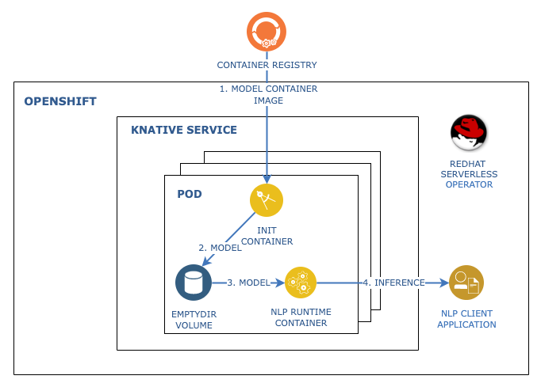

# Serve Watson NLP Models Using Knative Serving 

With IBM Watson NLP, IBM introduced a common library for natural language processing, document understanding, translation, and trust. IBM Watson NLP brings everything under one umbrella for consistency and ease of development and deployment. This tutorial walks you through the steps to serve pretrained Watson NLP models using Knative Serving in a Red Hat OpenShift cluster.

Knative Serving is an Open-Source Enterprise-level solution to build Serverless and Event Driven Applications in Kubernetes / OpenShift cluster. It supports horizontal autoscaling based on the requests that come into a service, allowing the service to scale down to zero replicas. For more information see [https://knative.dev/docs/](https://knative.dev/docs/).

In this tutorial you will create a Knative Service to run the Watson NLP Runtime. Pods of this Knative Service specify Watson NLP pretrained model images as init containers. These init containers run to completion before the main application starts in the Pod. They will provision models to the emptyDir volume of the Pod. When the Watson NLP Runtime container starts, it loads the models and begins serving them.

Using this approach allows for models to be kept in separate container images from the runtime container image. To change the set of served models you need only to update the Knative Service Manifest.

## Reference Architecture

 

## Prerequisites

- Install [Docker Desktop](https://docs.docker.com/get-docker/).
- Ensure that you have access to an OpenShift Container Platform account with cluster administrator access. 
  - For this tutorial, IBMers and Business Partners can reserve a [Sandbox Environment](https://techzone.ibm.com/collection/watson-nlp-serving-nlp-models#tab-4). When you reserve this, a Project will be created for you in an OpenShift cluster. You will recieve an email with instructions on accessing the environment.
  - Alternatively, if you are using your own cluster, follow the instructions below to install Knative Serving.
    - [Install the OpenShift Serverless Operator](https://docs.openshift.com/container-platform/4.10/serverless/install/install-serverless-operator.html)
    - [Install Knative Serving](https://docs.openshift.com/container-platform/4.10/serverless/install/installing-knative-serving.html)
- Install the Red Hat OpenShift CLI (```oc```) and log in to the OpenShift cluster.
- Create a Docker registry secret in the Kubernetes project that grants access to the [Watson NLP Runtime and pretrained models](https://github.com/ibm-build-lab/Watson-NLP/blob/main/MLOps/access/README.md#kubernetes-and-openshift)

**Tip:** Podman provides a Docker-compatible command-line front end. Unless otherwise noted, all of the Docker commands in this tutorial should work for Podman if you alias the Docker CLI with the shell command:

```bash
alias docker=podman
```

## Steps

### Step 1. Configure Knative

> Skip this step if you are using the [Sandbox Environment](https://github.com/ibm-build-lab/Watson-NLP/tree/main/MLOps/reserve-openshift-sandbox).

The deployment approach that we use in this tutorial relies on capabilities of Knative Serving that are disabled by default. Below you will configure Knative Service to enable *init containers* and *empty directories*.

To apply the configuration, use the following command:

```yaml
kubectl apply -f - <<EOF
apiVersion: operator.knative.dev/v1beta1
kind: KnativeServing
metadata:
  name: knative-serving
  namespace: knative-serving
spec:
  config:
    features:
      kubernetes.podspec-init-containers: "enabled"
      kubernetes.podspec-volumes-emptydir: "enabled"
EOF
```

### Step 2. Clone the GitHub Repository

Clone the repository containing code used in this tutorial.

```bash
git clone https://github.com/ibm-build-labs/Watson-NLP
cd Watson-NLP/MLOps/Watson-NLP-Knative/deployment
```

### Step 3. Deploy the Model Service

In this step you will create a Knative Service to run the Watson NLP Runtime. When a Service is created, Knative does the following:

- It creates a new immutable revision for this version of the application.
- It creates a Route, Ingress, Service, and Load Balancer for your application.
- It automatically scales replicas based on request load, including scaling to zero active replicas.

To create the Service, run the following command.

```bash
oc apply -f knative-service.yaml
```

Verify that the service has been created.
  
```bash
oc get configuration  
```
  
You should see output similar to the following.
  
```
NAME            LATESTCREATED         LATESTREADY           READY   REASON
watson-nlp-kn   watson-nlp-kn-00001   watson-nlp-kn-00001   True    
```
  
To check the revisions of this service:
  
```bash
oc get revisions 
```

Set the URL for the Service in an environment variable.
  
```bash
export SERVICE_URL=$(oc get ksvc watson-nlp-kn  -o jsonpath="{.status.url}")
```

### Step 4. Test Knative Autoscaling
  
With the parameters used when creating the Service, Knative will autoscale Pods based on requests including scaling to zero when there are no requests. Run the following command to list the Pods in your OpenShift Project.

```bash
oc get pods
```

Pods belonging to the Knative Service should have the prefix `watson-nlp-kn`. Initially, there should be none. If you do see some, then wait for a minute or two and they will be  automatically terminated.

Run following command to trigger the Knative Service to start up Pods.
  
```bash
curl ${SERVICE_URL}
```

Use `ctrl-c` to break out of the command.

You can watch the Pods being created to in response to the request, and then later terminated, using the following command.

```bash
oc get pods -w
```

The output will be similar to the following.

```
NAME                                              READY   STATUS     RESTARTS   AGE
watson-nlp-kn-00001-deployment-6f8b5d7494-cdvqb   0/2     Init:0/1   0          15s
watson-nlp-kn-00001-deployment-6f8b5d7494-cdvqb   0/2     PodInitializing   0          75s
watson-nlp-kn-00001-deployment-6f8b5d7494-cdvqb   1/2     Running           0          76s
watson-nlp-kn-00001-deployment-6f8b5d7494-cdvqb   2/2     Running           0          2m
watson-nlp-kn-00001-deployment-6f8b5d7494-cdvqb   2/2     Terminating       0          3m
watson-nlp-kn-00001-deployment-6f8b5d7494-cdvqb   1/2     Terminating       0          3m20s
watson-nlp-kn-00001-deployment-6f8b5d7494-cdvqb   1/2     Terminating       0          3m30s
watson-nlp-kn-00001-deployment-6f8b5d7494-cdvqb   0/2     Terminating       0          3m32s
```

Use `ctrl-c` to break out of the command.

### Step 5. Test the Service

In this step, you will make an inference request on the model using the REST interface. Exceute the following command.

```bash
curl -X POST "${SERVICE_URL}/v1/watson.runtime.nlp.v1/NlpService/ClassificationPredict" -H "accept: application/json" -H "grpc-metadata-mm-model-id: classification_ensemble-workflow_lang_en_tone-stock" -H "content-type: application/json" -d "{ \"rawDocument\": { \"text\": \"Watson nlp is awesome! works in knative\" }}" | jq
```

You will see output similar to the following.

```
{
  "classes": [
    {
      "className": "satisfied",
      "confidence": 0.6308287
    },
    {
      "className": "excited",
      "confidence": 0.5176963
    },
    {
      "className": "polite",
      "confidence": 0.3245624
    },
    {
      "className": "sympathetic",
      "confidence": 0.1331128
    },
    {
      "className": "sad",
      "confidence": 0.023583649
    },
    {
      "className": "frustrated",
      "confidence": 0.0158445
    },
    {
      "className": "impolite",
      "confidence": 0.0021891927
    }
  ],
  "producerId": {
    "name": "Voting based Ensemble",
    "version": "0.0.1"
  }
}
```
  

### Conclusion

In this tutorial you deployed a pretrained Watson NLP Model on a Red Hat OpenShift cluster using Knative Service. Model images are specified as init-containers in the Kubernetes manifest. You further observed Knative autoscaling, including scaling to zero.
