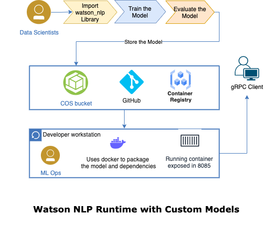
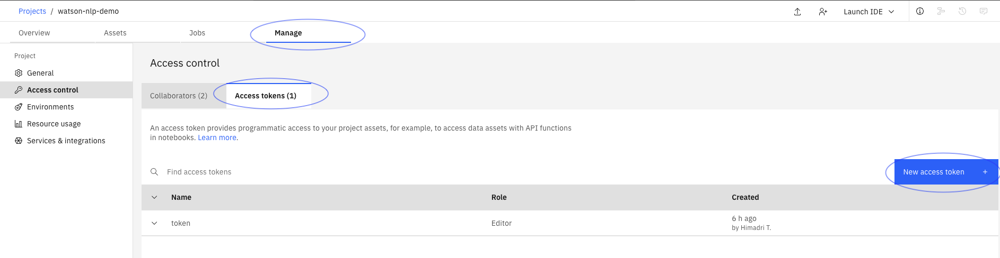

# Serving a Custom Model on a Kubernetes or OpenShift Cluster
In this tutorial you will take a Watson NLP model that you have trained in Watson Studio and serve it on a Kubernetes or OpenShift cluster. The model will be packaged as a container image using the [model builder](https://github.com/IBM/ibm-watson-embed-model-builder). The container images can be used in the same way as the pretrained Watson NLP models, i.e. specified as init containers of Watson NLP Runtime Pods.

To complete this tutorial, you need to have first completed the [Consumer Complaint Classification](https://techzone.ibm.com/collection/watson-nlp-text-classification#tab-1) tutorial, which includes steps on training a custom ensemble model and saving it to the Cloud Object Storage (COS) bucket associated with the project.

### Architecture diagram


    
### Prerequisites
    
- [Python 3.9](https://www.python.org/downloads/) or later is installed
- [Docker Desktop](https://docs.docker.com/get-docker/) is installed
- Docker has access to the [Watson NLP Runtime and pretrained models](https://github.com/ibm-build-labs/Watson-NLP/blob/main/MLOps/access/README.md#docker)
- You have created a custom trained Watson NLP model in Watson Studio, generated using this [notebook](https://github.com/ibm-build-labs/Watson-NLP/blob/main/ML/Text-Classification/Consumer%20complaints%20Classification.ipynb) 
- You have a Kubernetes or OpenShift cluster on which you can deploy an application
- You have either the Kubernetes (`kubectl`) or OpenShift (`oc`) CLI installed, and configured to talk to your cluster.
- Your Kubernetes or OpenShift cluster has access to the [Watson NLP Runtime and pretrained models](https://github.com/ibm-build-labs/Watson-NLP/blob/main/MLOps/access/README.md#kubernetes-and-openshift)
- You have completed the [Consumer Complaint Classification](https://techzone.ibm.com/collection/watson-nlp-text-classification#tab-1) tutorial, and have saved the custom trained model named `ensemble_model` to the COS bucket associated with the project. The tutorial uses this [notebook](https://github.com/ibm-build-labs/Watson-NLP/blob/main/ML/Text-Classification/Consumer%20complaints%20Classification.ipynb).
    
**Tip**:
- [Podman](https://podman.io/getting-started/installation) provides a Docker-compatible command line front end. Unless otherwise noted, all the the Docker commands in this tutorial should work for Podman, if you simply alias the Docker CLI with `alias docker=podman` shell command.  
      
    
## Steps

### 1. Save your model
First, you will export your Watson NLP model from Watson Studio on IBM Cloud. Create a `models` directory on your local machine.
```
mkdir models
```
Now go to the page for your project in the IBM Cloud Pak for Data GUI. Create an access token with *Editor* role using **Manage > Access control > Access tokens** if one does not already exist.



Open your notebook for editing.  You need to ensure that the project token is set so that you can access the project assets from the notebook.  Look for a cell similar to the following at the top of your notebook.
```
# @hidden_cell
# The project token is an authorization token that is used to access project resources like data sources, connections, and used by platform APIs.
from project_lib import Project
project = Project(project_id='<project-id>', project_access_token='<access-token>')
pc = project.project_context
```
If you do not see this cell, then add it to the notebook by clicking **More > Insert project token** from the notebook action bar. Run the cell.


    
Add the following line to your notebook and run it in order to save your model.
```
project.save_data('<file_name>', data=<trained_model_object>.as_file_like_object(), overwrite=True)
```
Where:
- `<file_name>` is the exported model name 
- `<trained_model_object>` is the model being saved

The model will be saved as a ZIP archive in the Cloud Object Storage (COS) bucket associated with the project. Once saved, you will be able to find it in the **Assets** tab. 


    
Download the model into the *models* directory on your local machine using the file name `ensemble-model`. (Use the vertical ellipsis to the right of the model name to open a menu with the download option.)

### 3. Build the container image
Have a look at the Dockerfile in the current directory.
```
ARG WATSON_RUNTIME_BASE="wcp-ai-foundation-team-docker-virtual.artifactory.swg-devops.com/watson-nlp-runtime:0.13.1_ubi8_py39" 
FROM ${WATSON_RUNTIME_BASE} as base 
ENV LOCAL_MODELS_DIR=/app/models 
COPY models /app/models 
```
The Watson NLP Runtime is used as the base image. Any models that are in the `models` subdirectory on the host will be opein the container at build time.

Use the following command to build the image. 
```
docker build . -t watson-nlp-custom-container:v1 
```
This results in a image named `watson-nlp-custom-container:v1`.  Check that it exists.
```
docker images
```

### 4. Serve the models

### 5. Test the service
Now test the model service using a client program on your local machine. Install the Watson NLP Runtime client library.
```
pip install watson-nlp-runtime-client
```
The client program appears in the directory `Watson-NLP/Watson-NLP-Custom-Model-Container/Client`. Note that the client code included with this tutorial will make inference requests to the sample model `ensemble_classification-wf_en_emotion-stock` that is referenced in step 2.  If you are using your own model, you will have to first update the client code.

Enable port forwarding. On Kubernetes:

OpenShift:


From the `Runtime` directory:
```
cd ../Client 
```
Run the client program.
```
python3 client.py "Watson NLP is awesome" 
```
This program takes a single text string as an argument.  The result from the model is printed to the screen.
