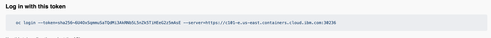

# Sandbox Environment

## Watson NLP Standalone Containers on IBM RedHat OpenShift Kubernetes Service (ROKS)

## Steps to reserve an OpenShift sanbox in IBM Cloud

### Step 1: Please click on the below url and login with your credentials

```

https://techzone.ibm.com/collection/watson-nlp-serving-models-with-standalone-containers

```

### Step 2: Click on the tab run on Kubernetes or OpenShift


### Step 3: Scroll down the page, look for a box `Sandbox Environment: Watson NLP Standalone Containers on IBM RedHat OpenShift Kubernetes Service (ROKS)` and hit the reserve button


### Step 4: Pick up the option between `Reserve now` and `Schedule for later`


### Step 5: Fill up the form and submt


### Step 6: When the enviroment is ready, you will receive an email like below.


Please make a note about the information in the email

- Integrated OpenShift container image registry
- Project name
- Project URL

## Steps to publish image to OpenShift container registry

### Step 1: Set variable `REGISTRY` and `NAMESPACE` as follows to push the image to OpenShift internal registry

```
REGISTRY=<Integrated OpenShift container image registry: you received in the email>
```

```
NAMESPACE=<Project name: you received in the email>
```

### Step 2: Log in to your IBM Cloud account

```
ibmcloud login
```

Use ibmcloud login --sso command to login, if you have a federated ID.

### Step 3: Go to the project URL in the email and login to your OpenShift cluster


### Step 4: Click on the top right corner on your Id, a drop down will be show and click on the `Copy login command'. A popup window will open.


### Step 5: Click on the display token and copy the command 'Login in with this token`


