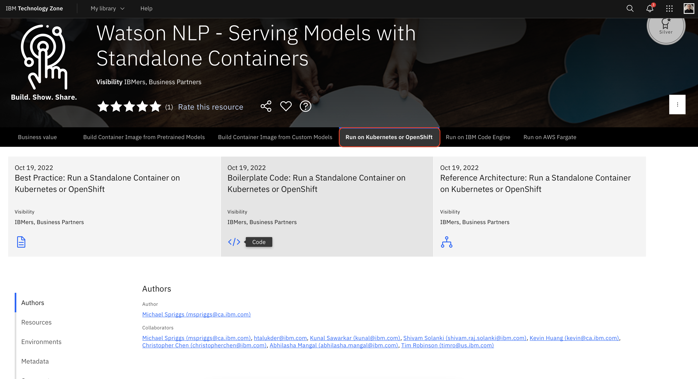
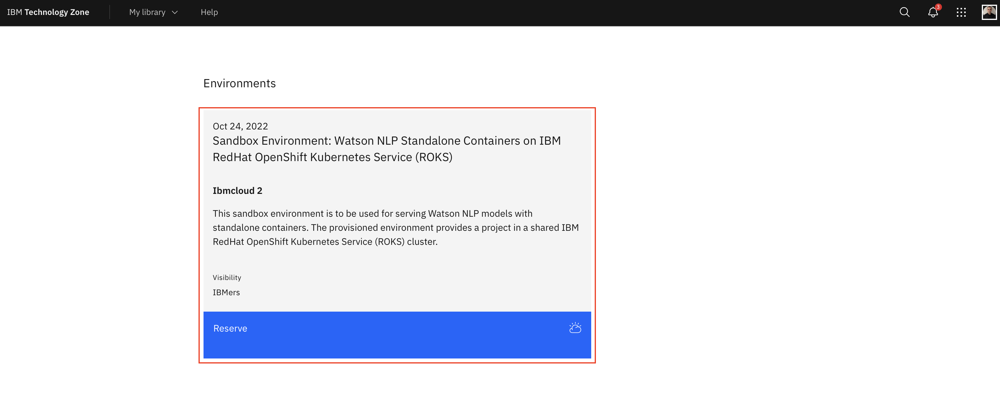
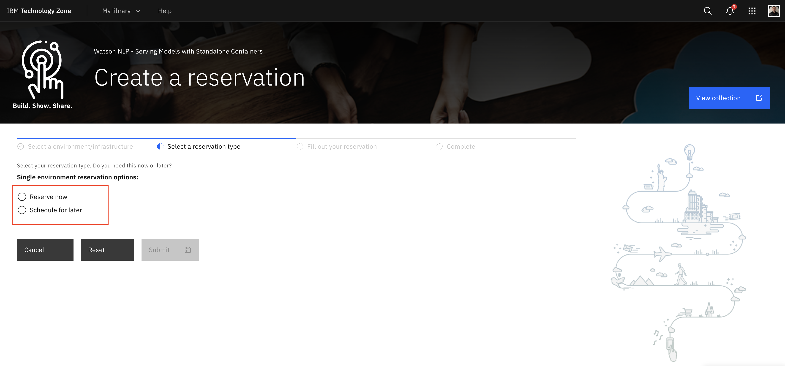
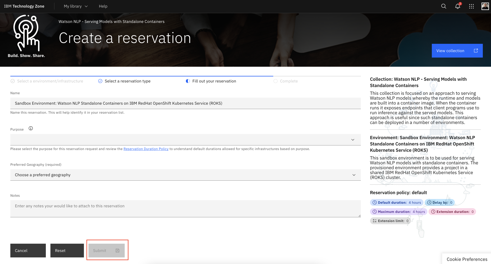
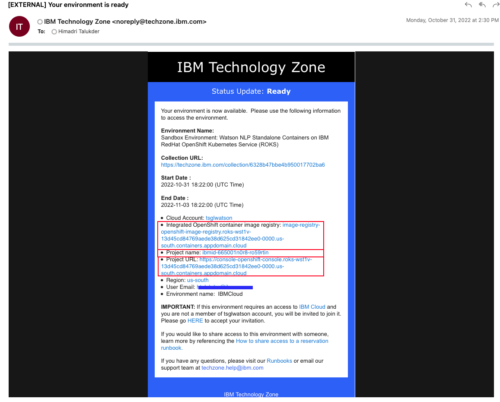
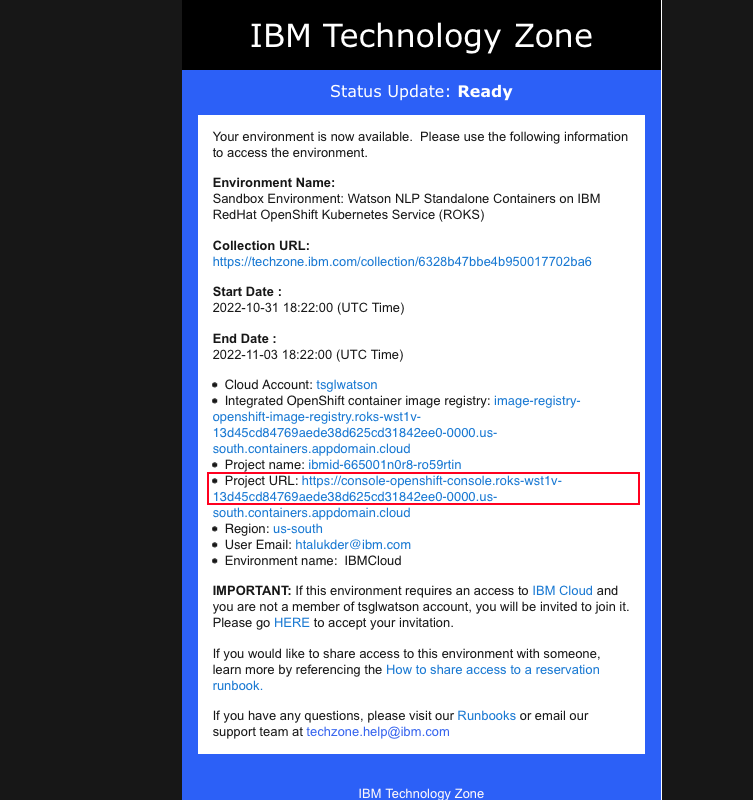
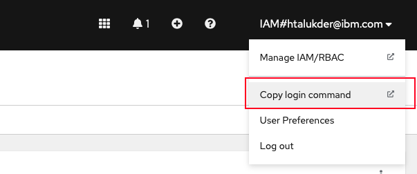

# Sandbox Environment

## Steps to reserve an OpenShift sanbox in IBM Cloud

### Step 1: Please click on the below url and login with your credentials

```

https://techzone.ibm.com/collection/watson-nlp-serving-models-with-standalone-containers

```

### Step 2: Click on the tab run on Kubernetes or OpenShift



### Step 3: Scroll down the page, look for a box `Sandbox Environment: Watson NLP Standalone Containers on IBM RedHat OpenShift Kubernetes Service (ROKS)` and hit the reserve button



### Step 4: Pick up the option between `Reserve now` and `Schedule for later`



### Step 5: Fill up the form and submt



### Step 6: When the enviroment is ready, you will receive an email like below



Please make a note about the information in the email

- ***Integrated OpenShift container image registry*** is the openshift internal `REGISTRY`
- ***Project name*** is the namespace of the OpenShift platform as well as the internal container registry `NAMESPACE`
- ***Project URL*** is the path to login to OpenShift cluster

## Steps to login to OpenShift Cluster

Assuming that

- You have an [IBM Cloud account](https://cloud.ibm.com/login)
- You have installed [IBM Cloud CLI](https://cloud.ibm.com/docs/cli?topic=cli-getting-started)

### Step 1: Log in to your IBM Cloud account

From the command terminal execute the below command

```
ibmcloud login
```

<sub>Use ibmcloud login --sso command to login, if you have a federated ID.</sub>

### Step 2: Go to the project URL in the email and login to your OpenShift cluster



### Step 3: Click on the top right corner on your Id, a drop down will be show and click on the `Copy login command'. A popup window will open



### Step 4: Click on the display token and copy the command 'Login in with this token` and execute in the terminal window

### Step 5: Login to OpenShift internal container registry

```
echo $(oc whoami -t) | docker login $REGISTRY -u $(oc whoami) --password-stdin
```

### Step 6: check status

```
oc get all
```
