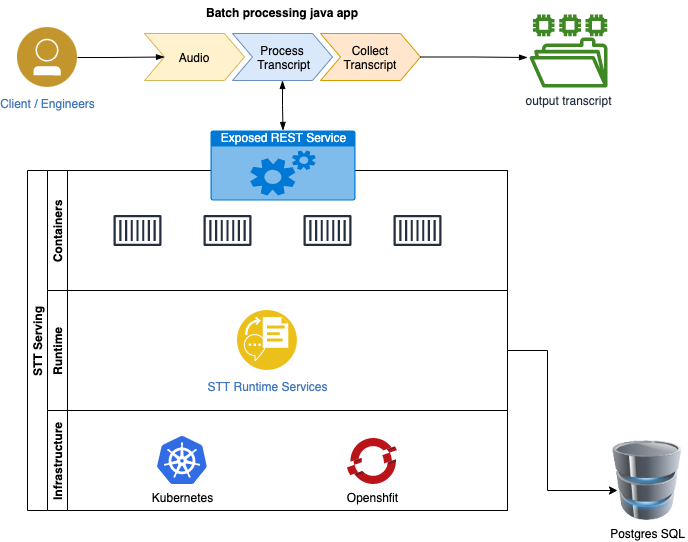

## STT Client Java WebApp
In this tutorial, I am going to explain Speech to Text serving can be accessed via REST endpoint. There are couple of ways you can access the REST endpoint.
- Batch processing / Synchronous way
- Asynchronous way
- Real time

I am going to show you the first option batch processing using a Java spring boot web application. Where you can upload an audio file and get an audio transcript in return.

Architecture diagram:


 
### Resources

GitHub Repo: https://github.com/ibm-build-labs/Watson-NLP/tree/main/STTApplication

Prerequisites
- Docker is installed on your workstation
- Java 17
- Eclipse, if you want to customize the application
- You already have a STT Runtime service running in a k8/OpenShift cluster

### Build and deploy
As I mentioned before this is a java springboot application. Fiegn library is used to make the API call to STT REST Serving.

Clone the git repo 
```
git clone https://github.com/ibm-build-labs/Watson-NLP
```
```
cd STTApplication
```

Below is the list of libraries that are used.
```
<dependencies>
		<dependency>
			<groupId>org.springframework.boot</groupId>
			<artifactId>spring-boot-starter-thymeleaf</artifactId>
		</dependency>
		<dependency>
			<groupId>org.springframework.boot</groupId>
			<artifactId>spring-boot-starter-web</artifactId>
		</dependency>
		<dependency>
			<groupId>org.springframework.cloud</groupId>
			<artifactId>spring-cloud-starter-openfeign</artifactId>
		</dependency>
		<dependency>
		  <groupId>io.github.openfeign</groupId>
		  <artifactId>feign-httpclient</artifactId>
		</dependency>
</dependencies>
```

#### docker file.
```
FROM openjdk:17-jdk-alpine
ARG JAR_FILE=target/*.jar
COPY ${JAR_FILE} app.jar
ENTRYPOINT ["java","-jar","/app.jar"]
```

Build the image with the below command. I am using ibm container registry to push the image. You can choose a repository on your own.
```
docker build . -t us.icr.io/watson-core-demo/stt-web-application:v1
```
```
docker push us.icr.io/watson-core-demo/stt-web-application:v1
```

### Deploy in Kubernetes
We are creating two Kubernetes object here, deployment and a service. In deployment.yaml file you need to modify two things
- Image location
- Environmental variable STT_SERVICE_ENDPOINT

Here is a sample deployment.yaml file and highlighted the text you might want to replace.
```
apiVersion: apps/v1
kind: Deployment
metadata:
  name: stt-web-app
spec:
  selector:
    matchLabels:
      app: stt-web-app
  replicas: 1
  template:
    metadata:
      labels:
        app: stt-web-app
    spec:
      containers:
      - name: stt-web-app
        image: us.icr.io/watson-core-demo/stt-web-application:v1
        resources:
          requests:
            memory: "500m"
            cpu: "100m"
          limits:
            memory: "1Gi"
            cpu: "500m"
        env:
          - name: STT_SERVICE_ENDPOINT
            value: "install-1-stt-runtime:1080"
        ports:
        - containerPort: 8080
```

The you can get the service name from the Kubernetes cluster you have deployed your STT Serving. Here is an example. In my case my STT service name is install-1-stt-runtime and port is 1080 for non tls and for tls 1443
```
kubectl get svc 
```
```
NAME                          TYPE        CLUSTER-IP       EXTERNAL-IP   PORT(S)                         AGE
install-1-stt-runtime         NodePort    172.21.206.51    <none>        1080:30280/TCP,1443:32753/TCP   14d
install-1-tts-runtime         NodePort    172.21.199.140   <none>        1080:31439/TCP,1443:30824/TCP   14d
```

Here I am creating a clusterIP service exposing in port 8080, Here is the yaml file
```
apiVersion: v1
kind: Service
metadata:
  name: stt-web-app
spec:
  type: ClusterIP
  selector:
    app: stt-web-app
  ports:
  - port: 8080
    protocol: TCP
    targetPort: 8080
```

### Deploy:
```
kubectl apply -f /deployment/
```

#### Check that the pod and service are running.
```
kubectl get pods
```
```
NAME                                           READY   STATUS    RESTARTS   AGE
stt-web-app-64d9df8f49-4fm97                   1/1     Running   0          25h
```
```
kubectl get svc 
```
```
NAME                          TYPE        CLUSTER-IP       EXTERNAL-IP   PORT(S)                         AGE
stt-web-app                   ClusterIP   172.21.238.164   <none>        8080/TCP                        25h
```

To access the app, you need to do a port-forward
```
kubectl port-forward svc/stt-web-app 8080
```

you can access the app at http://localhost:8080
