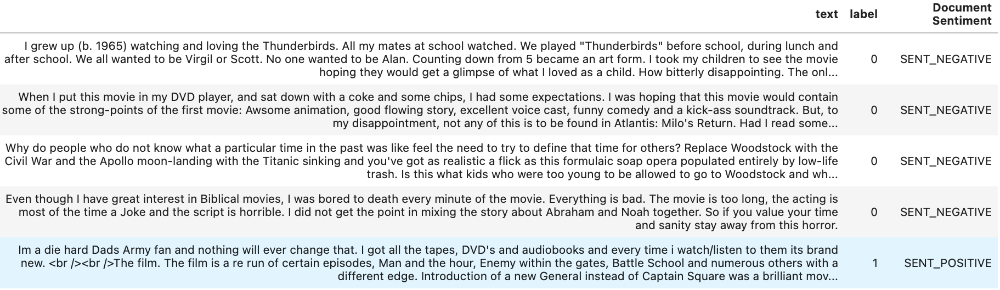
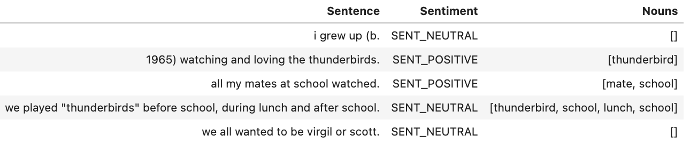

## Introduction

Sentiment analysis is used ubiquitously to gain insights from text data. For example, using sentiment analysis, companies can understand the voice of the customer or the market sentiment of the company. However, due to the lack of a standard infrastructure and standard libraries, many sentiment analysis projects remain at the proof-of-concept (POC) level and are never put into production.

With Watson NLP, IBM introduced a common library for Natural Language Processing, Document Understanding, Translation, and Trust. Watson NLP brings everything under one umbrella for consistency and ease of development and deployment. This tutorial walks you through the steps of using a pretrained model for sentiment analysis as well as fine-tuning a sentiment analysis model using the watson_nlp library.

The watson_nlp library is available on IBM Watson Studio as a runtime library so that you can directly use it for model training, evaluation, and prediction. The following figure shows the Watson NLP architecture.


## Prerequisites

To follow the steps in this tutorial, you need:

* An [IBMid](https://cloud.ibm.com/login?cm_sp=ibmdev-_-developer-tutorials-_-cloudreg)
* A Watson Studio project

Before working through the tutorial, you should have an understanding of IBM Watson Studio and Jupyter Notebooks.

## Estimated time

It should take you approximately 60 minutes to complete this tutorial.

## Steps

The steps in this tutorial use an example of IMDB movie reviews from Kaggle to walk you through the process.

### Setting up your environment

To begin, you set up a Python notebook environment using Watson Studio on IBM Cloud so that you can use the `watson_nlp` library.

#### Reserve your env

** How does this work outside of Tech Zone when you can't reserve an env? This process needs to be documented here for people outside of IBM.**
(Note: If you can't reserve an env on Tech Zone but if you have access to Watson Studio instance, you can skip steps 1 and 2 to complete the tutorial)

1. Under the [Sentiment Analysis](https://techzone.ibm.com/collection/watson-core-nlp#tab-1) tab, find the environment tile and click **Reserve** to reserve a Watson Studio environment.

    

2. Shortly, you will receive an email inviting you to join an IBM cloud account. Follow the instructions in the email to join.  Your environment should be ready within a few minutes.  When it is ready, you will recieve a second email similar to the following.

    

3. Log in to [IBM Cloud Pak for Data](https://dataplatform.cloud.ibm.com?cm_sp=ibmdev-_-developer-tutorials-_-cloudreg). After you log in, ensure that you are using cloud account **2577353 - tsglwatson**. You can check the name of the current account in the bar the top of the screen.  Change the account if necessary using the drop-down menu.  From the IBM Cloud Pak for Data dashboad, find the tile for the Project that you want to work with.  For the Sentiment Analysis tutorial, the name of this Project will have the prefix **sentiment-analysis**.  Once the Project is open, you can view the notebooks and data assets of the project using the **Assets** tab.

    (Note: If you are not using the TechZone environment, you will not have access to this IBM cloud account. You can load the [Sentiment Analysis Pre-trained model notebook](https://github.com/ibm-build-labs/Watson-NLP/blob/main/Sentiment-Analysis/Sentiment%20Analysis%20-%20Pre-Trained%20models.ipynb) into your Watson Studio project directly. Follow [instructions for creating notebook from URL](https://www.ibm.com/docs/en/cloud-paks/cp-data/4.5.x?topic=notebooks-creating)).

    

4. Before working with the notebooks, you must define the environment in which these notebooks will run. To get started on that, click on the **Manage** tab.

    

5. Click on **Environments** from the side Navbar. Next click on **Templates** tab. Finally, click on **New template**

    

6. We will create an environment template that contains the Watson NLP library. Give your environment template a name like **Watson NLP**. In the Hardware configuration, select at least **4 vCPU and 16 GB RAM**  (Note: For better performance, select higher Hardware configuration). For Software, select **DO + NLP Runtime 22.1 on Python 3.9**. Finally click **Create**

    

7. Now we will set an environment for a notebook.  Click on the **Assets** tab. Find the notebook you want to work with among the assets.  Click on the ellipsis (the three dots) to the right of the notebook name in order to open a drop-down menu.  Within this menu click **Change environment**.

    

8. Select the environment template that you created previously and click **Change**.
 
    

9. You will be able to run the notebook by clicking the ellipsis and selecting **Edit**.


10. Your notebook will load. You can follow the instructions in your notebook to complete the tutorials on Watson NLP.

    


### Step 1. Collecting the data set

**These steps need to be broken out like the "Setting up your environment section.**
(Note: If you are reserving the env through TechZone, you don't need to collect the data manually. The env comes with the Watson Studio project pre-created for you. You can skip the rest of the steps here and follow the instructions in the notebook to complete the Sentiment Analysis tutorial. However, if you are not reserving the env through TechZone and you have a Watson Studio instance, then you should follow the steps described below)

1. The IMDB movie reviews data set from <a href="https://www.kaggle.com/datasets/yasserh/imdb-movie-ratings-sentiment-analysis" target="_blank" rel="noopener noreferrer">Kaggle</a> has been downsampled and saved for you to reduce model training time. Download the dataset from this [GitHub Repo](
https://github.com/ibm-build-labs/Watson-NLP/raw/main/Sentiment-Analysis/movies_small.csv)

2. Upload the data set to your Watson Studio project by going to the Assets tab and then dropping the data files as shown in the following figure.

    

3. After you have added the dataset to the project, you might have to reload the Notebook. You have two options of accessing the dataset from the Jupyter Notebook depending on the level of access you have.

    A. If you are a project administrator, then

    i) You can just insert the project token as shown below:

    

    ii) After inserting the project token, you can continue executing all the cells in the notebook. This cell in particular will load your dataset in the notebook.'
    

    B. If you are not a Watson Studio project administrator, then you cannot create a project token.

    i) Create a new cell under Step 2 - Data Loading by clicking on **Insert** menu and then selecting **Insert Cell Below** or **Esc+B** shortcut key. Highlight the code cell shown in the image below by clicking it.

    


    ii) Ensure you place the cursor below the commented line. Click the Find and add data icon (01/00) on the top right corner. Choose the Files tab, and pick the `movies_small.csv` file. Click Insert to code and choose pandas DataFrame. Rename the dataframe from `df_data_1` to `review_df`.

    

4. After you've added the data set to the project, you can access it from the Jupyter Notebook, and read the csv file into a pandas DataFrame.

    

### Step 2. Data processing and exploratory data analysis

#### Step 2.A Extract frequently mentioned movie aspects

You will extract the most frequently mentioned aspects (nouns) in the movie reviews for each movie to get to know what the audiences are talking about in their reviews.

For this, you will use the Watson NLP pre-trained syntax model to extract the most frequently used nouns from the reviews. These nouns help you to comprehend what the main message of the reviews is.

1. Load the Watson NLP syntax model

```
syntax_model = watson_nlp.load(watson_nlp.download('syntax_izumo_en_stock'))
```

2. The syntax model performs part-of-speech tagging (for nouns, pronouns, verbs, etc.) so that you can filter out all nouns from the reviews. Instead of retrieving the nouns as they occur in the review, the lemmatized version of the nouns (e.g. companies -> company) is stored. This allows you to create more accurate statistics over all noun-occurrences.

Use the helper functions to identify the lemma form of nouns in the review text.

```
def extract_nouns(review_text):
    # converting text into lower case before processing
    review_text =review_text.lower()
    syntax_result = syntax_model.run(review_text, parsers=('lemma', 'part_of_speech'))
    # filter nouns
    nouns = [token['lemma'] for token in syntax_result.to_dict()['tokens'] if ((token['part_of_speech'] == 'POS_PROPN' or token['part_of_speech'] == 'POS_NOUN') and len(token['lemma']) > 2)] 
    # remove stopwords
    nouns = [noun for noun in nouns if noun.upper() not in stopwords]
    return list(nouns)
```

3. Extract the lemmatized nouns and show them with the review text in which they occurred.

```
noun_df = create_noun_dataframe(review_df)
sentiment_noun_df = review_df[['text', 'label']].merge(noun_df, how='left', left_index=True, right_index=True)
sentiment_noun_df.head()
```

4. Use the `explode` function to transform the noun list to separate rows for each noun. That way, you can count the occurrences for each noun in a subsequent step.

```
exp_nouns = sentiment_noun_df.explode('Nouns')
```

5. Plot the most frequent nouns as a bar chart.

    

6. Create a word cloud for the most frequent nouns and show them.

    

This block extracts nouns from the movie reviews. The most frequently used nouns are typical aspects of a movie that review authors talk about.


You can also plot a bar chart or a word cloud for the most frequently occurring nouns.


### Step 3. Model building

#### Step 3.A Extract document and sentence sentiment

Are reviewers talking positively or negatively about the movies? Sentiment can be extracted for the complete review and for individual sentences. The sentiment extraction helpers can extract both sentiment levels.

1. Load the *sentiment-document_bert_multi_stock* (BERT) sentiment model for English:

`sentiment_model = watson_nlp.load(watson_nlp.download('sentiment-document_bert_multi_stock'))
`

2. Extract the overall sentiment of the review and the sentiment for each sentence

```
def extract_sentiment(review_text):
    # run the syntax model
    # converting review text into lower case
    review_text = review_text.lower()
    syntax_result = syntax_model.run(review_text, parsers=('token', 'lemma', 'part_of_speech'))
    # run the sentiment model on the result of the syntax analysis
    sentiment_result = sentiment_model.run(syntax_result, sentence_sentiment=True)
    
    document_sentiment = sentiment_result.to_dict()['label']
    sentence_sentiment = [(sm['span']['text'], sm['label']) for sm in sentiment_result.to_dict()['sentiment_mentions']]
    return (document_sentiment, sentence_sentiment)
```

3. Extract the sentiment and display it with the review text. 

    

#### 3.B Identify nouns that drive sentiment

We now identify the most frequently used nouns in sentences with positive or negative sentiment.

1. Extract nouns from the sentences/sentiment dataframe:

    

2. Show the most frequent nouns in positive sentences.

    

In this case, the word clouds show that the most positive sentiments comes from the reviews with words like film, movie, time, story, character etc. So, the audience must love the film/movie when the story and character was good and it was mentioned in the reviews.

3. Show the most frequent nouns in negative sentences.

    

In this case, the word clouds show that the most negative sentiments comes from reviews with words like time, character, scene, director. So, the audience might not have liked movies with poor direction, character and scenes in the movie.

4. Show the nouns that "drive" sentiment for each review. Create a crosstab between nouns and the resulting sentence sentiment, and correlate them. The darker the cell, the more often does a noun occur in a sentence of a certain polarity.


    

It can be observed from the above visual that script is the most contributing factor to negative sentiments while performance and love are the most contributing factors to positive sentiments.

#### 3.C Aspect-oriented sentiment analysis

Let's see how the sentiment for these aspects (script, performance and love) looks like. For this, use the Watson NLP targeted sentiment model to extract the sentiment that is specific to the most frequently used nouns in the movie revies.

1. Load the syntax model for English and the targeted BERT sentiment model:

`targeted_sentiment_model = watson_nlp.load(watson_nlp.download('sentiment-targeted_bert_multi_stock'))
`

2. Use a helper method to extract the sentiment for each target and the sentences containing the target as evidence.

```
def extract_targeted_sentiment(review_text, target_words):
    # run the syntax model
    syntax_result = syntax_model.run(review_text, parsers=('token', 'lemma', 'part_of_speech'))
    # extract the spans for the target words
    targets = watson_nlp.toolkit.get_target_spans(review_text, target_words)
    # run the sentiment model on the result of syntax and the target words
    sentiment_result = targeted_sentiment_model.run(syntax_result, targets)
    
    # iterate over all target aspects
    target_sentiments = []
    for idx, val in enumerate(target_words):
        sentiment_prediction = sentiment_result.to_dict()['sentiment_predictions'][idx]
        sentiment_mentions = None
        if sentiment_prediction['sentiment_mentions'] is not None:
            sentiment_mentions = [(sm['span']['text'], sm['label']) for sm in sentiment_prediction['sentiment_mentions']]
        target_sentiments.append(sentiment_prediction['label'])
        target_sentiments.append(sentiment_mentions)
    return target_sentiments
```

3. Extract the sentiment specifically for *script*, *performance* and *love*. **Note:** this cell will run for several minutes.

    

4. Display the sentiment for selected aspects

    

### Step 4. Model Evaluation

1. Apply data processing on the test data to make is compatible with the evaluate method in the Watson NLP library.

```
def input_data_prep(df):
    df['weight'] = 1
    df.rename(columns={'label': 'labels'}, inplace=True)
    df = df[['text', 'weight', 'labels']]
    df['labels'] = df['labels'].replace({0: 'negative', 1: 'positive'})
    df['labels'] = df['labels'].apply(convertToList)
    display(df.head(5))
    return df
```

2. Evaluate the model by passing the test data and using the `evaluate_quality` method from the Watson NLP library.

    ```
    pre_eval_func = lambda x: syntax_model.run_batch(x)
    sentiment_model.find_label_func

    results = sentiment_model.evaluate_quality(test_file, pre_eval_func)
    ```

    

As you can observe here that the overall accuracy, precision and recall values are 0.87 each. This has been achieved by evaluating an Out-of-the-box (OOB) model without training it on the IMDB Movie reviews dataset. If you want a better performance or custom model, you can follow the next tutorial in this learning path where you will be fine-tuning/re-training a pre-trained BERT based sentiment analysis model from the Watson NLP library on the same dataset.

## Conclusion

This tutorial shows how easily you can use watson_nlp library for simplifying natural language processing tasks like sentiment analysis. The tutorial showed using both a pretrained model that's ready to use as well as fine-tuning and retraining a model to learn from the data set.

## Next steps

You can run this <a href="https://github.com/ibm-build-labs/Watson-NLP/blob/main/Sentiment-Analysis/Sentiment%20Analysis%20-%20Model%20Training.ipynb" target="_blank" rel="noopener noreferrer">Jupyter Notebook</a> to see how training a sentiment analysis model using Watson NLP works. The notebook demonstrates how to train sentiment analysis model on movie reviews using Watson Natural Language Processing.

In this notebook, you see how Watson NLP offers blocks for various NLP task and shows sentiment analysis with the Sentiment block (BERT Document Sentiment block). Sentiment analysis classifies the sentiment of the reviews into positive or negative sentiment. You use the Sentiment workflow to train a BERT-based sentiment analysis model. Then, you save the trained sentiment analysis model and evaluate the trained model on the test data set for IMDB movie reviews.
