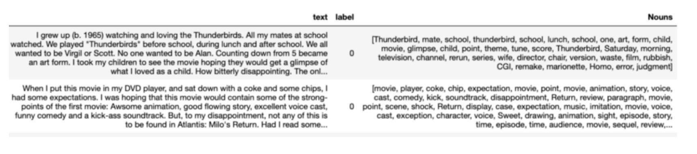
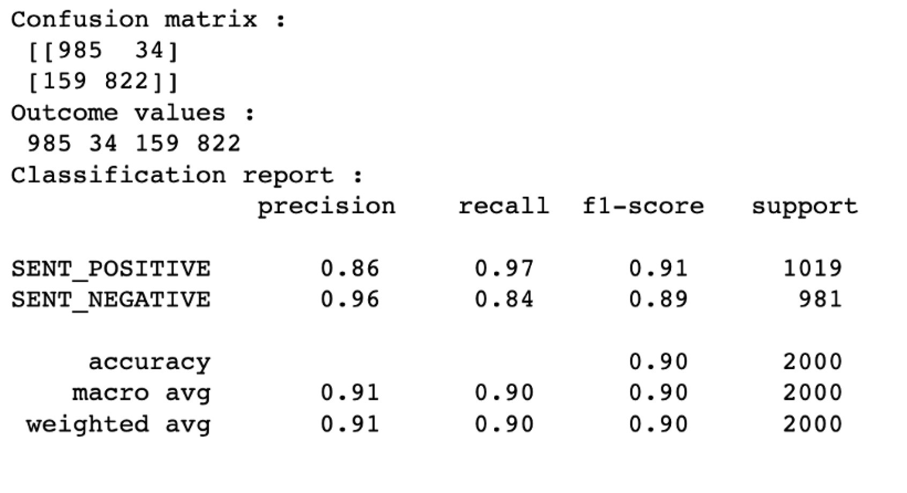

## Introduction

Sentiment analysis is used ubiquitously to gain insights from text data. For example, using sentiment analysis, companies can understand the voice of the customer or the market sentiment of the company. However, due to the lack of a standard infrastructure and standard libraries, many sentiment analysis projects remain at the proof-of-concept (POC) level and are never put into production.

With Watson NLP, IBM introduced a common library for Natural Language Processing, Document Understanding, Translation, and Trust. Watson NLP brings everything under one umbrella for consistency and ease of development and deployment. This tutorial walks you through the steps of using a pretrained model for sentiment analysis as well as fine-tuning a sentiment analysis model using the watson_nlp library.

The watson_nlp library is available on IBM Watson Studio as a runtime library so that you can directly use it for model training, evaluation, and prediction. The following figure shows the Watson NLP architecture.


## Prerequisites

To follow the steps in this tutorial, you need:

* An [IBMid](https://cloud.ibm.com/login?cm_sp=ibmdev-_-developer-tutorials-_-cloudreg)
* A Watson Studio project

Before working through the tutorial, you should have an understanding of IBM Watson Studio and Jupyter Notebooks.

## Estimated time

It should take you approximately ?? minutes/hours? to complete this tutorial.

## Steps

The steps in this tutorial use an example of IMDB movie reviews from Kaggle to walk you through the process.

### Setting up your environment

To begin, you set up a Python notebook environment using Watson Studio on IBM Cloud so that you can use the `watson_nlp` library.

#### Reserve your env

** How does this work outside of Tech Zone when you can't reserve an env? This process needs to be documented here for people outside of IBM.**
(Note: If you can't reserve an env on Tech Zone but if you have access to Watson Studio instance, you can skip steps 1 and 2 to complete the tutorial)

1. Under the [Sentiment Analysis](https://techzone.ibm.com/collection/watson-core-nlp#tab-1) tab, find the environment tile and click **Reserve** to reserve a Watson Studio environment.

    

2. Shortly, you will receive an email inviting you to join an IBM cloud account. Follow the instructions in the email to join.  Your environment should be ready within a few minutes.  When it is ready, you will recieve a second email similar to the following.

    

3. Log in to [IBM Cloud Pak for Data](https://dataplatform.cloud.ibm.com?cm_sp=ibmdev-_-developer-tutorials-_-cloudreg). After you log in, ensure that you are using cloud account **2577353 - tsglwatson**. You can check the name of the current account in the bar the top of the screen.  Change the account if necessary using the drop-down menu.  From the IBM Cloud Pak for Data dashboad, find the tile for the Project that you want to work with.  For the Sentiment Analysis tutorial, the name of this Project will have the prefix **sentiment-analysis**.  Once the Project is open, you can view the notebooks and data assets of the project using the **Assets** tab.

    (Note: If you are not using the TechZone environment, you will not have access to this IBM cloud account. You can load the [Sentiment Analysis Pre-trained model notebook](https://github.com/ibm-build-labs/Watson-NLP/blob/main/Sentiment-Analysis/Sentiment%20Analysis%20-%20Pre-Trained%20models.ipynb) into your Watson Studio project directly. Follow [instructions for creating notebook from URL](https://www.ibm.com/docs/en/cloud-paks/cp-data/4.5.x?topic=notebooks-creating)).

    

4. Before working with the notebooks, you must define the environment in which these notebooks will run. To get started on that, click on the **Manage** tab.

    

5. Click on **Environments** from the side Navbar. Next click on **Templates** tab. Finally, click on **New template**

    

6. We will create an environment template that contains the Watson NLP library. Give your environment template a name like **Watson NLP**. In the Hardware configuration, select at least **4 vCPU and 16 GB RAM**  (Note: For better performance, select higher Hardware configuration). For Software, select **DO + NLP Runtime 22.1 on Python 3.9**. Finally click **Create**

    

7. Now we will set an environment for a notebook.  Click on the **Assets** tab. Find the notebook you want to work with among the assets.  Click on the ellipsis (the three dots) to the right of the notebook name in order to open a drop-down menu.  Within this menu click **Change environment**.

    

8. Select the environment template that you created previously and click **Change**.
 
    

9. You will be able to run the notebook by clicking the ellipsis and selecting **Edit**.


10. Your notebook will load. You can follow the instructions in your notebook to complete the tutorials on Watson NLP.

    


### Step 1. Collecting the data set

**These steps need to be broken out like the "Setting up your environment section.**
(Note: If you are reserving the env through TechZone, you don't need to collect the data manually. The env comes with the Watson Studio project pre-created for you. You can skip the rest of the steps here and follow the instructions in the notebook to complete the Sentiment Analysis tutorial. However, if you are not reserving the env through TechZone and you have a Watson Studio instance, then you should follow the steps described below)

1. The IMDB movie reviews data set from <a href="https://www.kaggle.com/datasets/yasserh/imdb-movie-ratings-sentiment-analysis" target="_blank" rel="noopener noreferrer">Kaggle</a> has been downsampled and saved for you to reduce model training time. Download the dataset from this [GitHub Repo](
https://github.com/ibm-build-labs/Watson-NLP/raw/main/Sentiment-Analysis/movies_small.csv)

2. Upload the data set to your Watson Studio project by going to the Assets tab and then dropping the data files as shown in the following figure.

    

3. After you have added the dataset to the project, you might have to reload the Notebook. You have two options of accessing the dataset from the Jupyter Notebook depending on the level of access you have.

    A. If you are a project administrator, then

    i) You can just insert the project token as shown below:

    

    ii) After inserting the project token, you can continue executing all the cells in the notebook. This cell in particular will load your dataset in the notebook.'
    

    B. If you are not a Watson Studio project administrator, then you cannot create a project token.

    i) Create a new cell under Step 2 - Data Loading by clicking on **Insert** menu and then selecting **Insert Cell Below** or **Esc+B** shortcut key. Highlight the code cell shown in the image below by clicking it.

    


    ii) Ensure you place the cursor below the commented line. Click the Find and add data icon (01/00) on the top right corner. Choose the Files tab, and pick the `movies_small.csv` file. Click Insert to code and choose pandas DataFrame. Rename the dataframe from `df_data_1` to `review_df`.

    

4. After you've added the data set to the project, you can access it from the Jupyter Notebook, and read the csv file into a pandas DataFrame.

    

### Step 2. Data processing and exploratory data analysis

**These steps need to be broken out like the "Setting up your environment section.**
You can continue executing the cells in the notebook to complete the Data processing and exploratory data analysis step. There are some noteworthy points mentioned below (not steps):

You can carry out Syntax analysis with the Syntax block for English, which is available out-of-the-box (OOTB) and can be loaded in Watson Studio as shown in the following code listing.

```
syntax_model = watson_nlp.load(watson_nlp.download('syntax_izumo_en_stock'))
```

This block extracts nouns from the movie reviews. The most frequently used nouns are typical aspects of a movie that review authors talk about.



You can also plot a bar chart or a word cloud for the most frequently occurring nouns.


### Step 3. Model building

**These steps need to be broken out like the "Setting up your environment section unless this is just a discussion about model building.**
You can continue executing the cells in the notebook to complete the Model building step. There are some noteworthy points mentioned below (not steps):

#### Document Sentiment Analysis

Are reviewers talking positively or negatively about the movies? Sentiment can be extracted for the complete review and for individual sentences. Sentiment analysis models are also readily available in the watson_nlp library and can be loaded in IBM Watson Studio as shown in the following code listing.

```
sentiment_model = watson_nlp.load(watson_nlp.download('sentiment-document_bert_multi_stock'))
```

This model classifies the sentiment of the movie reviews into positive, negative or neutral sentiment. The document level sentiment analysis provides you with the overall sentiment for the entire document, as shown in the following figure.


Each row representing movie review is considered as a document with multiple lines of review and the Document Sentiment for each row as predicted by the sentiment_model is shown on the right.

#### Identify drivers of Sentiment

You can use sentence level sentiment analysis in collaboration with the nouns that we have extracted in the previous EDA step to identify drivers of Sentiment. After extracting sentence level sentiment, you can plot a word cloud to get an idea about the most frequent nouns in positive and negative sentence as shown here:


In this case, the word clouds show that the most negative sentiments comes from reviews with words like time, character, scene, director. So, the audience might not have liked movies with poor direction, character and scenes in the movie.

Furthermore, you can also create a cross-tab between nouns and the resulting sentence sentiment, and correlate them. The darker the cell, the more often does a noun occur in a sentence of a certain polarity.


It can be observed from the above visual that script is the most contributing factor to negative sentiments while performance and love are the most contributing factors to positive sentiments.

### Step 4. Model evaluation

**These steps need to be broken out like the "Setting up your environment section unless this is just a discussion about model evaluation.**
You can continue executing the cells in the notebook to complete the Data processing and exploratory data analysis step. There are some noteworthy points mentioned below (not steps):

You can easily evaluate the pre-trained model using evaluate_quality on your data set as shown below:

```
results = sentiment_model.evaluate_quality(test_file, pre_eval_func)
```


As you can observe here that the overall accuracy, precision and recall values are 0.87 each. This has been achieved by evaluating an pre-trained (OOTB) model without training it on the IMDB Movie reviews data set. If you want a custom model to learn the nuances of a text corpus, you can follow the next step where you will be fine-tuning a pre-trained BERT based sentiment analysis model from the Watson NLP library on the same data set.

### Step 5. Model improvement

The model improvement steps are developed in the [Sentiment Analysis - Model Training Notebook](https://github.com/ibm-build-labs/Watson-NLP/blob/main/Sentiment-Analysis/Sentiment%20Analysis%20-%20Model%20Training.ipynb).

A. If you are using the TechZone env, you can directly access the Sentiment Analysis - Model Training Notebook in the **Assets** tab of your project. You can continue executing all the cells in the notebook to complete the model training and improvement exercise.

B. If you are not using the TechZone env, you can create a notebook in your Watson Studio project using this [Raw link for the notebook](https://raw.githubusercontent.com/ibm-build-labs/Watson-NLP/main/Sentiment-Analysis/Sentiment%20Analysis%20-%20Model%20Training.ipynb).
You should follow instructions in Setting up the env and collecting the dataset before you start executing the cells in this notebook.

#### Fine-tuning a pretrained model

You can use the Workflow feature of the watson_nlp library for fine-tuning a sentiment analysis model. Workflows are end-to-end pipelines from a raw document to a final block, where all necessary blocks are chained as part of the workflow pipeline. For instance, the Sentiment classification block requires syntax prediction inputs, so the end-to-end workflow is: input document -> Syntax Block -> Sentiment Classification Block -> output sentiment. Instead of calling individual blocks, you can call the workflow directly. The steps are shown below:

1. Get the BERT based model from the workflow:

    ```
    from watson_nlp.workflows.document_sentiment import BERT
    ```

2. Configure the syntax block.

    ```
    syntax_model = watson_nlp.load(watson_nlp.download('syntax_izumo_en_stock')) syntax_lang_code_map = {"en": syntax_model}
    ```

3. Create a pipeline with the syntax block as the first step and sentiment classification as the second step.

    ```
    bert_wkflow = BERT.train( 
           train_file, 
           test_file, 
           syntax_lang_code_map, 
           pretrained_model_resource, 
           label_list=['negative', 
           'neutral', 'positive'], 
           learning_rate=2e-5, 
           num_train_epochs=5, 
           do_lower_case=True, 
           train_max_seq_length=512, 
           train_batch_size=32, 
           dev_batch_size=32, 
           predict_batch_size=128, 
           predict_max_seq_length=128, 
           num_layers_to_remove=2, 
           combine_approach="NON_NEUTRAL_MEAN", 
           keep_model_artifacts=True)
    ```

After you create your pipeline, you can train your model for the specified number of epochs (5 in this case). You can monitor the model training progress as shown below:


You can observe that with just 5 epochs, the model is performing well on the test data set.

#### Save the trained model

Once the model has been trained, you can easily save it using the save() method from watson_nlp library or using the project.save_data() function from Watson Studio as shown below:

```
project.save_data('bert_wkflow_imdb_5_epochs', data=bert_wkflow.as_file_like_object(), overwrite=True)
```

This saves the model on the Cloud Object Storage (COS) associated with the Watson Studio instance.

#### Evaluate the trained model

The saved model can be loaded into Watson Studio notebook using the `load()` method.

```
wk_loaded = watson_nlp.load(model_path)
```

The loaded model can then be used on text to make predictions using the run() method from watson_nlp library.

```
wk_loaded.run(raw_document, language_code=”en”)
```

The following image shows a sample output.


The model is predicting the sentiment to be positive with a score of 0.75 in this case. You can use this method to make predictions for each row in the dataframe. Once you have the predictions, you can use the predicted label vs the actual label to create a confusion matrix for evaluating the model.



The model performance has improved over out-of-the-box pretrained model as the nuances in the data set/text corpus can be learnt during model training which helps in improvement of the model performance.

## Conclusion

This tutorial shows how easily you can use watson_nlp library for simplifying natural language processing tasks like sentiment analysis. The tutorial showed using both a pretrained model that's ready to use as well as fine-tuning and retraining a model to learn from the data set.

## Next steps

You can run this <a href="https://github.com/ibm-build-labs/Watson-NLP/blob/main/Sentiment-Analysis/Sentiment%20Analysis%20-%20Model%20Training.ipynb" target="_blank" rel="noopener noreferrer">Jupyter Notebook</a> to see how training a sentiment analysis model using Watson NLP works. The notebook demonstrates how to train sentiment analysis model on movie reviews using Watson Natural Language Processing.

In this notebook, you see how Watson NLP offers blocks for various NLP task and shows sentiment analysis with the Sentiment block (BERT Document Sentiment block). Sentiment analysis classifies the sentiment of the reviews into positive or negative sentiment. You use the Sentiment workflow to train a BERT-based sentiment analysis model. Then, you save the trained sentiment analysis model and evaluate the trained model on the test data set for IMDB movie reviews.
