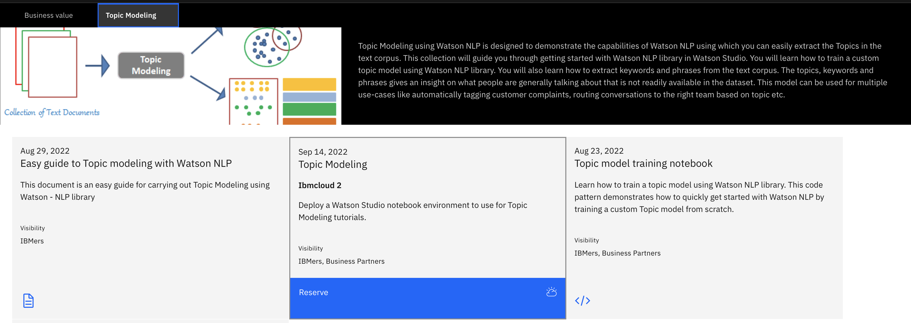
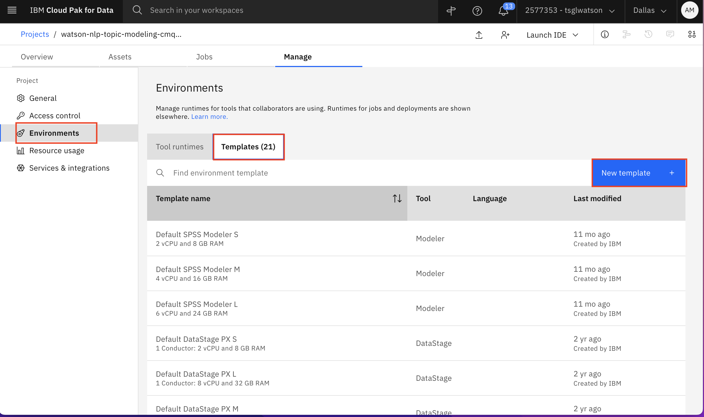
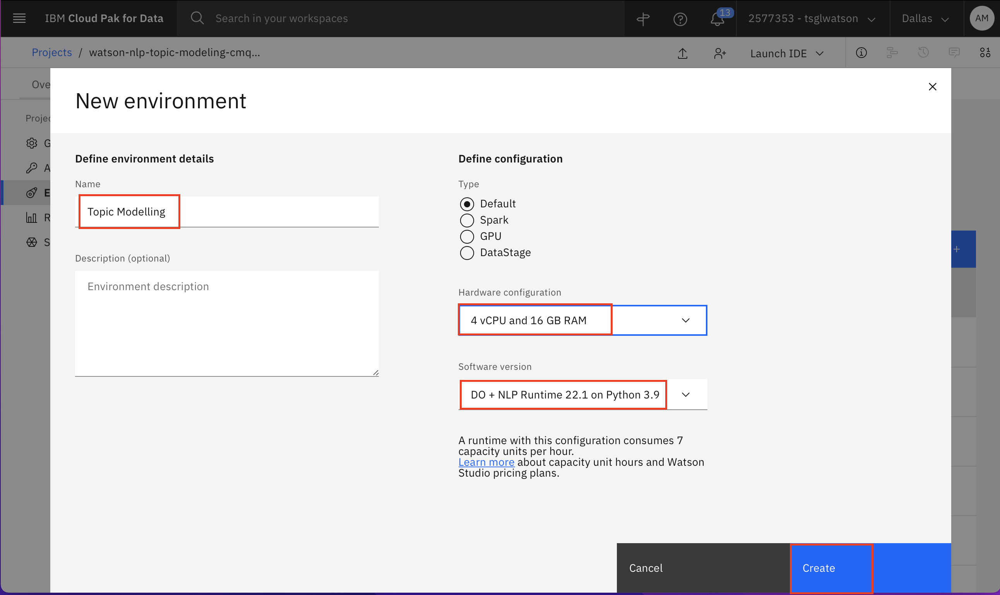
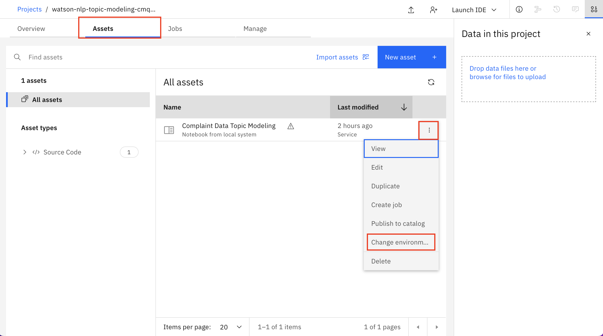
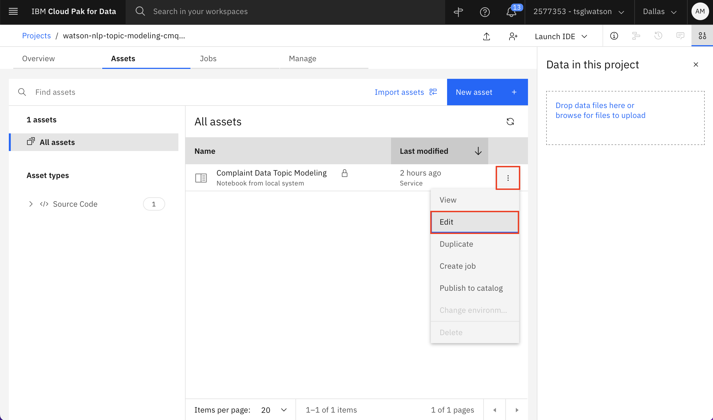
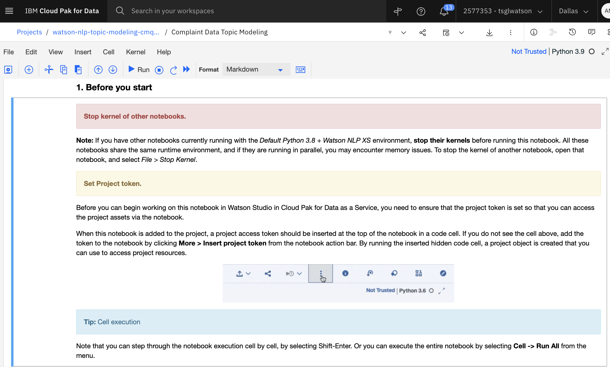

# Topic Modeling tutorial with Watson NLP

Topic modeling is an unsupervised machine learning algorithm used to convert unstructured content into structured format in the form of set of similar documents, detecting word and phrase patterns within them. It is automatically clustering word groups and similar expressions to best characterize a set of similar documents.

The volume of unstructured data has increased exponentially since the inception of social media. Therefore, it is very time consuming and overloading process for the employees to handle the volume of unstructured data and convert them into structured format. By using topic analysis model, A machine will be able to sort through endless lists of unstructured content into similar documents. It will save time & money for the companies. Watson NLP provides all NLP tasks at one place, which can be used to train the models on our data & get useful insights from unstructured content.

This tutorial shows you step by step process to train the Topic Modeling model using Watson NLP.  The `watson_nlp` library is available on IBM Watson Studio as a runtime library so you can directly use it for model training.  


## Prerequisites

To follow the steps in this tutorial, you need:

* An [IBMid](https://cloud.ibm.com/login?cm_sp=ibmdev-_-developer-tutorials-_-cloudreg)
* A Watson Studio project
* A [Python notebook](https://github.com/ibm-build-labs/Watson-NLP/blob/main/Emotion-Classification/Emotion%20Classification%20-%20Pre-Trained%20Models.ipynb)
* **What are the helper libraries that you need to import?**

Before working through the tutorial, you should have an understanding of IBM Watson Studio and Jupyter Notebooks.

## Estimated time

It should take you approximately 1 hour to complete this tutorial.

## Steps
The steps in this tutorial use an example of  [Consumer complaint database](https://www.consumerfinance.gov/data-research/consumer-complaints) to walk you through the process.

### Setting up your environment

To begin, you set up a Python notebook environment using Watson Studio on IBM Cloud so that you can use the watson_nlp_ library.

#### Reserve your env

** How does this work outside of Tech Zone when you can't reserve an env? This process needs to be documented here for people outside of IBM.**
(Note: If you can't reserve an env on Tech Zone but if you have access to Watson Studio instance, you can skip steps 1 and 2 to complete the tutorial)

1. Under the [Topic Modeling](https://techzone.ibm.com/collection/watson-nlp-topic-modeling) tab, find the environment tile and click **Reserve** to reserve a Watson Studio environment.

    

2. Shortly, you will receive an email inviting you to join an IBM cloud account. Follow the instructions in the email to join.  Your environment should be ready within a few minutes.  When it is ready, you will recieve a second email similar to the following.

    

3. Log in to [IBM Cloud Pak for Data](https://dataplatform.cloud.ibm.com?cm_sp=ibmdev-_-developer-tutorials-_-cloudreg). After you log in, ensure that you are using cloud account **2577353 - tsglwatson**. You can check the name of the current account on the top right of the screen.  Change the account if necessary using the drop-down menu.  From the IBM Cloud Pak for Data dashboad, find the tile for the Project that you want to work with.  For the Consumer complaints classification tutorial, the name of this Project will have the prefix **watson-nlp-topic-modelling**.  Once the Project is open, you can view the notebooks and data assets of the project using the **Assets** tab.

    (Note: If you are not using the TechZone environment, you will not have access to this IBM cloud account. You can load the [Compliant Data Topic Modelling notebook](https://github.com/ibm-build-labs/Watson-NLP/blob/main/Topic-Modeling/Complaint%20Data%20Topic%20Modeling.ipynb) into your Watson Studio project directly. Follow [instructions for creating notebook from URL](https://www.ibm.com/docs/en/cloud-paks/cp-data/4.5.x?topic=notebooks-creating)).

    

4. Before working with the notebooks, you must define the environment in which these notebooks will run. To get started on that, click on the **Manage** tab.

    

5. Click on **Environments** from the side Navbar. Next click on **Templates** tab. Finally, click on **New template**

    

6. We will create an environment template that contains the Watson NLP library. Give your environment template a name like **Topic Modelling**. In the Hardware configuration, select at least **4 vCPU and 16 GB RAM**  (Note: For better performance, select higher Hardware configuration). For Software, select **DO + NLP Runtime 22.1 on Python 3.9**. Finally click **Create**

    

7. Now we will set an environment for a notebook.  Click on the **Assets** tab. Find the notebook you want to work with among the assets.  Click on the ellipsis (the three dots) to the right of the notebook name in order to open a drop-down menu.  Within this menu click **Change environment**.

    

8. Select the environment template that you created previously and click **Change**.
 
    

9. You will be able to run the notebook by clicking the ellipsis and selecting **Edit**.



10. Your notebook will load. You can follow the instructions in your notebook to complete the tutorials on Watson NLP.

    


### Step 1. Collecting the data set

(Note: If you are reserving the env through TechZone, you don't need to collect the data manually. The env comes with the Watson Studio project pre-created for you. You can skip the rest of the steps here and follow the instructions in the notebook to complete the Topic Modelling tutorial. However, if you are not reserving the env through TechZone and you have a Watson Studio instance, then you should follow the steps described below)

1. The Consumer Financial complaint database collected from [Consumer complaint database](https://www.consumerfinance.gov/data-research/consumer-complaints). Download the dataset from this [GitHub Repo](https://github.com/ibm-build-labs/Watson-NLP/raw/main/Sentiment-Analysis/movies_small.csv).  To use here we normalize this dataset by removing which rows does not have value of consumer complaints. This data set contains 999285 consumer complaints with the date received, submitted via, products, sub-products and company information.  .

2. Upload the data set to your Watson Studio project by going to the Assets tab and then dropping the data files as shown in the following figure.

    

3. After you have added the dataset to the project, you might have to reload the Notebook. You have two options of accessing the dataset from the Jupyter Notebook depending on the level of access you have.

    A. If you are a project administrator, then

    i) You can just insert the project token as shown below:

    

    ii) After inserting the project token, you can continue executing all the cells in the notebook. This cell in particular will load your dataset in the notebook.'
    

    B. If you are not a Watson Studio project administrator, then you cannot create a project token.

    i) Create a new cell under Step 2 - Data Loading by clicking on **Insert** menu and then selecting **Insert Cell Below** or **Esc+B** shortcut key. Highlight the code cell shown in the image below by clicking it.

    


    ii) Ensure you place the cursor below the commented line. Click the Find and add data icon (01/00) on the top right corner. Choose the Files tab, and pick the `complaint_updated.csv` file. Click Insert to code and choose pandas DataFrame. Rename the dataframe from `df_data_1` to `complaint_df`.

    

4. After you've added the data set to the project, you can access it from the Jupyter Notebook, and read the csv file into a pandas DataFrame.

    

### Step 3. Data Processing & EDA

1. Convert the recieved date into date time format.

```
for index in range(len(complaint_df['Date received'])):
    date_str = complaint_df['Date received'][index]
    complaint_df.at[index,'Date received'] =datetime.strptime(date_str, '%Y-%m-%d')

complaint_df.head()
```

2. Extract most frequent companies in the dataset.

    

#### Step 3.1 Text Pre-Processing

Our first step is to pre-process the documents in a way that cleans distracting signals and makes them easier to process and analyze. This is a standard step in many NLP pipelines. Here we perform two types of pre-processing:

    a. Stop-words filtering
    b. Remove Some Patterns
    c. Lemmatization

1. We rely on WatsonNLP's stock list of stop-words and customize it. For example, we might assume that a word like 'keep' can be useful for separating the data, so we remove it from the list. In addition, we might want to add a few other words to the list. For instance, common informal contractions that aren't part of the stock list.


```
# added sub-products & products into stop word list to know more about what people are talking about
wnlp_stop_words = watson_nlp.download_and_load('text_stopwords_classification_ensemble_en_stock').stopwords
stop_words = list(wnlp_stop_words)
stop_words.extend(["gimme", "lemme", "cause", "'cuz", "imma", "gonna", "wanna", 
                   "gotta", "hafta", "woulda", "coulda", "shoulda", "howdy","day"])
stop_words.extend(complaint_df['Sub-product'].unique().tolist())
stop_words.extend(complaint_df['Product'].unique().tolist())
stop_words.extend(["chase","credit card", "company","day","bank","hour","express",'credit','card','SYNCHRONY FINANCIAL'.lower(),'synchrony','financial'])
stop_words.extend(["Ocwen Financial Corporation".lower(), "Ocwen".lower(),"corporation","financial corporation","Paypal Holdings, Inc".lower(),"paypal","holdings","paypal holdings"])
```

2.  Define a custom list of Izumo part-of-speech tags that will be used for filtering

```
pos_filter = {
    4,      # POS_AUX
    10,     # POS_PART
    11,     # POS_PRON
    15,     # POS_SYM
    17      # POS_X
}
```

3. Now we define a tokenizer that implements the pre-processing as explained above. The input for the tokenizer is the document text and the output is a list of lemmas, while ignoring stop-words.

```
def custom_tokenizer(text):
    # parse the text for pos tagging and lemmatization
    result = syntax_model.run(text, parsers=('part_of_speech', 'lemma'))

    # collect the terms that qualify as meaningful.
    # to qualify, a term must meet all conditions:
    # (a) not be pos-tagged as symbol / content-less word
    # (b) not be a stop-word from the pre-defined list
    # (c) be longer than 1 character
    terms = []
    for token in result.tokens:
        pos_tag = token.part_of_speech
        if pos_tag not in pos_filter:
            lemma = token.lemma.strip()
            text = token.span.text.strip()
            term = lemma if len(lemma) > 0 else text
            if len(term) >1:
                terms.append(term)
    return " ".join(terms)
```

### Step 4. Model Building


1. Import required libraries for Topic modeling

```
from watson_nlp.toolkit import NGramSummary
from watson_nlp.blocks.topics import HierarchicalClustering
from watson_core import data_model as dm
```

2. Load stopwords list for using topic modling

```
buffer = project.get_file("stopwords.txt")
topic_model_stopwords = pd.read_csv(buffer,delimiter="\n",encoding='utf-8')
```

#### Step 4.1. Training a Summary Model

1. Supply the train parameters for the summary model.

```
train_params = {
    "min_words_per_utterance": 10,
    "num_turns_to_remove": 0,
    "beginning_ratio": 1,
    "beginning_weighting_factor": 1,
    "min_ngram_size": 2,
    "max_ngram_size": 3,
    "max_ngrams": 10,
    'stopwords': list(topic_model_stopwords)
}
```

2. Convert dataframe into the required format for training the model
```
complaint_df_up = pd.DataFrame(top_complaint_df)
train_file = './train_data.csv'
complaint_df_up.to_csv(train_file)

complaint_df_up.head()
```

3. Train the summary model
```
summary_model = NGramSummary.train(train_data=syntax_data,train_params=train_params)
```

#### Step 4.2 Train a Hierarchical Topic Model

1. Supply the train parameters for the Hierarchical Topic Model.
```
train_params = { 'king_cluster_min_ratio': .5, 'min_records_per_king_cluster': 10, 'num_topics_per_iteration': 40, 'max_num_iters_per_model': 4, 'min_word_support': 0.01, 'max_word_support': 0.7, 'max_ngrams_per_topic': 10, }
```

2. Train the Heirachical topic model
```
topic_model = HierarchicalClustering.train(train_data=syntax_data, 
                                           summary_model=summary_model,
                                           train_params = {'king_cluster_min_ratio': 1.0, 
                                                           'min_records_per_king_cluster': 5000,
                                                           'num_topics_per_iteration': 15,
                                                           'max_num_iters_per_model': 10,
                                                           'max_ngrams_per_topic':15})
```

3. Extract topics for one company

    

### Step 5. Save Model

```
topic_model.save('complaint_topic_model_synchrony')
project.save_data('complaint_topic_model_synchrony', data=topic_model.as_file_like_object(), overwrite=True)
```

## Conclusion

This tutorial shows you how to use the Watson NLP library and how easily you can easily train Topic model. This notebook also demonstrated one possible application of Watson NLP.