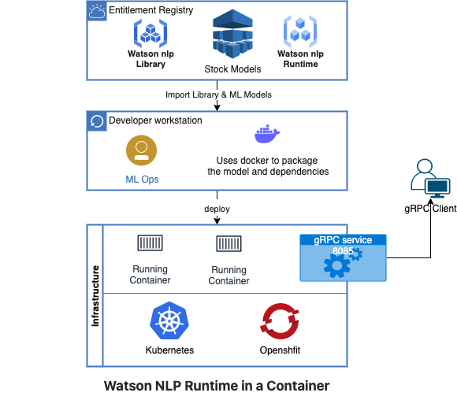

# Serving Watson NLP Models with Standalone Containers on Kubernetes and OpenShift
In this tutorial you will build a standalone container image to serve Watson NLP models and run it on a Kubernetes or OpenShift cluster. The standalone container image will include both the Watson NLP Runtime as well as Watson NLP models.  When the container runs, it exposes gRPC and REST endpoints that clients can use to run inference against the served models.  

### Architecture diagram



### Prerequisites
- Docker is installed on your workstation.
- Python >= 3.9 installed in your workstation.  (This is needed to run the client program.)
- An [IBM Artifactory](https://na.artifactory.swg-devops.com/ui/admin/artifactory/user_profile) user name and API key are required to build the Docker image. Get an Artifactory Api key from [here](https://taas.w3ibm.mybluemix.net/guides/create-apikey-in-artifactory.md)
  - ARTIFACTORY_USERNAME 
  - ARTIFACTORY_API_KEY
  
Set the following variables in your environment.
```
export ARTIFACTORY_USERNAME=<USER_NAME>
export ARTIFACTORY_API_KEY=<API_KEY>
```

## Steps

### 1. Clone the GitHub repository
Clone the repository containing the code used in this tutorial.  
```
git clone https://github.com/ibm-build-labs/Watson-NLP 
```
### 2. Build the container image 
In this step, you will build a container image to deploy. If you already have a standalone container image to serve stock and/or custom Watson NLP models that you prefer to use, you can skip this step.

Go to the build directory.
```
cd Watson-NLP/Watson-NLP-Container-k8/Runtime
```
This directory contains the Dockerfile with the following contents.
```
ARG WATSON_RUNTIME_BASE="wcp-ai-foundation-team-docker-virtual.artifactory.swg-devops.com/watson-nlp-runtime:0.13.1_ubi8_py39"
FROM ${WATSON_RUNTIME_BASE} as base
#################
## Build Phase ##
#################
FROM base as build

# Args for artifactory credentials
ARG ARTIFACTORY_USERNAME
ARG ARTIFACTORY_API_KEY
ENV ARTIFACTORY_USERNAME=${ARTIFACTORY_USERNAME}
ENV ARTIFACTORY_API_KEY=${ARTIFACTORY_API_KEY}

# Build arg to specify space-delimited names of models
ARG MODEL_NAMES
WORKDIR /app/models
# Download all of the models locally to /app/models
RUN true && \
    mkdir -p /app/models && \
    arr=(${MODEL_NAMES}) && \
    for model_name in "${arr[@]}"; do \
        python3 -c "import watson_nlp; watson_nlp.download('${model_name}', parent_dir='/app/models')"; \
    done && \
    true

###################
## Release Phase ##
###################
FROM base as release

ENV LOCAL_MODELS_DIR=/app/models
COPY --from=build /app/models /app/models
```
Notice that the Watson NLP Runtime image is used as the base image. Stock Watson NLP models are downloaded during the build phase, and then copied into the final image during the release phase.

The following arguments are used during the build.  Set these as environment variables.  
- **WATSON_RUNTIME_BASE**=Watson base runtime image (optional).
- **ARTIFACTORY_USERNAME**=Artifactory username to download the base image
- **ARTIFACTORY_API_KEY**=Artifactory API key to download the base image
- **MODEL_NAMES**=Space-separated list of models to be served. 

To build this image, run the following command.
```
docker build . \
--build-arg WATSON_RUNTIME_BASE="wcp-ai-foundation-team-docker-virtual.artifactory.swg-devops.com/watson-nlp-runtime:0.13.1_ubi8_py39" \
--build-arg MODEL_NAMES="ensemble_classification-wf_en_emotion-stock sentiment_document-cnn-workflow_en_stock" \
--build-arg ARTIFACTORY_API_KEY=$ARTIFACTORY_API_KEY \
--build-arg ARTIFACTORY_USERNAME=$ARTIFACTORY_USERNAME \
-t watson-nlp-container:v1
```
This will create a Docker image called `watson-nlp-container:v1`.  When the container runs, it serves two stock Watson NLP models: 
- `sentiment_document-cnn-workflow_en_stock` 
- `ensemble_classification-wf_en_emotion-stock`

### 3. Copy the image to a container registry
To deploy this image in Kubernetes or OpenShift cluster, you must first provision the image to a container repository that your cluster can access.  Tag your image with proper repository and namespace/project name. Replace `<REPO>` and `<PROJECT_NAME>` in the following commands based on your configuration.
```
docker tag watson-nlp-container:v1 <REPO>/<PROJECT_NAME>/watson-nlp-container:v1 
```
Push the image to upstream
```
docker push <REPO>/<PROJECT_NAME>/watson-nlp-container:v1 
```

### 3. Deploy in Kubernetes/OpenShift
To run the service in an OpenShift or Kubernetes cluster, ensure that you have either the Kubernetes CLI (`kubectl`) or OpenShift CLI (`oc`) installed on your local machine, and that you have logged into the cluster.  Further, ensure that the Docker image you created above is in a container registry that is accessible from your Kubernetes or OpenShift cluster.
 
Below is an example of the YAML to use to deploy on your cluster.  This file is available in the sample code at: 
```
Watson-NLP/Watson-NLP-Container-k8/Runtime/deployment/deployment.yaml
```
Before you start the service, you will need to update the image path in the Deployment to point to your container image.
```
apiVersion: apps/v1 
kind: Deployment 
metadata: 
  name: watson-nlp-container 
spec: 
  selector: 
    matchLabels: 
      app: watson-nlp-container 
  replicas: 1 
  template: 
    metadata: 
      labels: 
        app: watson-nlp-container 
    spec: 
      containers: 
      - name: watson-nlp-container 
        image: image-registry.openshift-image-registry.svc:5000/openshift/watson-nlp-container:v1 
        resources: 
          requests: 
            memory: "2Gi" 
            cpu: "500m" 
          limits: 
            memory: "4Gi" 
            cpu: "1000m" 
        ports: 
        - containerPort: 8085 
--- 
apiVersion: v1 
kind: Service 
metadata: 
  name: watson-nlp-container 
spec: 
  type: ClusterIP 
  selector: 
    app: watson-nlp-container 
  ports: 
  - port: 8085 
    protocol: TCP 
    targetPort: 8085 
```

####  3.1 Run on Kubernetes
Run the below commands to deploy in the cluster from the directory `Watson-NLP/Watson-NLP-Container-k8`.
```
kubectl apply -f Runtime/deployment/deployment.yaml 
```
Check that the pod and service are running. 
```
kubectl get pods
```
```
kubectl get svc
```
#### 3.2 Run on OpenShift

In openshift it is a privileged container. Create a service account and give the accout scc previllege to give extra permission to run the model.
```
oc create sa watson-nlp-sa
```

```
oc adm policy add-scc-to-user anyuid -z watson-nlp-sa
```

Run the below commands to deploy in the cluster from the project root directory `Watson-NLP/Watson-NLP-Container-k8`.
```
oc apply -f Runtime/deployment/deployment.yaml 
```
Check that the pod and service are running. 
```
oc get pods 
```
```
oc get svc 
```


### 4. Test
Finally, you can test the service using a simple Python client program. The client code is under the directory `Watson-NLP/Watson-NLP-Container-k8/Client`. Note that the client command is specific to the models. If you are using different models from the ones in the above build, you will have to change the client code.

Assuming that you start in the Runtime directory: 
```
cd ../Client 
```
Ensure that the Watson NLP Python SDK is installed on your machine. 
```
pip3 install watson_nlp_runtime_client 
```
Enable port forwarding from your local machine prior to running the test. For a Kubernetes cluster:
```
kubectl port-forward svc/watson-nlp-container 8085 
```
If you are using OpenShift:
```
oc port-forward svc/watson-nlp-container 8085
```

The client command expects a single text string argument, and requests inference scoring of the models being served.  Run the client command as: 
```
python3 client.py "Watson NLP is awesome" 
```

##### Output

```
classes {
  class_name: "joy"
  confidence: 0.9687168002128601
}
classes {
  class_name: "anger"
  confidence: 0.03973544389009476
}
classes {
  class_name: "fear"
  confidence: 0.030667975544929504
}
classes {
  class_name: "sadness"
  confidence: 0.016257189214229584
}
classes {
  class_name: "disgust"
  confidence: 0.0033179237507283688
}
producer_id {
  name: "Voting based Ensemble"
  version: "0.0.1"
}

score: 0.9761080145835876
label: SENT_POSITIVE
sentiment_mentions {
  span {
    end: 21
    text: "Watson NLP is awesome"
  }
  score: 0.9761080145835876
  label: SENT_POSITIVE
}
producer_id {
  name: "Document CNN Sentiment"
  version: "0.0.1"
}
```
