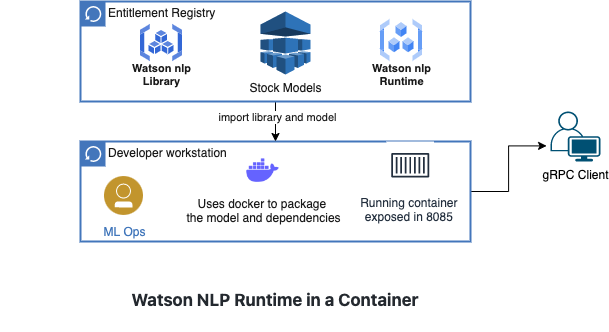

# Serve Stock Watson NLP Models using Standalone Containers
In this tutorial you will learn how to serve stock Watson NLP models from standalone containers.  Both the models and the Watson NLP Runtime will be packaged into the container image.  When the container runs it will expose REST and gRPC endpoints that client programs can use to do inference on the models. 

Standalone containers are useful since they can be deployed anywhere: your laptop using a container runtime like Docker; a Kubernetes or OpenShift cluster; or, a cloud container service like IBM Code Engine or AWS Fargate.  In this tutorial, you will run the container on your local machine using Docker.

The tutorial uses Watson NLP stock models for Sentiment Analysis and Emotion Classification, but this can easily be adapted to serving other stock Watson NLP models. 

### Architecture diagram



### Prerequisites
- Docker is installed on your workstation
- Python >= 3.9 installed in your workstation to run the client program
- An [IBM Artifactory](https://na.artifactory.swg-devops.com/ui/admin/artifactory/user_profile) user name and API key are required to build the Docker image. Get an Artifactory Api key from [here](https://taas.w3ibm.mybluemix.net/guides/create-apikey-in-artifactory.md)
  - ARTIFACTORY_USERNAME 
  - ARTIFACTORY_API_KEY
  
Set the following variables in your environment.
```
export ARTIFACTORY_USERNAME=<USER_NAME>
export ARTIFACTORY_API_KEY=<API_KEY>
```

## Steps

### 1. Clone the GitHub repository
This repository contains the code used in this tutorial.
```
git clone https://github.com/ibm-build-labs/Watson-NLP 
```
### 2. Build the Docker Image
Run the following.
```
cd Watson-NLP/Watson-NLP-Container/Runtime
```
In this directory is a Dockerfile.  The contents are as follows. 
```
ARG WATSON_RUNTIME_BASE="wcp-ai-foundation-team-docker-virtual.artifactory.swg-devops.com/watson-nlp-runtime:0.13.1_ubi8_py39"
FROM ${WATSON_RUNTIME_BASE} as base
#################
## Build Phase ##
#################
FROM base as build

# Args for artifactory credentials
ARG ARTIFACTORY_USERNAME
ARG ARTIFACTORY_API_KEY
ENV ARTIFACTORY_USERNAME=${ARTIFACTORY_USERNAME}
ENV ARTIFACTORY_API_KEY=${ARTIFACTORY_API_KEY}

# Build arg to specify space-delimited names of models
ARG MODEL_NAMES
WORKDIR /app/models
# Download all of the models locally to /app/models
RUN true && \
    mkdir -p /app/models && \
    arr=(${MODEL_NAMES}) && \
    for model_name in "${arr[@]}"; do \
        python3 -c "import watson_nlp; watson_nlp.download('${model_name}', parent_dir='/app/models')"; \
    done && \
    true

###################
## Release Phase ##
###################
FROM base as release

ENV LOCAL_MODELS_DIR=/app/models
COPY --from=build /app/models /app/models
```
Observe that the container image uses the Watson NLP Runtime as its base image.  During the build phase it downloads stock models to the machine.  These are copied into the image in the release phase.  

The following arguments are passed to the build command.
- **WATSON_RUNTIME_BASE**=The Watson NLP Runtime image (optional).
- **ARTIFACTORY_USERNAME**=Artifactory username to download the base image
- **ARTIFACTORY_API_KEY**=Artifactory API key to download the base image
- **MODEL_NAMES**=A space-separated list of stock Watson NLP models that you want served from this container.

To build the image, run the following command.
```
docker build . \
--build-arg WATSON_RUNTIME_BASE="wcp-ai-foundation-team-docker-virtual.artifactory.swg-devops.com/watson-nlp-runtime:0.13.1_ubi8_py39" \
--build-arg MODEL_NAMES="ensemble_classification-wf_en_emotion-stock sentiment_document-cnn-workflow_en_stock" \
--build-arg ARTIFACTORY_API_KEY=$ARTIFACTORY_API_KEY \
--build-arg ARTIFACTORY_USERNAME=$ARTIFACTORY_USERNAME \
-t watson-nlp-container:v1
```
This will create a Docker image called `watson-nlp-container:v1`.  When the container runs, it will serve two stock models: 
- sentiment_document-cnn-workflow_en_stock 
- ensemble_classification-wf_en_emotion-stock 

### 3. Run the server locally
Use the following command to start the service on your local machine.
```
docker run -d -p 8085:8085 watson-nlp-container:v1
```
The models are now being served.  The gRPC endpoint will be exposed on port 8085 at localhost.

### 4. Test 
You can now test the service.  There is code for a simple Python client code in the directory **Watson-NLP/Watson-NLP-Container/Client**.  
```
cd ../Client 
```
Ensure that the Watson NLP Python SDK is installed on your machine. 
```
pip3 install watson_nlp_runtime_client 
```
This client command expects a single text string argument and requests inference from stock Sentiment Analysis and Emotion Classification models.  

Run the client command as: 
```
python3 client.py "Watson NLP is awesome" 
```
You will see output similar to the following.
```
classes {
  class_name: "joy"
  confidence: 0.9687168002128601
}
classes {
  class_name: "anger"
  confidence: 0.03973544389009476
}
classes {
  class_name: "fear"
  confidence: 0.030667975544929504
}
classes {
  class_name: "sadness"
  confidence: 0.016257189214229584
}
classes {
  class_name: "disgust"
  confidence: 0.0033179237507283688
}
producer_id {
  name: "Voting based Ensemble"
  version: "0.0.1"
}

score: 0.9761080145835876
label: SENT_POSITIVE
sentiment_mentions {
  span {
    end: 21
    text: "Watson NLP is awesome"
  }
  score: 0.9761080145835876
  label: SENT_POSITIVE
}
producer_id {
  name: "Document CNN Sentiment"
  version: "0.0.1"
}
```
