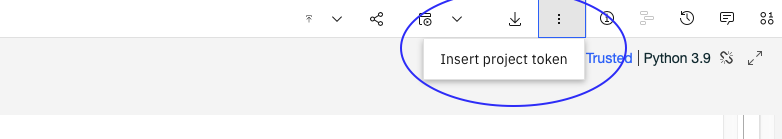
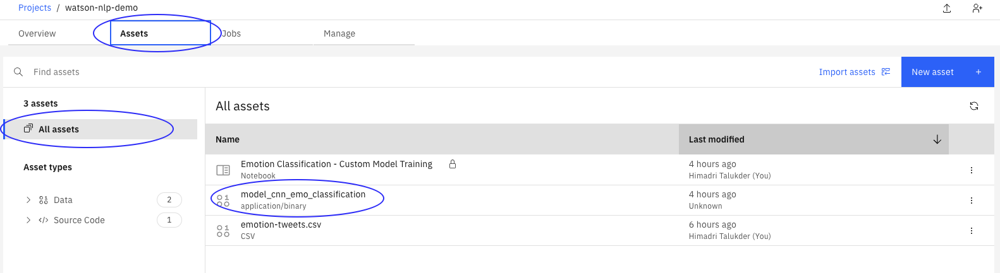

## Serve Custom Models using Standalone Containers
In this tutorial you will export a Watson NLP model from Watson Studio and to serve it with Docker. 

We will serve the model with a standalone container, in which the model is packaged into a the container image together with the Watson NLP Runtime. When the container runs it will expose REST and gRPC endpoints that client programs can use to make inference requests. 

Standalone containers can be deployed anywhere include laptop with Docker; on a Kubernetes or OpenShift cluster; or, on a cloud container service like IBM Code Engine or AWS Fargate.  

### Architecture diagram


    
### Prerequisites
    
- Install [Docker Desktop](https://docs.docker.com/get-docker/)
- Install [Python 3.9](https://www.python.org/downloads/) or later (this is used to run the client program)
- Ensure that Docker has [access](https://github.com/ibm-build-labs/Watson-NLP/blob/main/access/README.md) to the Watson NLP Runtime and pretrained models, and that you have installed the Python Client SDK on your machine
    
## Steps
### 1. Clone the GitHub repository
Clone the repository that contains example code used in this tutorial. 
```
git clone https://github.com/ibm-build-labs/Watson-NLP 
```
Go to the build directory.
```
cd Watson-NLP/Watson-NLP-Custom-Model-Container/Runtime 
```
You will find in this directory a `Dockerfile` and a `models` subdirectory. When we build the container image, any models that are in the `models` directory will be copied into the image.

### 2. Export your model
In this step you will save a Watson NLP model to your machine.  If you have a model in a Watson Studio notebook that you want to use, then follow the instructions below to export it. Otherwise, you can complete this tutorial using this sample [model](https://github.com/ibm-build-labs/Watson-NLP/releases/download/ml_model/ensemble_classification-wf_en_emotion).  Save it to the `models` directory with the name `ensemble_classification-wf_en_emotion-stock`, and then skip ahead to step 3.

Go to the page for your project in the IBM Cloud Pak for Data GUI. Create an access token with *Editor* role using **Manage > Access control > Access tokens**.


Open up your notebook for editing, and then add the token to your notebook by clicking **More > Insert project token** on the notebook action bar. 



This will add a code cell to your notebook similar to the following.
```
# @hidden_cell
# The project token is an authorization token that is used to access project resources like data sources, connections, and used by platform APIs.
from project_lib import Project
project = Project(project_id='<project-id>', project_access_token='<access-token>')
pc = project.project_context
```
Run this code cell. Once complete, `project` can by used to access resources associated with your project. Below, we will use it to export the model to Cloud Object Storage (COS).
    
Add the following line to your notebook environment, and run this line in order to save your model. 
```
project.save_data('<file_name>', data=<trained_model_object>.as_file_like_object(), overwrite=True)
```
In the above line you must replace the following:
- `<file_name>` is the exported model name 
- `<trained_model_object>` is the model being saved

The model will be saved into ZIP archive in a Cloud Object Storage (COS) bucket associated with the project. Once you have saved the model, you will be able to find it in the **Assets** tab. 


    
Using the Watson Studio GUI download the model into the *models* directory on your local machine. You can save multiple models in this directory.  

When the model service starts, the file name that you use to save the model will be used as the model ID.  Client programs will use this model ID when making requests for inference.

### 3. Build the container image
Have a look at the Dockerfile in the current directory.
```
ARG WATSON_RUNTIME_BASE="wcp-ai-foundation-team-docker-virtual.artifactory.swg-devops.com/watson-nlp-runtime:0.13.1_ubi8_py39" 
FROM ${WATSON_RUNTIME_BASE} as base 
ENV LOCAL_MODELS_DIR=/app/models 
COPY models /app/models 
```
The Watson NLP Runtime is used as the base image. Any models that are in the `models` subdirectory on the host will be opein the container at build time.

Use the following command to build the image. 
```
docker build . -t watson-nlp-custom-container:v1 
```
This results in a image named `watson-nlp-custom-container:v1`.  Check that it exists.
```
docker images
```

### 4. Run the service with Docker
Use the following command to start the service. 
```
docker run -d -p 8085:8085 watson-nlp-custom-container:v1 
```
The container will expose a gRPC endpoint on port 8085. 

### 5. Test the service
Now test the model service using a client program. Ensure that the [Watson NLP Python SDK](https://github.com/ibm-build-labs/Watson-NLP/blob/main/access/README.md) is installed on your machine.

The client program appears in the directory `Watson-NLP/Watson-NLP-Custom-Model-Container/Client`. Note that the client code included with this tutorial will make inference requests to the sample model `ensemble_classification-wf_en_emotion-stock` that is referenced in step 2.  If you are using your own model, you will have to first update the client code.

From the `Runtime` directory:
```
cd ../Client 
```
Run the client program.
```
python3 client.py "Watson NLP is awesome" 
```
This program takes a single text string as an argument.  The result from the model is printed to the screen.
