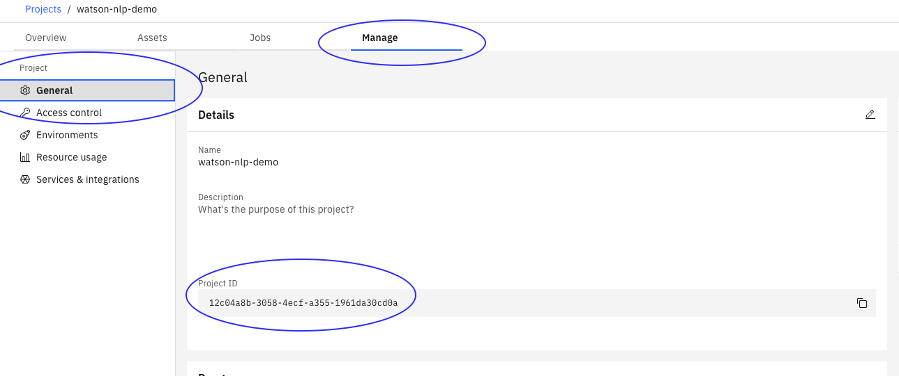

## Serving Custom Watson NLP Models using Standalone Containers
In this tutorial you will learn to export a Watson NLP model from Watson Studio and to serve it with Docker. 

We will serve the model with a standalone container, in which the model is packaged into a the container image together with the Watson NLP Runtime. When the container runs it will expose REST and gRPC endpoints that client programs can use to make inference requests. 

Standalone containers can be deployed anywhere include laptop with Docker; on a Kubernetes or OpenShift cluster; or, on a cloud container service like IBM Code Engine or AWS Fargate.  

### Architecture diagram


    
### Prerequisites
    
- Docker is installed on your workstation.
- Python >= 3.9 installed in your workstation to run the client program.
- An IBM Artifactory username and API key are required to build the Docker image. Set the following variables in your environment.
    - ARTIFACTORY_USERNAME
    -  ARTIFACTORY_API_KEY
    
## Steps
### 1. Clone the GitHub repository
Clone the repository that contains example code used in this tutorial. 
```
git clone https://github.com/ibm-build-labs/Watson-NLP 
```
Go to the build directory.
```
cd Watson-NLP-Custom-Model-Container/Runtime 
```
In this directory, you will find a Dockerfile and a models directory. The Dockerfile will be used to build the standalone container. During the build, models that reside in the models directory will be incorporated into the container image.

### 2. Save the model
If you have trained a model in a Watson Studio notebook, then in this step you will export it and put it in the models directory. Otherwise, you can download a model from [here](https://github.com/ibm-build-labs/Watson-NLP/releases/download/ml_model/ensemble_classification-wf_en_emotion) and save it in the models directory. In that case you may skip to step 3.

Before you can export your custom model, ensure that a project token is set in the notebook environment so that your notebook can access the Cloud Object Storage (COS) bucket associated with your project.  

Get your access token from the IBM Data Platform GUI from **Manage -> Access control -> Access tokens.** 


Add the token to your notebook by clicking **More -> Insert project token** on the notebook action bar. By running the inserted hidden code cell, a project object is created that you can use to access project resources. 


Get your project id from **Manage -> General -> Project Id**


    
Ensure that project access token is be inserted at the top of the notebook in a code cell.  Replace the **project_id** and **project_access_token** in the following with the values you obtained above. 
```
from project_lib import Project 
project = Project(project_id='<project_id>', project_access_token='<project_access_token>') 
```
In your notebook environment you can save your model as a project by adding and running the following line.
```
project.save_data('<file_name>', data=<trained_model_object>.as_file_like_object(), overwrite=True)
```
Here:
- `<file_name>` is the exported model name 
- `<trained_model_object>` is the model being saved

The model will be saved into ZIP archive in a Cloud Object Storage (COS) bucket that is associated with the project.  Note that the ZIP archive created by the `save_data` function can be loaded using `watson_nlp.load()`, i.e. the same function that also used to load stock Watson NLP models.  

Once you have saved the model, you will be able to find the saved model in asset tab. 


    
Use the Watson Studio GUI to download the model to your work station, copying it in to the models directory. You can save multiple models in this directory.  

The file name for the model will be used as the model ID.  When making an inference request from a client program, this model ID will be used to specify which model to use. 

### 3. Build
After the models you want to serve have been saved to your workstation, you can build the container image.  Examine the contents of the Dockerfile. 
```
ARG WATSON_RUNTIME_BASE="wcp-ai-foundation-team-docker-virtual.artifactory.swg-devops.com/watson-nlp-runtime:0.13.1_ubi8_py39" 
FROM ${WATSON_RUNTIME_BASE} as base 
ENV LOCAL_MODELS_DIR=/app/models 
COPY models /app/models 
```

The image uses the Watson NLP Runtime image as the base image, and the models are copied in to the container file system.  A default version of the Runtime is set in the Dockerfile, but this can be overridden in the build command. 

Build the image using the following command. 
```
docker build . \ 
--build-arg WATSON_RUNTIME_BASE="wcp-ai-foundation-team-docker-virtual.artifactory.swg-devops.com/watson-nlp-runtime:0.13.1_ubi8_py39" \ 
-t watson-nlp-custom-container:v1 
```
This results in a image named watson-nlp-custom-container:v1. 
### 4. Run 
Use the following command to start the server with Docker on your local machine. 
```
docker run -d -p 8085:8085 watson-nlp-custom-container:v1 
```
The container exposes a gRPC service on port 8085. 

### 5. Test 
We will test the service using a simple Python client program.  The client code is under the directory **Watson-NLP-Custom-Model-Container/Client**.  Assuming we start in the Runtime directory: 
```
cd ../Client 
```
Ensure that the Watson NLP Python SDK is installed on your machine. 
```
pip3 install watson_nlp_runtime_client 
```
The client command expects a single text string argument, and requests inference scoring of by one of the models being served.  Run the client command as: 
```
python3 client.py "Watson NLP is awesome" 
```

This will query the default model that we have packaged with this example.  In order to query another model, you will have to update some of the client code. 
To make call to the gRPC inference service, you will need the following: 

- **Model_ID:** This is passed as a header argument, mm-model-id : “<MODEL_ID>”. You can set the Model ID in environment variable 
```
export WATSON_NLP_MODEL_ID=” ensemble_classification-wf_en_emotion” 
```
- Make a request object based on the model id. You may have to pass additional parameter. 
```
request = common_service_pb2.watson_nlp_topics_Message( 
    raw_document=dm.RawDocument(text=inputText).to_proto() 
) 
```
- Call the stub installed by Watson_nlp_runtime_client 
```
response = self.stub.watson_nlp_topics_Predict(request,metadata=[("mm-model-id", WATSON_NLP_MODEL_ID)] ) 
```
