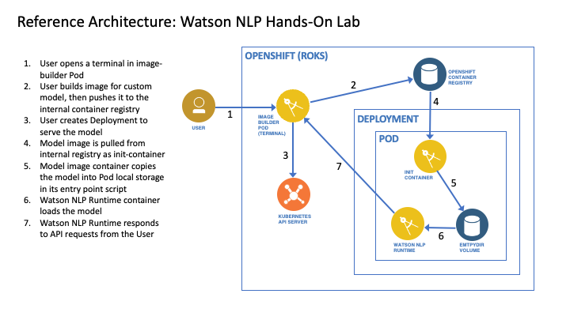
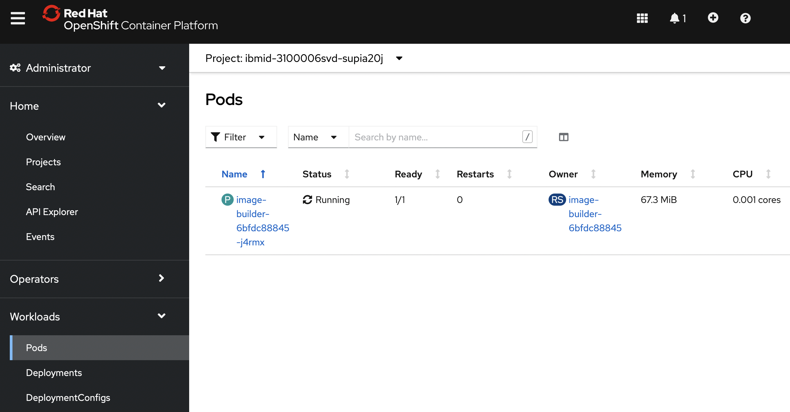
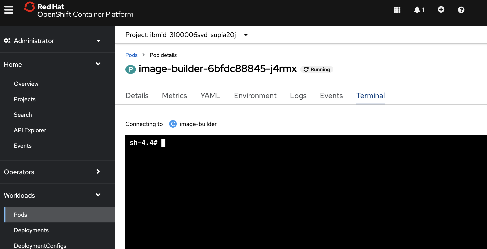
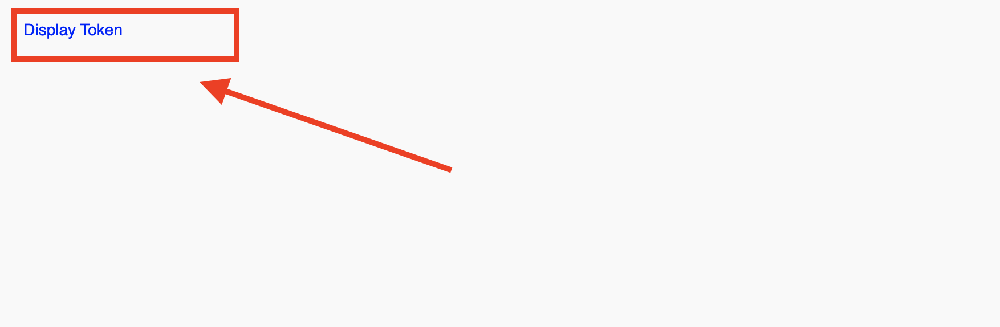

# Watson NLP Hands-On Lab: Deploy Model

In this tutorial, you will learn to deploy Watson NLP models on an OpenShift cluster. In the first part of the lab you will serve a pretrained model for emotion classification, and in the second part you will serve a custom trained model. 



When you reserve an environment for the lab, a Project in an OpenShift (ROKS) cluster will be provisioned for you. Initially, there will be a Pod running that you can log into in order to use the terminal environment. You will use this terminal to build a container image for a custom model, push this image to a container registry, and deploy the model on the OpenShift cluster.

## Prerequisites

Be sure to do the following in advance of the lab session.

1. Ensure that you have access to [IBM Technology Zone (TechZone)](https://techzone.ibm.com/)
2. Ensure that you can get an entitlement key from the [container software library](https://myibm.ibm.com/products-services/containerlibrary) in order to access IBM Entitled Registry.
3. Reserve an environment through TechZone: [https://techzone.ibm.com/collection/watson-nlp-library-hands-on-lab/journey-deploy-model](https://techzone.ibm.com/collection/watson-nlp-library-hands-on-lab/journey-deploy-model).

When making your TechZone reservation, fill in the request form as follows:

- **Purpose:** Practice/Self-Education
- **Purpose description:** Hands-on lab
- **Preferred geography:** AMERICAS - us-south region - any datacenter

Once your reservation has been created, you will receieve an email that contains the URL for the OpenShift Web Console. This information will also be available from the TechZone [reservations](https://techzone.ibm.com/my/reservations) page.

Note that these TechZone reservations will last only for 3 days, so do not create your reservation too early.

4. If you are not already a member of IBM Cloud account ```2577353 - tsglwatson``` then after making your reservation, you will receive an email inviting you to join. Follow the directions in the email to accept the invitation. This is required before you will be able to access the reserved resources. Note that this email may possibly end up in your Outlook *Others* folder. Also, check your spam folder.  

## Deploy a Pretrained NLP Model

### Step 1: Open the OpenShift Web Console

When you reserve your environment for this lab, a Project (Namespace) will be provisioned for you in an OpenShift (ROKS) cluster running on IBM Cloud. You can find the URL to log into the OpenShift Web Console either in the email sent to you from TechZone when the environment was provisioned, or via [https://techzone.ibm.com/my/reservations](https://techzone.ibm.com/my/reservations).

Navigate to the URL with a browser in order to open the OpenShift Web Console. 

In Administrator view, open the Pods menu. A drop-down menu at the top of the Web Console specifies the currently selected OpenShift Project. Ensure that this is set to the Project that was provisioned for you.



### Step 2: Open a Terminal in the Image-Builder Pod

Initially, there will be a single running Pod named ```image-builder-XXX``` in this Project. Navigate to the page for this Pod in the OpenShift Web Console, and click the ```Terminal``` tab to open a terminal shell into the Pod.



**Optional.** You may want to use *terminal multiplexer* (```tmux```) so that if your terminal session is accidentally closed during the lab, you can run the command again to restore your shell environment. To use this, run the following command.

```bash
tmux attach -t workshop -d || tmux new -s workshop
```

### Step 3: Log in to OpenShift from the Terminal

Click your login ID in the upper-right corner of the OpenShift web console and select ```Copy login command```. Next, click on ```Display token```.



This will display the login command for the OpenShift cluster. Copy and paste this login command into your terminal session. The command will look similar to the following.

```bash
oc login --token=xxxx --server=xxxx
```

Set some environment variables. These will be useful to us in subsequent steps.

```bash
export REGISTRY=$(oc registry info)
export PROJECT=$(oc config view --minify -o 'jsonpath={..namespace}')
```

### Step 4: Add Your Entitlement Key

Go to [https://myibm.ibm.com/products-services/containerlibrary](https://myibm.ibm.com/products-services/containerlibrary) to get an entitlement key for the IBM Container Registry. You may need to add a new entitlement key if one does not already exist.

Store this key in an environment variable named ```IBM_ENTITLEMENT_KEY```, replacing ```xxx``` in the following command with your key.

```bash
export IBM_ENTITLEMENT_KEY=xxx
```

Create a secret named ```watson-nlp``` in your Project in the OpenShift cluster, and add it to the default service account. This will allow Pods to retrieve the Watson NLP images from IBM's Entitled Container Registry.

```bash
oc create secret docker-registry watson-nlp --docker-server=cp.icr.io/cp --docker-username=cp --docker-password=$IBM_ENTITLEMENT_KEY
oc patch serviceaccount default -p '{"imagePullSecrets": [{"name": "watson-nlp"}]}'
```

### Step 5: Create the Watson NLP Service

In this step you will retrieve a Kubernetes manifest from GitHub that we will use to deploy Watson NLP with a pretrained emotion classification model.  Run the following commands to download the manifest and apply it.

```bash
cd /workshop
wget https://raw.githubusercontent.com/ibm-build-lab/Watson-NLP/workshop/MLOps/Init-Container/deployment/deployment.yaml
oc apply -f deployment.yaml
```

The Watson NLP service is now created.

### Step 6: View the Created Resources (Optional)

In the previous step you created two Kubernetes resources: 

1. **Deployment.** Pods of this Deployment run the Watson NLP Runtime. A pretrained Watson NLP model is given as an ```initContainer``` which will run to completion before the main container starts.
2. **Service.** Provides access to the Pods of the Deployment.

To view the Service:

```bash
oc get svc 
```

To view the Deployment:

```bash
oc get deployment 
```

A single Pod will be created in the Deployment with the name prefixed ```watson-nlp```. Use the following command to check the state of the Pod.

```bash
oc get pods
```

This Pod may take a little while to initialize, while images are downloaded. Wait for the Pod to enter the ```Running``` state. 

As an alternative to the OpenShift CLI, you can use the OpenShift Web Console to monitor the resources.

### Step 7: Test the Pretrained Model

Once the Pod is Running, the pretrained model is being served. 

Run a test query against the model:

```bash
curl -X POST "http://watson-nlp-runtime-service:8080/v1/watson.runtime.nlp.v1/NlpService/EmotionPredict" -H  "accept: application/json" -H  "grpc-metadata-mm-model-id: emotion_aggregated-workflow_lang_en_stock" -H  "content-type: application/json" -d "{  \"rawDocument\": {    \"text\": \"procrasting is fun until im an hour away from the time its due and i still havent finished so i have a panic attack\"  }}" | jq
```

Note that it may take a minute or so before the service responds. You will see output similar to the following.

```yaml
{
  "emotionPredictions": [
    {
      "emotion": {
        "anger": 0.03344198,
        "disgust": 0.0025860614,
        "fear": 0.88980633,
        "joy": 0.014183758,
        "sadness": 0.085293785
      },
      "target": "",
      "emotionMentions": [
        {
          "span": {
            "begin": 0,
            "end": 115,
            "text": "procrasting is fun until im an hour away from the time its due and i still havent finished so i have a panic attack"
          },
          "emotion": {
            "anger": 0.03344198,
            "disgust": 0.0025860614,
            "fear": 0.88980633,
            "joy": 0.014183758,
            "sadness": 0.085293785
          }
        }
      ]
    }
  ],
  "producerId": {
    "name": "Ensemble Aggregated Emotion Workflow",
    "version": "0.0.1"
  }
}
```

## Deploy a Custom Model

In this part of the lab you will package a custom model into a container image using the Watson model builder tool. This is the same tool that is used internally at IBM to package pretrained models. Once the custom image is packaged, you will push it to the internal OpenShift container registry and then serve it.

For convenience, your build Pod has been provisioned with a custom NLP model that was trained in Watson Studio. The name of the model is ```model_tfidf_emo_classification```. 

View the the files belonging to this model under the ```/workshop/models``` directory.

```bash
tree /workshop/models
```

### Step 8: Install the model packager tool

In this step you will install the Watson NLP model packager tool. This Python tool takes one or more models and packages them as container images.

Use the following command to install the tool.

```bash
pip3 install watson-embed-model-packager
```

### Step 9: Build the Model Container Image

Run the following command to perform a setup operation for the packaging tool. The first command performs a setup step, and the second performs the build. 

```bash
cd
python3 -m watson_embed_model_packager setup \
    --library-version watson_nlp:3.6.0 \
    --local-model-dir /workshop/models \
    --output-csv model-manifest.csv

python3 -m watson_embed_model_packager build --config model-manifest.csv
```

This will create a new Docker image ```watson-nlp_model_tfidf_emo_classification```. You can verify that this was created with the following command:

```bash
docker images
```

### Step 10: Push Model Image to Container Registry

In order to use the model images on the OpenShift cluster, you need to push them to a container registry. We will use the OpenShift internal registry for this purpose. 

Run the following to log into the registry, tag and push images.

```bash
echo $(oc whoami -t) | docker login $REGISTRY -u $(oc whoami) --password-stdin --tls-verify=false

cd /workshop
for m in $(ls models)
do 
  docker tag watson-nlp_${m}:latest ${REGISTRY}/${PROJECT}/watson-nlp_${m}:latest
  docker push ${REGISTRY}/${PROJECT}/watson-nlp_${m}:latest --tls-verify=false
done
```

You can view the images with the following command.

```bash
oc get is
```

### Step 11: Update Kubernetes Manifest

In this step we will update the Kubernetes Deployment that we previously created to serve the custom model. To do so, the model image that we built is added as an ```initContainer``` of the Pod. When this ```initContainer``` runs, the entry point command will copy the model into a local volume mount in the Pod where the Watson NLP Runtime can load it.

The following commands will generate a patch file and apply it.

```bash
echo "spec:
  template:
    spec:
      initContainers:
      - name: complaint-topic-model-discover
        image: image-registry.openshift-image-registry.svc:5000/$PROJECT/watson-nlp_model_tfidf_emo_classification
        volumeMounts:
        - name: model-directory
          mountPath: \"/app/models\"
        env:
        - name: ACCEPT_LICENSE
          value: 'true'
        resources:
          requests:
            memory: \"100Mi\"
            cpu: \"100m\"
          limits:
            memory: \"200Mi\"
            cpu: \"200m\"" > /tmp/patchFile.yaml
            
oc patch deployment watson-nlp-runtime --patch-file /tmp/patchFile.yaml
```

The Pod that is currently running will be replaced with a new Pod that serves both the pretrained and custom models. You will need to wait for the new Pod to enter the ```Running``` state. You can poll the state with the following command.

```bash
oc get pods
```

### Step 12: Test the Custom Model

Test the custom model with the following command.

```bash
curl -X POST "http://watson-nlp-runtime-service:8080/v1/watson.runtime.nlp.v1/NlpService/ClassificationPredict" -H  "accept: application/json" -H  "grpc-metadata-mm-model-id: model_tfidf_emo_classification" -H  "content-type: application/json" -d "{  \"rawDocument\": {    \"text\": \"procrasting is fun until im an hour away from the time its due and i still havent finished so i have a panic attack\"  }}" | jq
```

Note that it may take a minute or so before the service responds. You will see output similar to the following. 

```yaml
{
  "classes": [
    {
      "className": "fear",
      "confidence": 0.9930553
    },
    {
      "className": "sadness",
      "confidence": 0.03128322
    },
    {
      "className": "anger",
      "confidence": 0.0079456465
    },
    {
      "className": "joy",
      "confidence": 0.0018289405
    }
  ],
  "producerId": {
    "name": "SVM classifier",
    "version": "0.0.1"
  }
}
```


## Next Steps
  
Explore the Watson NLP API using the Swagger GUI.  To do so, install the OpenShift CLI (```oc```) installed on your laptop, and then log in to the OpenShift cluster with the Watson NLP service running. Enable port forwarding from your laptop with the following command:

```bash
oc port-forward svc/watson-nlp-runtime-service 8080
```

Then, navigate your web browser to the following URL to bring up the Swagger GUI.

```bash
http://localhost:8080/swagger/
```  

Using this GUI you will be able to test out the API on the deployed models.

Below are links to TechZone collections where you can continue to explore the topic of model deployment.
    
- [Serving Watson NLP Models with Standalone Containers](https://techzone.ibm.com/collection/watson-nlp-serving-models-with-standalone-containers)
- [Serving Watson NLP Models with Kubernetes or OpenShift](https://techzone.ibm.com/collection/watson-nlp-serving-nlp-models)
- [Creating a Watson NLP Client Application](https://techzone.ibm.com/collection/watson-nlp-creating-client-applications)
- [Automate Watson NLP Deployments with TechZone Deployer](https://techzone.ibm.com/collection/automation-for-ibm-watson-deployments)
